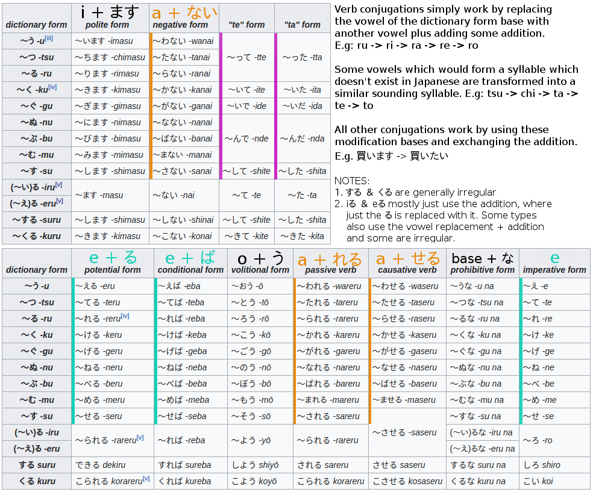

<!-- FILE_TOC -->

# Conjugations

## Conjugation building blocks

- Noun & na-adjectives conjugations are simply conjugations of だ
- i-adjective conjugations are a mix of conjugations from だ　＆　ある
- Verbs, have 3 main stems depending on the ending of the verb and all grammar constructs are an attachment to or replacement of them.
  - Masu stem + conjugations of ます
  - Negative stem + conjugations of ない
  - Te-form is simply the informal past where the た is replaced with て
  - There are also other less important forms (e.g. potential form, passive form, etc). 

  **:heavy_exclamation_mark::heavy_exclamation_mark::heavy_exclamation_mark: NOTE:** Notice that ALL forms are somewhat a transformation of the ending, where the vowel is changed in some way.

### ある

- See also ない

| Type                | Plain | Negative | Polite | Polite Neg.|
| ------------------- | ----- | ------ | ------ | ------ |
| Present | ある | ない | あります | ありません |
| Past    | あった | なかった | ありました | ありませんでした |
|Te-form|あって||||
|Negative te-form|なくて||||

Source: https://www.tanoshiijapanese.com/dictionary/conjugation_details.cfm?entry_id=28301&

### ない

- See also ある
- ない is actually an adjective

| Type             | Plain    | Negative     |
| ---------------- | -------- | ------------ |
| Present          | ない     | なくない     |
| Past             | なかった | なくなかった |
| Negative te-form | なくて   |              |

Source: https://jisho.org/search/%E3%81%AA%E3%81%84 -> Show Inflections

### ます

- This is based on 増す (masu), but conjugation also fits to masu-form.

| Type    | Plain  | Negative     |
| ------- | ------ | ------------ |
| Present | ます   | ません       |
| Past    | ました | ませんでした |

Source: https://jisho.org/word/%E5%A2%97%E3%81%99 -> Show Inflections

### する

| Type                | Plain | Negative | Polite | Polite Neg.|
| ------------------- | ----- | ------ | ------ | ------ |
| Present | する  | しない     | します   | しません       |
| Past    | した  | しなかった | しました | しませんでした |
|Te-form|して||||
|Negative te-form|しなくて||||

Source: https://www.tanoshiijapanese.com/dictionary/conjugation_details.cfm?entry_id=14743

### だ

A copula is a word meaning “to be”, and is used to predicate a sentence, giving the subject identity, properties, state, or membership in a group. Unlike in English, however, the Japanese copula can’t be used to show existence – instead you must use the verbs いる (iru) for animate beings and ある (aru) for inanimate objects. 

- The verb だ is a contraction of the である
- In the negative forms, じゃ is a colloquial contraction of では. Used in formal documents.
- Replacing *arimasen* with *nai desu* expresses a stronger negation.
- The attributive form of the copula is である, but the particles *no* and *na* are generally used instead. This *no* is the familiar [modifying particle](http://www.japaneseprofessor.com/lessons/beginning/modifying-particle-no/), but in some cases *na* is used instead (such as the “explaining” construction *na no da/desu*).

| Type                | Plain         | Polite                         | Honorific              |
| ------------------- | ------------- | ------------------------------ | ---------------------- |
| Present Affirmative | だ            | です                           | でございます           |
| Past Affirmative    | だった        | でした                         | でございました         |
| Present Negative    | じゃない      | じゃありません じゃないです | ではございません       |
| Past Negative       | じゃなかった  | じゃありませんでした           | ではございませんでした |
| Volitional          | だろう        | でしょう                       | でございましょう       |
| Te-Form             | で            | でありまして                   | でございまして         |
| Conditional         | なら / ならば | であれば                       | であれば               |
| Attributive         | の/な         |                                |                        |

Source: https://www.japaneseprofessor.com/reference/grammar/conjugations-of-the-japanese-copula/

## Verbs

### Stems

- **来る**、**する**、**ある** are irregulars and must be learned separately. 

- **ta-form** is the base for:

  - て-form, replace た with て

- **masu-form** is the base for: 

  - たい-form, replace ます with たい

- **negative-form** is the base for:

  - passive-form
  - causative-form

### Masu-Form

Stem for form:

- たい-form (want to)

| Base          | Masu-Form           |
| ---------------- | ------------------- |
| 食べる (eru) | 食べます        |
| 見る (iru)   | 見ます          |
| 聞く (ku)    | 聞きます        |
| 書く(ku)     | 書きます        |
| 行く(ku)     | 行きます        |
| 歌う (u)     | 歌います        |
| 話す (su)    | 話します        |
| 撮る (oru)       | 撮ります        |
| する (uru)   | します          |
| 来る (kuru)  | 来ます (kimasu) |

**Masu-Form Conjugations**

- See ます in "conjugation bases"

| Type    | Conjugations |
| ---------------- | ------------------- |
| Present | 食べます         |
| Negative | 食べません |
| Past | 食べました |
| Past-negative | 食べませんでした |

### Informal negation

| Base        | Negation       |
| ----------- | -------------- |
| 見る        | 見ない         |
| 行く        | 行かない       |
| 話す        | 話さない       |
| 読む        | 読まない       |
| 待つ        | 待たない       |
| 言う        | 言わない       |
| する        | しない         |
| 来る (kuru) | 来ない (konai) |

### Te-Form

| Basic                 | -て form        |
| --------------------- | --------------- |
| 食べる (eru)          | 食べて          |
| 見る (iru)            | 見て            |
| 切る (iru, exception) | 切って          |
| 買う (u)              | 買って          |
| 待つ (tsu)            | 待って          |
| 取る (oru)            | 取って          |
| 曲がる (aru)          | 曲がって        |
| 帰る (eru)            | 帰って (kaette) |
| 書く (ku)             | 書いて          |
| 行く (ku, exception)  | 行って          |
| 泳ぐ (gu)             | 泳いで          |
| 飲む (mu)             | 飲んで          |
| 遊ぶ (bu)             | 遊んで          |
| 死ぬ (nu)             | 死んで          |
| 消す (su)             | 消して          |
| する (suru)           | して            |
| 来る (kuru)           | 来て (kite)     |

## Nouns

- Nouns simply use the conjugations of the plain form of だ 

| Type          | Conjugation    |
| ------------- | -------------- |
| Negative      | 魚じゃない     |
| Past          | 魚だった       |
| Past negative | 魚じゃなかった |

## Adjectives

### i-adjective

| Type                 | Conjugation          |
| -------------------- | -------------------- |
| Negative             | 高くない             |
| Past                 | 高かった             |
| Past negative        | 高くなかった         |
| Polite present       | 高いです             |
| Polite negative      | 高くありません       |
| Polite past          | 高かったです         |
| Polite past negative | 高くありませんでした |

### na-adjective

| Type                 | Conjugation            |
| -------------------- | ---------------------- |
| Negative             | 暇じゃない             |
| Past                 | 暇だった               |
| Past negative        | 暇じゃなかった         |
| Polite present       | 暇です                 |
| Polite negative      | 暇ではありません       |
| Polite past          | 暇でした               |
| Polite past negative | 暇ではありませんでした |

# Must-know words

| Japanese   | English                  |
| ---------- | ------------------------ |
| これ       | this                     |
| ここ       | here                     |
|こんな|such|
| それ       | that (near to listener)  |
| そこ       | there (near to listener) |
|そんな|such|
| あれ       | that (further away)      |
| あそこ     | there (further away)     |
|あんな|such|
| 誰か     | Someone                  |
| 何か     | Something                |
| いつか   | Sometime                 |
| どこか   | Somewhere                |
| どれか   | A certain one from many  |
| 誰も     | Everybody/Nobody         |
| 何も     | Nothing (negative only)  |
| いつも   | Always                   |
| どこも   | Everywhere               |
| どれも   | Any and all              |
| 誰でも   | Anybody                  |
| 何でも   | Anything                 |
| いつでも | Anytime                  |
| どこでも | Anywhere                 |
| どこにも | Nowhere                 |
| どれでも | Whichever                |
|ので|because|
|なので|because|
|そろそろ|soon|
|だから|that is why|
|から|from, because|
|||
|||
|||
|||
|||

