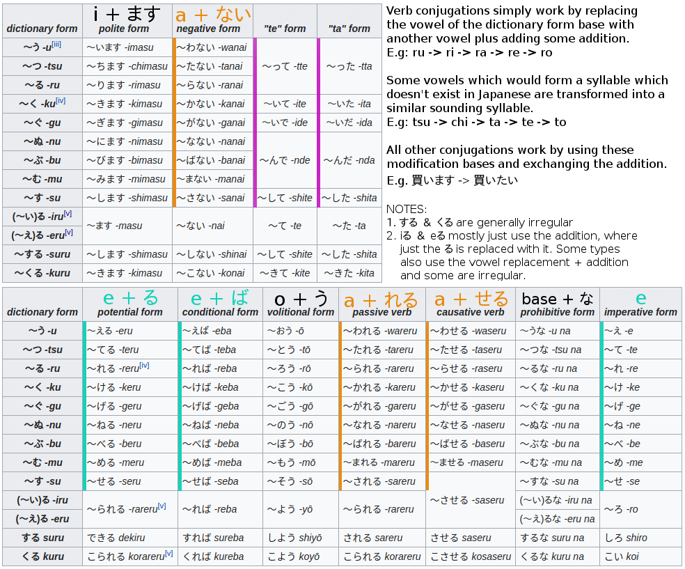

<!--- FILE_TOC -->

# Conjugations

## Conjugation building blocks

- Noun & na-adjectives conjugations are simply conjugations of だ
- i-adjective conjugations are a mix of conjugations from だ　＆　ある
- Verbs stem are based on their dictionary form ending, where the vowel is changed in some way.

**有る** - to be, to exist (only inanimate objects) - verb

| Type                | Plain | Negative | Polite | Polite Neg.|
| ------------------- | ----- | ------ | ------ | ------ |
| Present | ある | ない | あります | ありません |
| Past    | あった | なかった | ありました | ありませんでした |
|Te-form|あって||||
|Negative te-form|なくて||||

Source: https://www.tanoshiijapanese.com/dictionary/conjugation_details.cfm?entry_id=28301

**居る** - to be, to exist (only inanimate objects) - verb

| Type             | Plain    | Negative   | Polite   | Polite Neg.    |
| ---------------- | -------- | ---------- | -------- | -------------- |
| Present          | いる     | いない     | います   | いません       |
| Past             | いた     | いなかった | いました | いませんでした |
| Te-form          | いて     |            |          |                |
| Negative te-form | いなくて |            |          |                |

Source: https://www.tanoshiijapanese.com/dictionary/conjugation_details.cfm?entry_id=28301

**無い** - nonexistent, not being - i-adjective

| Type                | Plain    | Negative     |
| ------------------- | -------- | ------------ |
| Present             | ない     | なくない     |
| Past                | なかった | なくなかった |
| Negative te-form 1* | なくて   |              |
| Negative te-form 2* | ないで   |              |

Source: https://jisho.org/search/%E3%81%AA%E3%81%84 -> Show Inflections

* yeah... no idea how they differ, see grammar guide for なくて and ないで

**ます** - indicates respect for the listener - auxiliary verb

- This is based on 増す (masu), but conjugation also fits to masu-form.

| Type    | Plain  | Negative     |
| ------- | ------ | ------------ |
| Present | ます   | ません       |
| Past    | ました | ませんでした |
|Te-form|まして||

Source: https://jisho.org/word/%E5%A2%97%E3%81%99 -> Show Inflections

**為る** - to do - verb

| Type                | Plain | Negative | Polite | Polite Neg.|
| ------------------- | ----- | ------ | ------ | ------ |
| Present | する  | しない     | します   | しません       |
| Past    | した  | しなかった | しました | しませんでした |
|Te-form|して||||
|Negative te-form|しなくて||||

Source: https://www.tanoshiijapanese.com/dictionary/conjugation_details.cfm?entry_id=14743

**だ** - to be, is - verb, copula

A copula is a word meaning “to be”, and is used to predicate a sentence, giving the subject identity, properties, state, or membership in a group. Unlike in English, however, the Japanese copula can’t be used to show existence – instead you must use the verbs いる (iru) for animate beings and ある (aru) for inanimate objects. 

- The verb だ is a contraction of the である
- In the negative forms, じゃ is a colloquial contraction of では. Used in formal documents.
- Replacing じゃありません with じゃないです expresses a stronger negation. Also more colloquial.
- The attributive form of the copula is である, but the particles の and な are generally used instead. This の is the familiar [modifying particle](http://www.japaneseprofessor.com/lessons/beginning/modifying-particle-no/), but in some cases な is used instead (such as the “explaining” construction *na no da/desu*).
- た (not だ) indicates past, i.e. "did", "have done"

| Type                | Plain         | Polite                         | Honorific              |
| ------------------- | ------------- | ------------------------------ | ---------------------- |
| Present Affirmative | だ            | です                           | でございます           |
| Past Affirmative    | だった        | でした                         | でございました         |
| Present Negative    | じゃない      | じゃありません じゃないです | ではございません       |
| Past Negative       | じゃなかった  | じゃありませんでした           | ではございませんでした |
| Volitional          | だろう        | でしょう                       | でございましょう       |
| Te-Form             | で            | でありまして                   | でございまして         |
| Conditional         | なら / ならば | であれば                       | であれば               |
| Attributive         | の/な         |                                |                        |

Source: https://www.japaneseprofessor.com/reference/grammar/conjugations-of-the-japanese-copula/

## Verbs

**Syllable transformation**

| Base | i    | a    | e    | o    |
| ---- | ---- | ---- | ---- | ---- |
| u    | i    | wa   | e    | o    |
| tsu  | chi  | ta   | te   | to   |
| ru   | ri   | ra   | re   | ro   |
| ku   | ki   | ka   | ke   | ko   |
| gu   | gi   | ga   | ge   | go   |
| nu   | ni   | na   | ne   | no   |
| bu   | bi   | ba   | be   | bo   |
| mu   | mi   | ma   | me   | mo   |
| su   | shi  | sa   | se   | so   |

**Stems**

## Nouns

- Nouns simply use the conjugations of the plain form of だ 

| Type          | Conjugation    |
| ------------- | -------------- |
| Negative      | 魚じゃない     |
| Past          | 魚だった       |
| Past negative | 魚じゃなかった |

## Adjectives

**i-adjective**

- i-adjective conjugations are a mix of conjugations from だ　＆　ある

| Type                 | Conjugation          |
| -------------------- | -------------------- |
| Negative             | 高くない             |
| Past                 | 高かった             |
| Past negative        | 高くなかった         |
| Polite present       | 高いです             |
| Polite negative      | 高くありません       |
| Polite past          | 高かったです         |
| Polite past negative | 高くありませんでした |

**na-adjective**

- Noun & na-adjectives conjugations are simply conjugations of だ

| Type                 | Conjugation            |
| -------------------- | ---------------------- |
| Negative             | 暇じゃない             |
| Past                 | 暇だった               |
| Past negative        | 暇じゃなかった         |
| Polite present       | 暇です                 |
| Polite negative      | 暇ではありません       |
| Polite past          | 暇でした               |
| Polite past negative | 暇ではありませんでした |

# Particles

| Particle | Explanation                                                  |
| -------- | ------------------------------------------------------------ |
|で|- Marks a place, area, or length of time inside which something occurs. - Marks a method, tool or circumstance under which something happens. - Marks a material or substance; composition. - See also "connecting sentences"|
|でも|- Conjunction, equal to "but", "however" - After question word (誰, 何, どこ, etc) it turns them into "unspecific qualifiers", like "any". E.g. 誰でも (anybody), 何でも (anything), いつでも (anytime)|
| は       | - Topic particle (identifies what it is that you’re talking about) - Contrasts one option or thing against others. (A vs. B, C, D) - Used when elaborating on things already known to the listener. |
|へ|- Indicates direction or goal (e.g. "to")pronounced え in modern Japanese|
|か|- Question marker in polite speech, i.e. '?'. Can also occur as *か*よ、like '?!' - Attached to the end of a relative clause makes a mini-question inside a larger sentence. E.g. 昨日何を食べたか忘れた - "Forgot what I ate yesterday" - After question word (誰, 何, どこ, etc) it turns them into "unspecific qualifiers", like "some".  E.g. 誰か (somewhere)、何か (something), どこか (somewhere), etc.|
|が|- Identifier particle (also called subject particle), identifies the topic - Distinguishes one option or thing from others. (A vs. ???) - Used when adding new things/information to a conversation. - Used when describing specific things with adjectives. - Marks objects of potential-form verbs. (can/able to) - See also "connecting sentences"|
| も       | - Inclusive / exclusive topic particle (i.e. "also" or "not, neither" with negation) - After question word (誰, 何, どこ, etc) it turns them into "unspecific qualifiers" (see か), Can mostly also be negated E.g. 誰も (Everybody/Nobody), 何も (Nothing - negative only) |
|ね|- At sentence end, equivalent to “right?”, “isn’t it?”. Same as German "... ne?"|
|に|- The "target particle" - Marks an indirect object (the person/thing an action is done for/directed toward) - Marks a destination, direction or specific place for an action. (to/at) - Marks a specific point in time (ie. Monday / 3pm / 1972 / July) - Marks a period of time that something repeats in. - Marks direct objects for: なる (to become), あう (to meet), のる (to ride)|
| の | - Possessive particle. Connects nouns: AのB = "A's B" or "B of A". E.g. アメリカの大学  = College of America. - Can replace a noun, e.g. 白いのは... - white thing is... - Equivalent to 物 (こと) - Nominalizer for verbs and adjectives. Like -ING in English. E.g. 勉強するの - studyING - Indicates explanation or need for one (i.e. "Look, here’s the reason"), when used as sentence ending. Also ん, のだ or んだ. And *な*のだ or なんだ needed for differentiation. ジムのだ (It is Jim’s) vs ジムなのだ (It is Jim). The だ can also be conjugated E.g. のじゃない、 んじゃなかった、etc |
| と | - Marks a person that an action is done with. - Links nouns to create a complete “and” group. - Marks quoted speech or phrasal objects: おもう (to think), かく (to write) - Shows a natural/predictable “if-then” relationship between clauses. - Marks onomatopoeic words. |
| を | - Marks the grammatical object of a sentence. It follows nouns and noun phrases. - With verbs of motion, shows where the motion occurs. - Partly used for suru-verbs |
| よ | - At sentence end, informing the listener of something new or emphasis. Like "you know". Also as よね |

# Grammar points

| Grammar Point                   | Explanation                                                  |
| ------------------------------- | ------------------------------------------------------------ |
| Relative clause                 | If there are "qualifiers" before the subject, then it's a relative sentence. e.g.  学生だった人は... - Person who was a student... |
| Sentence order                  | Only rule is that the verb comes at the end. The subject and object can be shifted however you want. |
| Adjectives to adverbs           | i-adjectives: 早い → 早く、na-adjectives: きれい → きれいに E.g. 早く食べた - quickly ate |
| Verb + motion verb              | Frm: [verb with masu-stem] + [maybe a particle] + 行く OR 来る. E.g. 見に行く - "go to see" Can also be conjugated: 遊びにきた - "came to play"、持っていって - "go and bring" |
| どうか                          | どう + か - when used in an "implicit question" (see か particle) it's roughly equivalent to saying “whether or not” |
| Potential form exceptions       | Use 見える and 聞こえる when you want to say that you can see or hear something. If however, you wanted to say that you were given the opportunity to see or hear something, you would use the regular potential form. |
| 〜にする                        | に + する means “to decide on [X]”.                   |
| 〜なる                          | - When using with nouns and adjectives use with に, i.e. 〜になる - When using 〜なる with i-adjectives, instead of using ~になる, you need to conjugate the adjective to its negative stem and then attach なる. E.g. 強くなる (become strong), 強くなかった (was not strong), 強くなった (became strong(er)) - When using with verb add a generic noun such as a generic event: こと (事) or an appearance/manner: よう (様） |
| Transitive / Intransitive Verbs | The difference between the two is that transitive verbs is an action done by an active agent while intransitive verbs are used when something occurs without a direct agent.|
|||
|||
|||
|||
|||
|||

# Grammar Groups

## Connecting sentences

| Japanese | Explanation |
| -------- | ------------------------------------------------------------ |
| て・で   | For **comma lists for nouns and adjectives**, like "He is X, Y, and Z". Nouns and na-adjectives: Attach で, e.g. 静かで i-adjectives: Negative stem + て, e.g. 暑くない → 暑くて. Also for conjugated nouns: 彼女じゃない → 彼女じゃなくて. The last item isn't conjugated to the て ending.  E.g. 田中さんは、お金持ち*で*、かっこ*よくて*、魅力的ですね。 "Tanaka-san is rich, handsome, and charming, isn’t he?" For **verbs** use the regular て form. E.g. 食堂に*行って*、昼ご飯を*食べて*、昼寝をする。 "I will go to cafeteria, eat lunch, and take a nap." |
| とか・や | **"and", "or" for nouns**, implies more items. E.g. "X and Y and Z etc.". とか is more colloquial than や. Tense is determined by the last verb. Examples: 飲み物*や*カップ*や*ナプキンは、いらない？ "You don’t need (things like) drink, cup, or napkin, etc.?" 飲み物*とか*カップ*とか*ナプキンは、いらない？ You don’t need (things like) drink, cup, or napkin, etc.? |
|たり|- **Verb version of the や particle**, implies other items.  - Conjugate the verb into past tense and add り (i.e. たり、だり). At the end attach the verb する. - Tense is determined by the last verb. 映画を見たり、本を読んだり、昼寝したりする。 "I do things like (among other things) watch movies, read books, and take naps."|
|し|- **List for reasons** for multiple states or actions. - Works like や. Also implies that there are other reasons. - For any non-conjugated noun or na-adjective you need to add だ. 先生だし、年上だし・・・。 "Well, he’s/she’s the teacher, and older…" 優しいし、かっこいいし、面白いから。 "Because he’s kind, attractive, and interesting (among other things)."|
| から     | - because; since - The two sentences are always ordered [reason] から [result]. - When the reason is a non-conjugated noun or na-adjective you must use だから, otherwise it would sound like "from". |
| ので     | - because of ...; the reason is ...; - Pretty much the same as から. [reason] から [result] - When the reason is a non-conjugated noun or na-adjective you must use なので - Like のだ this can occur as ので、んで、なので、なんで |
| のに     | - despite - Used as ので. Also needs a な when used with non-conjugated noun or na-adjective. E.g.  学生なのに、彼女は勉強しない。 "Despite being a student, she does not study." |
| けど・が | - but; however; although - Used in the same manner as から and ので, but expresses contradiction. - If there is no contraction, then the meaning is more like "and". - Just like 「から」 the declarative 「だ」 is required for nouns and na-adjectives. E.g. 今日は暇だけど、明日は忙しい。 "I’m free today but I will be busy tomorrow." デパートに行きましたが、何も欲しくなかったです。 "I went to department store but there was nothing I wanted." |

## Te-form usages

| て・で +addition&nbsp;&nbsp;&nbsp;&nbsp;&nbsp;&nbsp;&nbsp;&nbsp;&nbsp;&nbsp; | Meaning                                                      |
| ---------------------------------------------------------- | ------------------------------------------------------------ |
| ～てください                                               | - Means "Please do X"  - In casual speech, it is often common to simply drop the ください part. - Negative is built via "negative form" + で. E.g. 買わないで. |
| ～ている                                                   | - Indicates continuous action, i.e. "currently doING something". - Conjugations work the same as with 居る. E.g. 読んでいます (is reading, polite), 読んでいない (is not reading) - Can also indicate an "enduring state-of-being". E.g. 知っている = "I know", 持っている = "to have / possess" - When used with motion verbs like 行っている or 来ている it means that you "completed the motion, and now you exist in that state." |
| ～てある                                                   | - By replacing 「いる」 with 「ある」, instead of a continuing action, it becomes a resultant state after the action has already taken place. Usually, this expression is used to explain that something is in a state of completion. |
| ～ておく                                                   | - While 「～てある」 carries a nuance of a completed action in preparation for something else, 「～ておく」 explicitly states that the action is done (or will be done) with the future in mind. E.g. 晩ご飯を作っておく。 I make dinner (in advance for the future). |
| ～ていく ～てくる                                       | - When “to go” 行く or “to come” 来る is used with the te-form, to show that an action is oriented toward or from someplace. While 「持っている」 means you are in a state of holding something (in possession of), when the 「いる」 is replaced with 「いく」 or 「くる」, it means you are taking or bringing something. |
| 〜てはだめ 〜てはいけない 〜てはならない             | - Expresses things that must NOT be done - いけない and ならない conjugate like i-adjectives but are not actual adjectives. - Base for いけない is いける (行ける) - Base for ならない is なる (成る) ここに入ってはいけません。 "You must not enter here." |

## Conditionals

| Type             | Explanation                                                  |
| ---------------- | ------------------------------------------------------------ |
| と               | - Natural consequence conditional. Simple if-then. E.g. 電気を消す*と*暗くなる。 "If you turn off the lights, it will get dark." |
| なら             | - Contextual conditional. You can use this particle to express what will happen given a certain context. A context must be present to use it. - Attach なら to the context in which the conditional would occur. You must NOT attach the declarative だ. みんなが行く*なら*私も行く。 "If given that everybody is going, then I’ll go too." |
| Conditional Form | - Conditional just expresses a regular “if” condition without any assumptions or embedded meanings. - Uses conditional form. 楽しければ、私も行く。 "If it’s fun, I’ll go too." |
| たら / だら      | - Past tense + ら. - Like the ば conditional, it is also a general conditional. お金があったらいいね。 "If I had money, it would be good, huh?" |
|もし|- NOT a conditional - もし is a supplement to add a sense of uncertainty on whether the condition is true. もしよかったら、映画を観に行きますか？ "If by any chance it’s ok with you, go to watch movie?"|

## Must / must not

| Japanese                                                     | Explanation                                                  |
| ------------------------------------------------------------ | ------------------------------------------------------------ |
| Must NOT do 〜てはだめ 〜てはいけない 〜てはならない | - Expresses things that must NOT be done - いけない and ならない conjugate like i-adjectives but are not actual adjectives. - Base for いけない is いける (行ける) - Base for ならない is なる (成る) ここに入ってはいけません。 "You must not enter here." |
|                                                              |                                                              |
|                                                              |                                                              |
|                                                              |                                                              |

