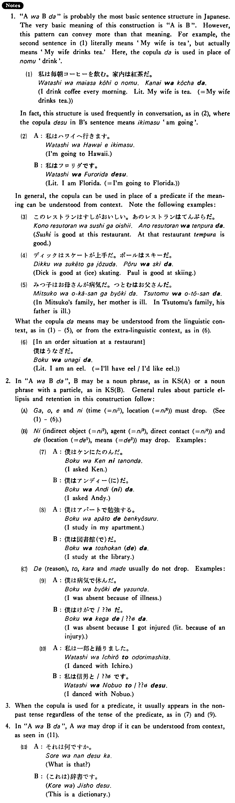

# は～だ

[1. Summary](#summary) 
[2. Example Sentences](#example-sentences) 
[3. Explanation](#explanation) 
 

## Summary

<table><tr>   <td>Summary</td>   <td>Someone or something is/was someone or something or is/was in some state, or will do/does/did something.</td></tr><tr>   <td>Part of speech</td>   <td>Structure</td></tr></table>

## Example Sentences

<table><tr>   <td>これは本だ・です。</td>   <td>This is a book.</td></tr><tr>   <td>コンサートは八時からだ・です。</td>   <td>The concert is from eight o'clock.</td></tr><tr>   <td>あの人は先生だ。</td>   <td>That person is a teacher.</td></tr><tr>   <td>私はジョーンズです。</td>   <td>I am Jones.</td></tr><tr>   <td>授業は四時までです。</td>   <td>My classes are till four o'clock.</td></tr><tr>   <td>今度の試合はワシントン大学とだ。</td>   <td>The next game is against the University of Washington.</td></tr></table>

## Explanation

1. The particle used with the noun or noun phrase between のは and だ usually drops if the particle does not have any concrete meaning (as in the cases of が and を), or if the meaning of the entire sentence is somehow predictable. Examples follow.
 <ul>(1) <li>八時にうちに来たのは森田さん(*が)だ。</li> <li>It was Mr. Morita who came to my house at eight o'clock.</li> </ul> <ul>(2) <li>森田さんが持って来たのはケーキ(*を)だ。</li> <li>It was cake that Mr. Morita brought here.</li> </ul> <ul>(3) <li>森田さんがケーキをくれたのは弟(に)だ。</li> <li>It was to my brother that Mr. Morita gave cake.</li> </ul> <ul>(4) <li>森田さんがうちに来たのは車でだ。</li> <li>It was by his car that Mr. Morita came to my house.</li> </ul> <ul>(5) <li>a. 森田さんが来たのは東京からだ。</li> <li>It was from Tokyo that Mr. Morita came.</li> 

 <li>b. 森田さんが出発したのは東京(から)だ。</li> <li>It was from Tokyo that Mr. Morita departed.</li> </ul> <ul>(6) <li>a. 森田さんが飲んだのは田山さんとだ。</li> <li>It was with Mr. Tayama that Mr. Morita drank.</li> 

 <li>b. 森田さんが一緒に飲んだのは田山さん(と)だ。</li> <li>It was with Mr. Tayama that Mr. Morita (literally: together drank.)</li> </ul> 
In (5b) and (6b) the particles から and と normally drop, because 出発した 'departed' and 一緒に 'together' generally co-occur with から and と, respectively.
 
3. The element between のは and だ cannot be a manner adverb. The following sentences are all unacceptable.
 <ul>(7) <li>*花子が歩いたのはゆっくりだ。</li> <li>*It was slowly that Hanako walked.</li> </ul> <ul>(8) <li>*太郎が字を書いたのはきれいにだ。</li> <li>*It was beautifully that Taro wrote characters.</li> </ul> 
Unlike English, the copula だ in this construction is normally in the present tense.
 <ul>(9) <li>きのう買ったのはステレオです/???でした。</li> <li>It was a stereo set that I bought yesterday.</li> </ul> 
5. The number of のは~だ sentences which can be produced from one sentence is limited only by the number of elements which can be placed between のは and だ. For example, four such sentences can be derived from (10).
 <ul>(10) <li>ジョンがジェーンに東京で八月に会った。</li> <li>John met Jane in August in Tokyo.</li> </ul> <ul>(11) <li>a. ジェーンに東京で八月に会ったのはジョンだ。</li> <li>It was John who met Jane in August in Tokyo.</li> 

 <li>b. ジョンが東京で八月に会ったのはジェーンだ。</li> <li>It was Jane whom John met in August in Tokyo.</li> 

 <li>c. ジョンがジェーンに八月に会ったのは東京(で)だ。</li> <li>It was in Tokyo that John met Jane in August.</li> 

 <li>d. ジョンがジェーンに東京で会ったのは八月だ。</li> <li>It was in August that John met Jane in Tokyo.</li> </ul> 
6. Normally the の clause takes は, marking the entire clause as presupposed, old, unimportant information, and the element between のは and だ represents a new, important piece of information. But sometimes the の clause takes が, marking the clause as new, important information. In this case the element between のが and だ indicates unimportant information.
 <ul>(12) <li>私が作っているのがロボットです。</li> <li>The one I'm making is a robot.</li> </ul> <ul>[Correct phrase]  <li>ロボットは私が作っています。</li> <li>Speaking of robots, I'm making one.</li> </ul> 
【Related Expression】
 
の in the present construction should not be confused with the の used as a nominalizer. Sentence [1] is the のは~だ construction and [2], the nominalized sentence.
 
(⇨ <a href="#㊦ の (3)">の3</a>)
 
[1]
 <ul> <li>本を読むのはたいてい夜だ。</li> <li>It is usually at night that I read books.</li> </ul> 
[2]
 <ul> <li>本を読むのはいいことだ。</li> <li>It is a good thing to read books.</li> </ul> 
One way to differentiate between the two constructions is to see if the sentence can be restated by deleting のは and だ and placing the element before のは in an appropriate position. For example, [1] can be restated as [3], but [2] cannot be restated, as seen in [4].
 
[3]  
<ul> <li>たいてい夜本を読む。</li> <li>I read books usually at night.</li> </ul> 
[4]
 <ul> <li>a. *いいこと本を読む。</li> 

 <li>b. *本をいいこと読む。</li> 

 <li>c. *本を読むいいこと。</li> </ul>

## Grammar Book Page

