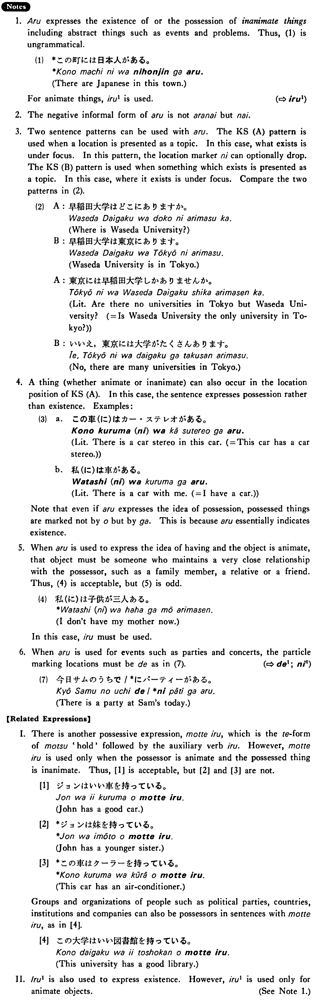

# ある (1)

[1. Summary](#summary) 
[2. Example Sentences](#example-sentences) 
[3. Explanation](#explanation) 
[4. Grammar Book Page](#grammar-book-page) 

## Summary

<table><tr>   <td>Summary</td>   <td>An inanimate thing exists.</td></tr><tr>   <td>Equivalent</td>   <td>Be; exist; have</td></tr><tr>   <td>Part of speech</td>   <td>Verb (Group 1)</td></tr><tr>   <td>Related expression</td>   <td>いる1; もっている</td></tr></table>

## Example Sentences

<table><tr>   <td>この町（に）は大学が三つある・あります。</td>   <td>In this town are three universities.</td></tr><tr>   <td>エッフェル塔はパリにある・あります。</td>   <td>The Eiffel Tower is in Paris.</td></tr><tr>   <td>私のアパト(に)はテレビが二台ある。</td>   <td>There are two TV sets in my apartment.</td></tr><tr>   <td>デトロイトはミシガン州にあります。</td>   <td>Detroit is in the State of Michigan.</td></tr><tr>   <td>和田さんのうち(に)はクーラーがない。</td>   <td>There is no air-conditioner at Mr. Wada's.</td></tr></table>

## Explanation

1. ある expresses the existence of or the possession of inanimate things including abstract things such as events and problems. Thus, (1) is ungrammatical.
  <ul>(1) <li>*この町には日本人がある。</li> <li>There are Japanese in this town.</li> </ul>  
For animate things, いる1 is used.  
2. The negative informal form of ある is not あらない but ない.  
3. Two sentence patterns can be used with ある. The Key Sentence (A) pattern is used when a location is presented as a topic. In this case, what exists is under focus. In this pattern, the location marker に can optionally drop. The Key Sentence (B) pattern is used when something which exists is presented as a topic. In this case, where it exists is under focus. Compare the two patterns in (2).
  <ul>(2) <li>A: 早稲田大学はどこにありますか 。</li> <li>Where is Waseda University?</li> 

 <li>B: 早稲田大学は東京にあります 。</li> <li>Waseda University is in Tokyo.</li> 

 <li>A: 東京には早稲田大学しかありませんか 。</li> <li>Literally: Are there no universities in Tokyo but Waseda University? (= Is Waseda University the only university in Tokyo?)</li> 

 <li>B: いいえ，東京には大学がたくさんあります 。</li> <li>No, there are many universities in Tokyo.</li> </ul>  
4. A thing (whether animate or inanimate) can also occur in the location position of Key Sentence (A). In this case, the sentence expresses possession rather than existence. Examples:
  <ul>(3) <li>a. この車(に)はカー・ステレオ がある。</li> <li>Literally: There is a car stereo in this car.(= This car has a car stereo.)</li> 

 <li>b. 私(に)は車がある。</li> <li>Literally: There is a car with me.(= I have a car.)</li> </ul>  
Note that even if ある expresses the idea of possession, possessed things are marked not by を but by が. This is because ある essentially indicates existence.
  
5. When ある is used to express the idea of having and the object is animate, that object must be someone who maintains a very close relationship with the possessor, such as a family member, a relative or a friend. Thus, (4) is acceptable, but (5) is odd.
  <ul>(4) <li>私(に)は子供が三人ある。</li> <li>I have three children.</li> </ul>  <ul>(5) <li>??私(に)は運転手がある。</li> <li>I have a chauffeur.</li> </ul>  
Since ある in this usage is a possessive expression, it cannot be used in situations where the idea indicates existence. Thus,(6) is unacceptable.
  <ul>(6) <li>*私(に)は母がもうありません。</li> <li>I don't have my mother now.</li> </ul>  
In this case, いる must be used.
  
6. When ある is used for events such as parties and concerts, the particle marking locations must be で as in(7). 
  
(⇨ <a href="#㊦ で (1)">で1</a>; <a href="#㊦ に (6)">に6</a>)
  <ul>(7) <li>今日サムのうちで/*にパーティがある。</li> <li>There is a party at Sam's today.</li> </ul>  
【Related Expressions】
  
I. There is another possessive expression, 持っている, which is the てform of 持つ 'hold' followed by the auxiliary verb いる. However, 持っている is used only when the possessor is animate and the possessed thing is inanimate. Thus, [1] is acceptable, but [2] and [3] are not.
  
[1] 
 <ul> <li>ジョンはいい車を持っている。</li> <li>John has a good car.</li> </ul>  
[2] 
 <ul> <li>*ジョ ンは妹を持っている。</li> <li>John has a younger sister.</li> </ul>  
[3] 
 <ul> <li>*この車はクーラを持っている。</li> <li>This car has an air-conditioner.</li> </ul>  
Groups and organizations of people such as political parties, countries, institutions and companies can also be possessors in sentences with 持っている, as in [4].
  
[4] 
 <ul> <li>この大学はいい図書館を持っている。</li> <li>This university has a good library.</li> </ul>  
II. いる1 is also used to express existence. However, いる1 is used only for animate objects. (See Note 1.)

## Grammar Book Page

