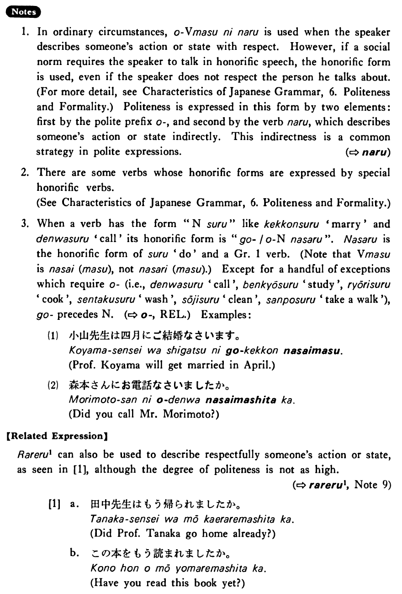

# お～になる

 
 
 
 
 

## Summary

<table><tr>   <td>Summary</td>   <td>A phrase which expresses the speaker’s respect for someone when describing that person’s action or state</td></tr><tr>   <td>Part of speech</td>   <td>Phrase</td></tr><tr>   <td>Related expression</td>   <td>お~する; られる1</td></tr></table>

## Formation

<table class="table"> <tbody><tr class="tr head"> <td class="td">おVます </td> <td class="td">になる </td> <td class="td">&nbsp;</td> </tr> <tr class="tr"> <td class="td">&nbsp;</td> <td class="td">お話しになる </td> <td class="td">Someone    (will) talk</td> </tr> <tr class="tr"> <td class="td">&nbsp;</td> <td class="td">お教えになる </td> <td class="td">Someone    (will) teach</td> </tr></tbody></table>

## Example Sentences

<table><tr>   <td>田中先生はもうお帰りになった・なりました。</td>   <td>Professor Tanaka already went home.</td></tr><tr>   <td>この本をもうお読みになりましたか。</td>   <td>Have you read this book yet?</td></tr><tr>   <td>グッドマン先生は私の名前をお忘れになった。</td>   <td>Professor Goodman has forgotten my name.</td></tr></table>

## Explanation

1. In ordinary circumstances, おVerbますになる is used when the speaker describes someone's action or state with respect. However, if a social norm requires the speaker to talk in honorific speech, the honorific form is used, even if the speaker does not respect the person he talks about. Politeness is expressed in this form by two elements: first by the polite prefix お, and second by the verb なる which describes someone's action or state indirectly. This indirectness is a common strategy in polite expressions.
  
2. There are some verbs whose honorific forms are expressed by special honorific verbs.
  
3. When a verb has the form "Nounする" like 結婚 'marry' and 電話する 'call' its honorific form is "ご/おNounなさる". なさる is the honorific form of する 'do' and a Group 1 verb. (Note that Verbます is なさい (ます), not なさり (ます).) Except for a handful of exceptions which require お (i.e., 電話する 'call', 勉強する 'study', 料理する 'cook', 選択する 'wash', 掃除する 'clean', 散歩する 'take a walk'), ご precedes Noun. (⇨ <a href="#㊦ お">お</a>, Related Expression) Examples:
  <ul>(1) <li>小山先生は四月にご結婚なさいます。</li> <li>Professor Koyama will get married in April.</li> </ul>  <ul>(2) <li>森本さんにお電話なさいましたか。</li> <li>Did you call Mr. Morimoto?</li> </ul>  
【Related Expression】
  
られる1 can also be used to describe respectfully someone's action or state, as seen in [1], although the degree of politeness is not as high.
  
(⇨ <a href="#㊦ られる (1)">られる1</a>, Note 9)
  <ul>[1] <li>a. 田中先生はもう帰られましたか。</li> <li>Did Professor Tanaka go home already?</li> 

 <li>b. この本をもう読まれましたか。</li> <li>Have you read this book yet?</li> </ul>

## Grammar Book Page

