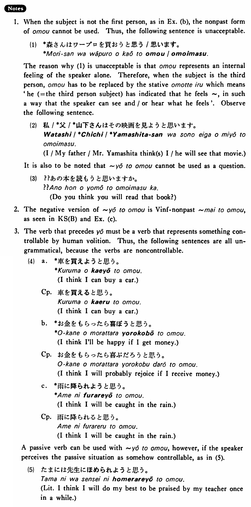

# ようと思う

[1. Summary](#summary) 
[2. Formation](#formation) 
[3. Example Sentences](#example-sentences) 
[4. Explanation](#explanation) 
 

## Summary

<table><tr>   <td>Summary</td>   <td>The speaker desires or decides to do something.</td></tr><tr>   <td>English</td>   <td>~ think ~ will</td></tr><tr>   <td>Part of speech</td>   <td>Phrase</td></tr><tr>   <td>Related expression</td>   <td>つもり</td></tr></table>

## Formation

<table class="table"> <tbody><tr class="tr head"> <td class="td">(i)  Vinformal volitional</td> <td class="td">と思う </td> <td class="td">&nbsp;</td> </tr> <tr class="tr"> <td class="td">&nbsp;</td> <td class="td">話そうと思う </td> <td class="td">I    think I will talk</td> </tr> <tr class="tr"> <td class="td">&nbsp;</td> <td class="td">食べようと思う </td> <td class="td">I    think I will eat</td> </tr> <tr class="tr head"> <td class="td">(ii)  Vinformal nonpast</td> <td class="td">まいと思う </td> <td class="td">&nbsp;</td> </tr> <tr class="tr"> <td class="td">&nbsp;</td> <td class="td">話すまいと思う </td> <td class="td">I    think I will not talk</td> </tr> <tr class="tr"> <td class="td">&nbsp;</td> <td class="td">食べるまいと思う </td> <td class="td">I    think I will not eat</td> </tr></tbody></table>

## Example Sentences

<table><tr>   <td>私は日本歴史を読もうと思う・思います。</td>   <td>I think I will read Japanese history (books).</td></tr><tr>   <td>私はもう酒を飲むまいと思う・思います。</td>   <td>I think I will not drink alcohol any longer.</td></tr><tr>   <td>夏休みに日本アルプスに登ろうと思います。</td>   <td>I think I will climb the Japan Alps during summer vacation.</td></tr><tr>   <td>森さんはワープロを買おうと思っています。</td>   <td>Mr. Mori is thinking of buying a word processor.</td></tr><tr>   <td>僕はあの人とはもう話すまいと思う。</td>   <td>I think I won't talk to that person any more.</td></tr></table>

## Explanation

1. When the subject is not the first person, as in Example (b), the nonpast form of 思う cannot be used. Thus, the following sentence is unacceptable.
  <ul>(1) <li>*森さんはワープロを買おうと思う/思います。</li> </ul>  
The reason why (1) is unacceptable is that 思う represents an internal feeling of the speaker alone. Therefore, when the subject is the third person, 思う has to be replaced by the stative 思っている which means 'he (= the third person subject) has indicated that he feels ~, in such a way that the speaker can see and/or hear what he feels'. Observe the following sentence.
  <ul>(2) <li>私/*父/*山下さんはその映画を見ようと思います。</li> <li>I/My father/Mr. Yamashita think(s) I/he will see that movie.</li> </ul>  
It is also to be noted that ようと思う cannot be used as a question.
  <ul>(3) <li>??あの本を読もうと思いますか。</li> <li>Do you think you will read that book?</li> </ul>  
2. The negative version of ようと思う is Verb informal nonpast まいと思う, as seen in Key Sentence B and Example (c).
  
3. The verb that precedes よう must be a verb that represents sometning controllable by human volition. Thus, the following sentences are all ungrammatical, because the verbs are noncontrollable.
  <ul>(4) <li>a. *車を買えようと思う。</li> <li>I think I can buy a car.</li> 

 <li>[Correct phrase= 車を買えると思う。]</li> <li>I think I can buy a car.</li>  

 

  <li>b. *お金をもらったら喜ぼうと思う。</li> <li>I think I'll be happy if I get money.</li> 

 <li>[Correct phrase= お金をもらったら喜ぶだろうと思う。]</li> <li>I think I will probably rejoice if I receive money.</li>  

 

  <li>c. *雨に降られようと思う。</li> <li>I think I will be caught in the rain.</li> 

 <li>[Correct phrase= 雨に降られると思う。]</li> <li>I think I will be caught in the rain.</li> </ul>  
A passive verb can be used with ようと思う, however, if the speaker perceives the passive situation as somehow controllable, as in (5).
  <ul>(5) <li>たまには先生にほめられようと思う。</li> <li>Literally: I think I will do my best to be praised by my teacher once in a while.</li> </ul>

## Grammar Book Page

