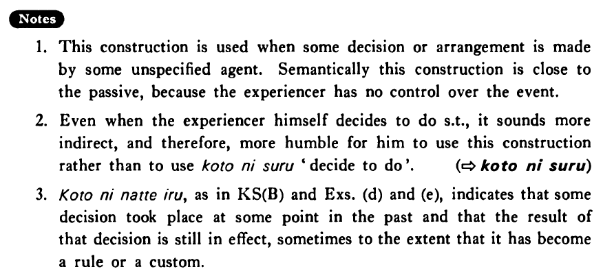

# ことになる

[1. Summary](#summary) 
[2. Formation](#formation) 
[3. Example Sentences](#example-sentences) 
[4. Explanation](#explanation) 
[5. Grammar Book Page](#grammar-book-page) 

## Summary

<table><tr>   <td>Summary</td>   <td>An event takes place as if spontaneously, irrespective of the speaker's volition.</td></tr><tr>   <td>English</td>   <td>It will be decided that ~; come about ~; be arranged that ~; turn out that ~</td></tr><tr>   <td>Part of speech</td>   <td>Phrase</td></tr><tr>   <td>Related expression</td>   <td>ことにする</td></tr></table>

## Formation

<table class="table"> <tbody><tr class="tr head"> <td class="td">Vinformal nonpast</td> <td class="td">ことに {なる/なった}</td> <td class="td">&nbsp;</td> </tr> <tr class="tr"> <td class="td">&nbsp;</td> <td class="td">話すことに {なる/なった}</td> <td class="td">It    will be decided/it has been decided that someone will talk</td> </tr> <tr class="tr"> <td class="td">&nbsp;</td> <td class="td">食べることに {なる/なった}</td> <td class="td">It    will be decide/it has been decided that someone will eat</td> </tr></tbody></table>

## Example Sentences

<table><tr>   <td>().　私は来年大阪に転勤することになった・なりました。</td>   <td>I'm going to be transferred to Osaka next year.</td></tr><tr>   <td>().　日本では車は道の左側を走ることになっている・います。</td>   <td>In Japan cars are supposed to be driven on the left side of the street.</td></tr><tr>   <td>().　私は来月から会社に勤めることになりました。</td>   <td>It has decided that I will be employed at a company beginning next month.</td></tr><tr>   <td>().　多分ジャンセンさんは日本で英語を教えることになるでしょう。</td>   <td>Perhaps it will turn out that Mr. Jansen will teach English in Japan.</td></tr><tr>   <td>().　来年六月に結婚することになりました。</td>   <td>It's been arranged that I will get married next June.</td></tr><tr>   <td>().　スミスさんは日本で英語を教えることになっている。</td>   <td>Mr. Smith is supposed to teach English in Japan.</td></tr><tr>   <td>().　今日山田先生に会うことになっています。</td>   <td>Today (it's been arranged that) I'm seeing Professor Yamada.</td></tr></table>

## Explanation

1. This construction is used when some decision or arrangement is made by some unspecified agent. Semantically this construction is close to the passive, because the experiencer has no control over the event.
  
2. Even when the experiencer himself decides to do something, it sounds more indirect, and therefore, more humble for him to use this construction rather than to use ことにする 'decide to do'.
  
(⇨ <a href="#㊦ ことにする">ことにする</a>)
  
3. ことになっている as in Key Sentence (B) and Examples, (d) and (e), indicates that some decision took place at some point in the past and that the result of that decision is still in effect, sometimes to the extent that it has become a rule or a custom.

## Grammar Book Page

