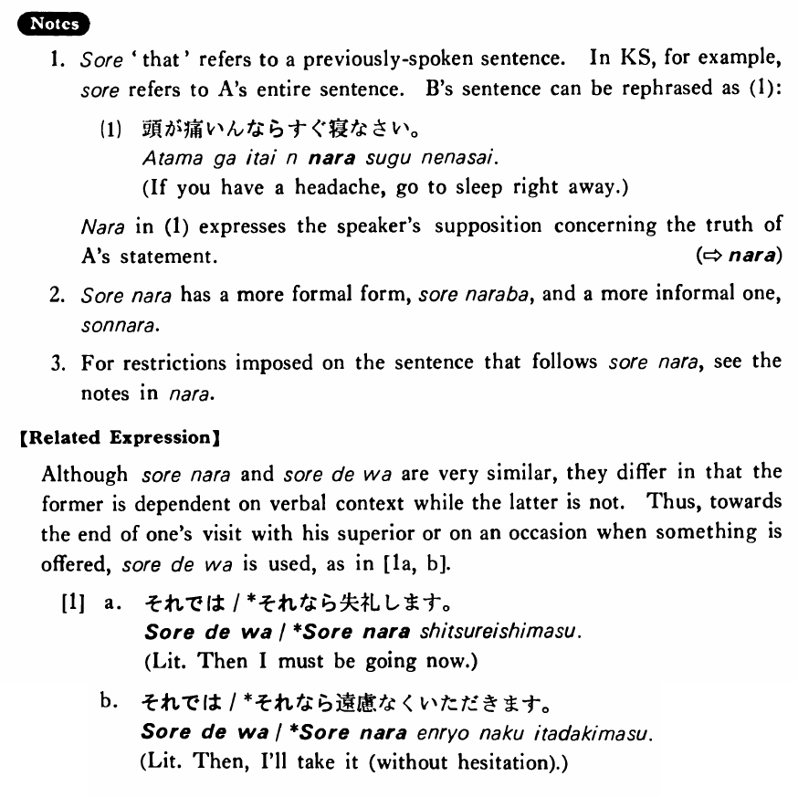

# それなら

 
 
 
 

## Summary

<table><tr>   <td>Summary</td>   <td>If that is the case,</td></tr><tr>   <td>English</td>   <td>Then; in that case</td></tr><tr>   <td>Part of speech</td>   <td>Conjunction</td></tr><tr>   <td>Related expression</td>   <td>それでは</td></tr></table>

## Example Sentences

<table><tr>   <td>A:頭が痛いんです。  B:それなら直ぐ寝なさい。</td>   <td>A: I have a headache.&emsp;&emsp;B: In that case, go to sleep right away.</td></tr><tr>   <td>A:映画を見に行きませんか。  B:明日試験があるんです。  A:それなら、明後日はどうですか。</td>   <td>A: Wouldn't you like to go see a movie?&emsp;&emsp;B: I have an exam tomorrow.&emsp;&emsp;A: Then, how about the day after tomorrow?</td></tr><tr>   <td>A:日本にはどのぐらいいましたか。  B:三年です。  A:それなら、日本のことはよく知っているでしょうね。</td>   <td>A: How long did you stay in Japan?&emsp;&emsp;B: Three years. A: Then, you must know a lot about Japan.</td></tr></table>

## Explanation

1. それ 'that' refers to a previously-spoken sentence. In Key Sentence, for example, それ refers to A's entire sentence. B's sentence can be rephrased as (1):
  <ul>(1) <li>頭が痛いんならすぐ寝なさい。</li> <li>If you have a headache, go to sleep right away.</li> </ul>  
なら in (1) expresses the speaker's supposition concerning the truth of A’s statement.
   
(⇨ <a href="#㊦ なら">なら</a>)
  
2. それなら has a more formal form, それならば and a more informal one, そんなら.
  
3. For restrictions imposed on the sentence that follows それなら, see the notes in なら.
  
【Related Expression】
  
Although それなら and それでは are very similar, they differ in that the former is dependent on verbal context while the latter is not. Thus, towards the end of one's visit with his superior or on an occasion when something is offered, それでは is used, as in [la, b].
  
[1]
 <ul> <li>a. それでは/*それなら失礼します。</li> <li>Literally: Then I must be going now.</li> 

 <li>b. それでは/*それなら遠慮なくいただきます。</li> <li>Literally: Then, I'il take it (without hesitation).</li> </ul>

## Grammar Book Page

