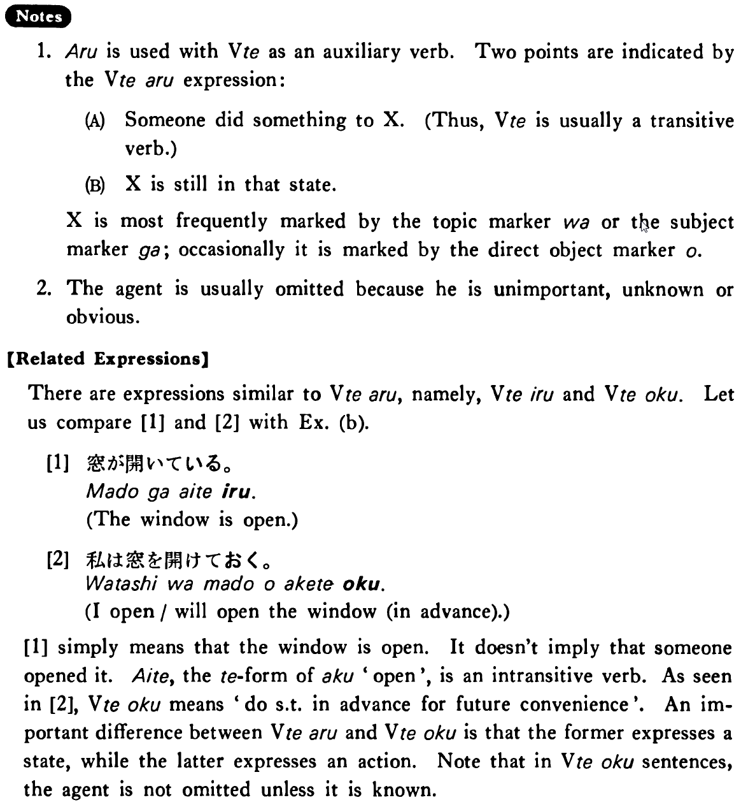

# ある (2)

 
 
 
 
 

## Summary

<table><tr>   <td>Summary</td>   <td>Something has been done to something and the resultant state of that action remains.</td></tr><tr>   <td>English</td>   <td>Have been done; be done</td></tr><tr>   <td>Part of speech</td>   <td>Auxiliary Verb (Group 1)</td></tr><tr>   <td>Related expression</td>   <td>いる2; おく</td></tr></table>

## Formation

<table class="table"><tbody><tr class="tr head"><td class="td">Vてある </td><td class="td">話してある </td><td class="td">Has    been said </td></tr><tr class="tr"><td class="td">&nbsp;</td><td class="td">食べてある </td><td class="td">Has    been eaten </td></tr></tbody></table>

## Example Sentences

<table><tr>   <td>それはもうジョンに話してある・あります。</td>   <td>It's been told to John already.</td></tr><tr>   <td>飲み物はもう買ってあります。</td>   <td>Drinks have already been bought.</td></tr><tr>   <td>窓が開けてある。</td>   <td>The window has been open/is open.</td></tr></table>

## Explanation

1. ある is used with Verbて as an auxiliary verb. Two points are indicated by the Verbてある expression:
  <ul>(A) <li>Someone did something to X. (Thus, Verbて is usually a transitive verb.)</li> </ul>  <ul>(B) <li>X is still in that state.</li> </ul>  
X is most frequently marked by the topic marker は or the subject marker が; occasionally it is marked by the direct object marker を.
  
2. The agent is usually omitted because he is unimportant, unknown or obvious.
  
【Related Expressions】
  
There are expressions similar to Verbてある, namely, Verbている and Verbておく. Let us compare [1] and [2] with Example (b).
  
[1] 
 <ul> <li>窓が開いている。</li> <li>The window is open.</li> </ul>  
[2] 
 <ul> <li>私は窓を開けておく。</li> <li>I open/ will open the window (in advance).</li> </ul>  
[1] simply means that the window is open. It doesn't imply that someone opened it. 開いて, the てform of 開く 'open', is an intransitive verb. As seen in [2], Verbておく means "do something in advance for future convenience'". An important difference between Verbてある and Verbておく is that the former expresses a state, while the latter expresses an action. Note that in Verbておく sentences, the agent is not omitted unless it is known.

## Grammar Book Page

