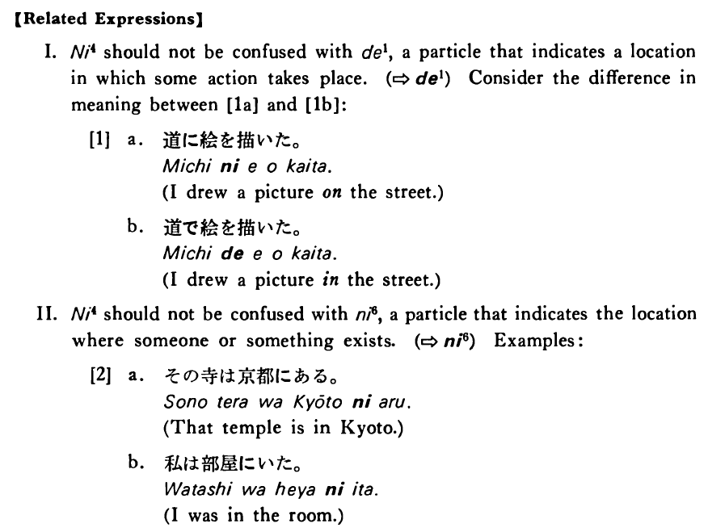

# に (4)

[1. Summary](#summary) 
[2. Example Sentences](#example-sentences) 
[3. Explanation](#explanation) 
[4. Grammar Book Page](#grammar-book-page) 

## Summary

<table><tr>   <td>Summary</td>   <td>A particle that indicates the surface of something upon which some action directly takes place.</td></tr><tr>   <td>Equivalent</td>   <td>On; onto</td></tr><tr>   <td>Part of speech</td>   <td>Particle</td></tr><tr>   <td>Related expression</td>   <td>で1; へ (まで, に7); に6</td></tr></table>

## Example Sentences

<table><tr>   <td>子供は紙に絵を書いた・書きました。</td>   <td>A child has drawn a picture on the paper.</td></tr><tr>   <td>ここにあなたの名前と住所を書いて下さい。</td>   <td>Please write your name and address here.</td></tr><tr>   <td>ヘリコプターが山の上に降りました。</td>   <td>A helicopter landed on the top of the mountain.</td></tr><tr>   <td>オーバーはハンガーに掛けて下さい。</td>   <td>Please hang your overcoat on the hanger.</td></tr><tr>   <td>そんな所に立っていると危ないですよ。</td>   <td>It's dangerous to keep standing in such a place.</td></tr></table>

## Explanation

【Related Expressions】
  
I. に4 should not be confused with で1, a particle that indicates a location in which some action takes place. (⇨ <a href="#㊦ で (1)">で1</a>) Consider the difference in meaning between [1a] and [1b]:
  
[1]
  <ul> <li>a. 道に絵を描いた。</li> <li>I drew a picture on the street.</li> 

 <li>b. 道で絵を描いた。</li> <li>I drew a picture in the street.</li> </ul>  
II. に4 should not be confused with に6, a particle that indicates the location where someone or something exists. (⇨ <a href="#㊦ に (6)">に6</a>) Examples:
  
[2]
  <ul> <li>a. その寺は京都にある。</li> <li>That temple is in Kyoto.</li> 

 <li>b. 私は部屋にいた。</li> <li>I was in the room.</li> </ul>

## Grammar Book Page

