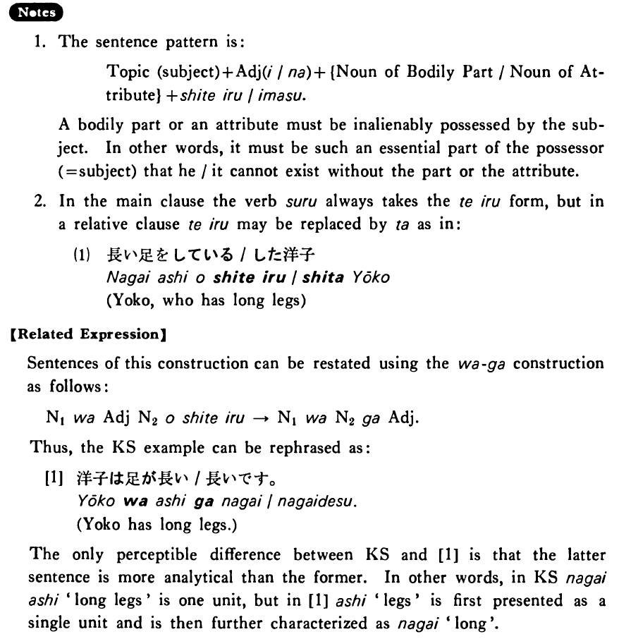

# する (2)

[1. Summary](#summary) 
[2. Example Sentences](#example-sentences) 
[3. Explanation](#explanation) 
[4. Grammar Book Page](#grammar-book-page) 

## Summary

<table><tr>   <td>Summary</td>   <td>Someone or something has some (semi)permanent attribute.</td></tr><tr>   <td>Equivalent</td>   <td>Have</td></tr><tr>   <td>Part of speech</td>   <td>Verb (Irregular)</td></tr><tr>   <td>Related expression</td>   <td>は~が</td></tr></table>

## Example Sentences

<table><tr>   <td>洋子は長い足をしている・います。</td>   <td>Yoko has long legs.</td></tr><tr>   <td>一男は丈夫な体をしています。</td>   <td>Kazuo has a strong body.</td></tr><tr>   <td>この机は丸い形をしている。</td>   <td>This table has a round shape.</td></tr></table>

## Explanation

1. The sentence pattern is:
  <ul> <li>Topic (subject) + Adjectiveい/な + {Noun of Bodily Part/Noun of Attribute} + している/います.</li> </ul>  
A bodily part or an attribute must be inalienably possessed by the subject. In other words, it must be such an essential part of the possessor (=subject) that he/it cannot exist without the part or the attribute.
  
2. In the main clause the verb する always takes the ている form, but in a relative clause ている may be replaced by た as in:
  <ul>(1) <li>長い足をしている/した洋子</li> <li>Yoko, who has long legs</li> </ul>  
【Related Expression】
  
Sentences of this construction can be restated using the は~が construction as follows:
  <ul> <li>Noun1 は Adjective Noun2 をしている → Noun1 は Noun2 が Adjective.</li> </ul>  
Thus, the Key Sentence example can be rephrased as:
  
[1]
  <ul> <li>洋子は足が長い/長いです。</li> <li>Yoko has long legs.</li> </ul>  
The only perceptible difference between Key Sentence and [1] is that the latter sentence is more analytical than the former. In other words, in Key Sentence 長い足 'long legs' is one unit, but in [1] 足 'legs', is first presented as a single unit and is then further characterized as 長い 'long'.

## Grammar Book Page

