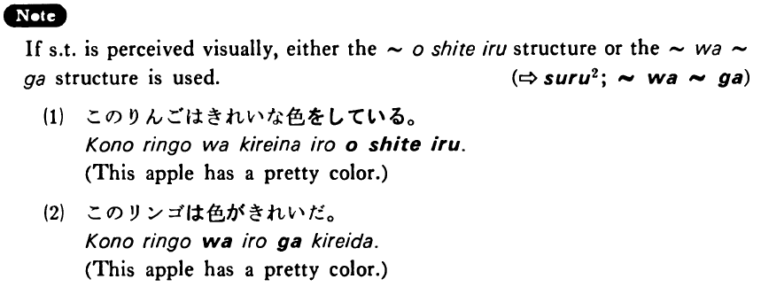

# する (3)

[1. Summary](#summary) 
[2. Example Sentences](#example-sentences) 
[3. Explanation](#explanation) 
[4. Grammar Book Page](#grammar-book-page) 

## Summary

<table><tr>   <td>Summary</td>   <td>Something is perceived by someone’s non-visual senses.</td></tr><tr>   <td>Equivalent</td>   <td>Fear; smell; hear</td></tr><tr>   <td>Part of speech</td>   <td>Verb (Irregular)</td></tr></table>

## Example Sentences

<table><tr>   <td>子供達の声がした・しました。</td>   <td>I heard children's voices.</td></tr><tr>   <td>この魚は変な味がしますね。</td>   <td>This fish tastes funny, doesn't it?</td></tr><tr>   <td>この切れはざらざらしている。</td>   <td>This cloth feels rough.</td></tr><tr>   <td>この花はいい匂いがする。</td>   <td>This flower smells good.</td></tr><tr>   <td>私は寒気がします。</td>   <td>I feel a chill.</td></tr></table>

## Explanation

If something is perceived visually, either the ~をしている structure or the は~が structure is used.
   
(⇨ <a href="#㊦ する (2)">する2</a>; <a href="#㊦ は～が">は~が</a>)
  <ul>(1)  <li>このりんごはきれいな色をしている。</li> <li>This apple has a pretty color.</li> </ul>  <ul>(2)  <li>このリンゴは色がきれいだ。</li> <li>This apple has a pretty color.</li> </ul>

## Grammar Book Page

