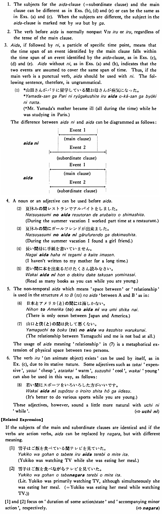

# 間・あいだ(に)

 
 
 
 
 

## Summary

<table><tr>   <td>Summary</td>   <td>The space between two temporal or physical points.</td></tr><tr>   <td>English</td>   <td>During (the time when); while</td></tr><tr>   <td>Part of speech</td>   <td>Phrase</td></tr><tr>   <td>Related expression</td>   <td>ながら; うちに</td></tr></table>

## Formation

<table class="table"><tbody><tr class="tr head"><td class="td">(i) Vて</td><td class="td">いる間（に）</td><td class="td"></td></tr><tr class="tr"><td class="td"></td><td class="td">話している間（に）</td><td class="td">While someone is talking</td></tr><tr class="tr"><td class="td"></td><td class="td">食べている間（に）</td><td class="td">While someone is eating</td></tr><tr class="tr head"><td class="td">(ii) Adjective い</td><td class="td">間（に）</td><td class="td"></td></tr><tr class="tr"><td class="td"></td><td class="td">間（に）高い</td><td class="td">While something is expensive</td></tr><tr class="tr head"><td class="td">(iii) Adjectiveな stem</td><td class="td">な 間（に）</td><td class="td"></td></tr><tr class="tr"><td class="td"></td><td class="td">静かな間（に）</td><td class="td">While something is quiet</td></tr><tr class="tr head"><td class="td">(iv) Noun</td><td class="td">の間（に）</td><td class="td"></td></tr><tr class="tr"><td class="td"></td><td class="td">夏休みの間（に）</td><td class="td">During the summer vacation</td></tr></tbody></table>

## Example Sentences

<table><tr>   <td>私がご飯を食べている間山田さんはテレビを見ていた・いました。</td>   <td>While I was eating my meal, Mr Yamada was watching TV.</td></tr><tr>   <td>私がご飯を食べている間に山田さんが来た・来ました。</td>   <td>While I was eating my meal, Mr. Yamada came in.</td></tr><tr>   <td>スミスさんは日本にいる間英語を教えていました。</td>   <td>Mr. Smith was teaching English (all during the time) while he was in Japan.</td></tr><tr>   <td>子供達がテルビを見ている間私は本を読んでいました。</td>   <td>I was reading a book (all during the time) while my children were watching TV.</td></tr><tr>   <td>高橋さんはアメリカにいる間にゴルフを覚えました。</td>   <td>Mr. Takahashi learned golf while he was in America.</td></tr><tr>   <td>中川さんのお母さんは中川さんがパリに留学している間に病気になりました。</td>   <td>Mr. Nakagawa's mother become ill while he was studying in Paris.</td></tr><tr>   <td>秋子は子供がいない間に本を読む。</td>   <td>Akiko reads books while her children are not at home.</td></tr></table>

## Explanation

1. The subjects for the 間-clause (=subordinate clause) and the main clause can be different as in Exs. (b), (d) and (e) or can be the same as in Exs. (a) and (c). When the subjects are different, the subject in the 間-clause is marked not by は but by が.
  
2. The verb before 間 is normally nonpast Vている or いる regardless of the tense of the main clause.
  
3. 間, if followed by に, a particle of specific time point, means that the time span of an event identified by the main clause falls within the time span of an event identified by the 間-clause, as in Exs. (c) and (e). 間 without に, as in Exs. (a) and (b), indicates that the two events are assumed to cover the same span of time. Thus, if the main verb is a punctual verb, 間 should be used with に. The following sentence, therefore, is ungrammatical.
 <ul>(1)<li> *山田さんがパリに留学している間お母さんが病気になった。</li> <li> *Mr. Yamada's mother became ill (all during the time) while he was studying in Paris.</li> </ul> 
The difference between 間に and 間 can be diagrammed as follows [see bottom of Notes].
  
4. A noun or an adjective can be used before 間.
 <ul> (2). <li>休みの間レストランでアルバイトをしました。</li> <li>During the summer vacation I worked part time at a restaurant.</li> </ul> <ul> (3). <li>休みの間にガールフレンドが出来ました。</li> <li>During the summer vacation I found a girlfriend.</li> </ul> <ul> (4). <li>長い間母に手紙を書いていません。</li> <li>I haven't written to my mother for a long time.</li> </ul> <ul> (5). <li>若い間に本を出来るだけたくさん読みなさい。</li> <li>Read as many books as you can while you are young.</li> </ul>  
5. The non-temporal 間 which means 'space between' or 'relationship' is used in the structure A と B (と) の間 'between A and B' as in:
  <ul> (6). <li>日本とアメリカ(と)の間には海しかない。</li> <li>There is only ocean between Japan and America.</li> </ul> <ul> (7). <li>山口と僕(と)の間は決して悪くない。</li> <li>The relationship between Yamaguchi and me is not bad at all.</li> </ul>  
The usage of 間 meaning 'relationship' in (7) is a metaphorical extension of physical space between two persons.
  
6. The verb いる '(an animate object) exists' can be used by itself, as in Ex. (c), due to its stative nature. Some adjectives such as 高い 'expensive', 安い 'cheap', 暖かい 'warm', 涼しい 'cool', 若い 'young' can also be used in this way, as follows:
  <ul> (8). <li>若い間にスポーツをいろいろした方がいいです。</li> <li>It's better to do various sports while you are young.</li> </ul>  
These adjectives, however, sound a little more natural with うちに 'while '.
   
<h3>[Related Expression]</h3>
  
If the subjects of the main and subordinate clauses are identical and if the verbs are action verbs, 間 can be replaced by ながら but with different meaning.
  <ul> [1] <li>雪子はご飯を食べている間テレビを見ていた。</li> <li>Yukiko was watching TV while she was eating her meal.</li> </ul> <ul> [2] <li>雪子はご飯を食べながらテレビを見ていた。</li> <li>Lit. Yukiko was primarily watching TV, although simultaneously she was eating her meal. (=Yukiko was eating her meal while watching TV.)</li> </ul>  
[1]and [2] focus on 'duration of some action/state' and 'accompanying minor action', respectively.
 
[Table from (1)]
 <table> <tbody><tr> <td width="180" colspan="2" valign="top" style="text-align:center;">  間に</td> <td width="444" valign="top" style="text-align:center;"> -------Event 1-------  (main clause)  Event 2<u></u></td> </tr> <tr> <td>&nbsp;</td> <td width="48" valign="top" style="text-align:center;">&nbsp;</td> <td width="444" valign="top" style="text-align:center;">-----------------------------------------  (subordinate clause)</td> </tr> <tr> <td width="180" colspan="2" valign="top" style="text-align:center;">  間</td> <td width="444" valign="top" style="text-align:center;">(main clause)  Event 2</td> </tr> <tr> <td width="132" valign="top" style="text-align:center;">&nbsp;</td> <td width="48" valign="top" style="text-align:center;">&nbsp;</td> <td width="444" valign="top" style="text-align:center;">-----------------------------------------  (subordinate clause)</td> </tr> </tbody></table>

## Grammar Book Page

