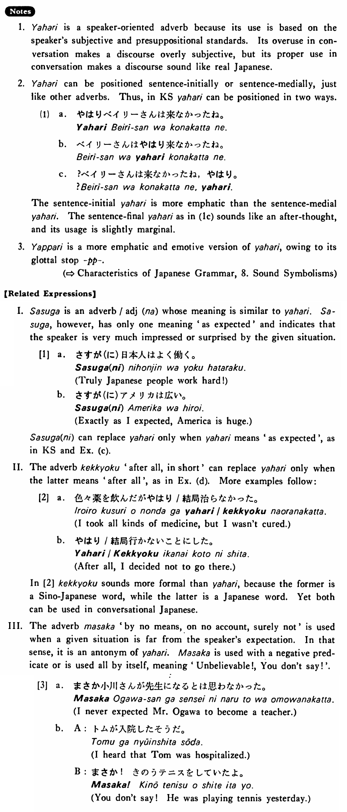

# やはり

[1. Summary](#summary) 
[2. Example Sentences](#example-sentences) 
[3. Explanation](#explanation) 
 

## Summary

<table><tr>   <td>Summary</td>   <td>An adverb indicating that the actual situation expectedly/anticipatively conforms to a standard based on past experience, comparison with other people, or common sense.</td></tr><tr>   <td>English</td>   <td>Still; also; after all; as expected; you know</td></tr><tr>   <td>Part of speech</td>   <td>Adverb</td></tr><tr>   <td>Related expression</td>   <td>結局; さすが(に)</td></tr><tr>   <td>Antonym expression</td>   <td>まさか</td></tr></table>

## Example Sentences

<table><tr>   <td>ベイリーさんはやはり来なかった・来ませんでしたね。</td>   <td>As expected, Mr. Bailey hasn't come, has he?</td></tr><tr>   <td>雪子さんは今でもやはり奇麗です。</td>   <td>Yukiko is still pretty.</td></tr><tr>   <td>お兄さんはテニスが上手ですが、弟さんもやっぱり上手ですよ。</td>   <td>The other brother is good at tennis, and the younger brother is also good at it.</td></tr><tr>   <td>やはり日本のビールは美味しいですね。</td>   <td>As expected, Japanese beer is good.</td></tr><tr>   <td>僕はやはり結婚することにしました。</td>   <td>I've decided to get married, after all.</td></tr></table>

## Explanation

1. やはり is a speaker-oriented adverb because its use is based on the speaker's subjective and presuppositional standards. Its overuse in conversation makes a discourse overly subjective, but its proper use in conversation makes a discourse sound like real Japanese.
  
2. やはり can be positioned sentence-initially or sentence-medially, just like other adverbs. Thus, in Key Sentence やはり can be positioned in two ways.
  <ul>(1) <li>a. やはりベイリーさんは来なかったね。</li> 

 <li>b. ベイリーさんはやはり来なかったね。</li> 

 <li>c. ?ベイリーさんは来なかったね，やはり。</li> </ul>  
The sentence-initial やはり is more emphatic than the sentence-medial やはり. The sentence-final やはり as in (1c) sounds like an after-thought, and its usage is slightly marginal.
  
3. やっぱり is a more emphatic and emotive version of やはり, owing to its glottal stop 'っぱ'.
  
【Related Expressions】
  
I. さすが is an adverb/adjective な whose meaning is similar to やはり. さすが, however, has only one meaning 'as expected' and indicates that the speaker is very much impressed or surprised by the given situation.
  
[1]
  <ul> <li>a. さすが(に)日本人はよく働く。</li> <li>Truly Japanese people work hard!</li> 

 <li>b.さすが(に)アメリカは広い。</li> <li>Exactly as I expected, America is huge.</li> </ul>  
さすが(に) can replace やはり only when やはり means 'as expected', as in Key Sentence and Example (c).
  
II. The adverb 結局 'after all, in short' can replace やはり only when the latter means 'after all', as in Example (d). More examples follow:
  
[2]
  <ul> <li>a. 色々薬を飲んだがやはリ/結局治らなかった。</li> <li>I took all kinds of medicine, but I wasn't cured.</li> 

 <li>b.やはリ/結局行かないことにした。</li> <li>After all, I decided not to go there.</li> </ul>  
In [2] 結局 sounds more formal than やはり, because the former is a Sino-Japanese word, while the latter is a Japanese word. Yet both can be used in conversational Japanese.
   
III. The adverb まさか 'by no means, on no account, surely not' is used when a given situation is far from the speaker's expectation. In that sense, it is an antonym of やはり. まさか is used with a negative predicate or is used all by itself, meaning 'Unbelievable!, You don't say!'.
  
[3]
  <ul> <li>a. まさか小川さんが先生になるとは思わなかった。</li> <li>I never expected Mr. Ogawa to become a teacher.</li> </ul>  <ul>b.  <li>A: トムが入院したそうだ。</li> <li>I heard that Tom was hospitalized.</li> 

 <li>B: まさか！　きのうテニスをしていたよ。</li> <li>You don't say! He was playing tennis yesterday.</li> </ul>

## Grammar Book Page

