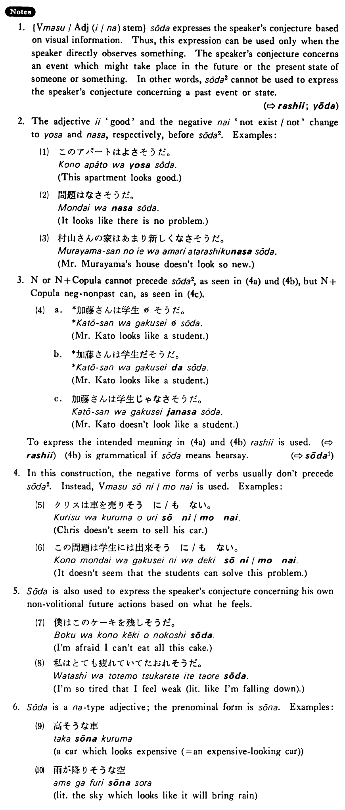

# そうだ (2)

[1. Summary](#summary) 
[2. Formation](#formation) 
[3. Example Sentences](#example-sentences) 
[4. Explanation](#explanation) 
[5. Grammar Book Page](#grammar-book-page) 

## Summary

<table><tr>   <td>Summary</td>   <td>An auxiliary adjective which indicates that what is expressed by the preceding sentence is the speaker’s conjecture concerning an event in the future or the present state of someone or something, based on what the speaker sees or feels.</td></tr><tr>   <td>Equivalent</td>   <td>Look; look like; appear; seem; feel like</td></tr><tr>   <td>Part of speech</td>   <td>Auxiliary Adjective (な)</td></tr><tr>   <td>Related expression</td>   <td>そうだ1; ようだ (だろう; らしい)</td></tr></table>

## Formation

<table class="table"> <tbody><tr class="tr head"> <td class="td">(i)  Vます</td> <td class="td">そうだ </td> <td class="td">&nbsp;</td> </tr> <tr class="tr"> <td class="td">&nbsp;</td> <td class="td">話しそうだ </td> <td class="td">It    looks like someone will talk</td> </tr> <tr class="tr"> <td class="td">&nbsp;</td> <td class="td">食べそうだ </td> <td class="td">It    looks like someone will eat</td> </tr> <tr class="tr head"> <td class="td">(ii)  Adjective い/な stem</td> <td class="td">そうだ </td> <td class="td">&nbsp;</td> </tr> <tr class="tr"> <td class="td">&nbsp;</td> <td class="td">高そうだ </td> <td class="td">Something    looks expensive</td> </tr> <tr class="tr"> <td class="td">&nbsp;</td> <td class="td">静かそうだ </td> <td class="td">Something    looks quiet</td> </tr></tbody></table>

## Example Sentences

<table><tr>   <td>雨が降りそうだ・そうです。</td>   <td>It looks like it will rain.</td></tr><tr>   <td>あの車が高そうだ・そうです。</td>   <td>That car looks expensive.</td></tr><tr>   <td>この家は強い風が吹いたら倒れそうだ。</td>   <td>It looks like this house will fall down when a strong wind blows.</td></tr><tr>   <td>あのステーキは美味しそうだった。</td>   <td>That steak looked delicious.</td></tr><tr>   <td>この辺りは静かそうだ。</td>   <td>This neighbourhood looks quiet.</td></tr></table>

## Explanation

1. {Verbます/Adjective(い/な)stem} そうだ expresses the speaker's conjecture based on visual information. Thus, this expression can be used only when the speaker directly observes something. The speaker's conjecture concerns an event which might take place in the future or the present state of someone or something. In other words, そうだ2 cannot be used to express the speaker's conjecture concerning a past event or state.
  
(⇨ <a href="#㊦ らしい">らしい</a>; <a href="#㊦ ようだ">ようだ</a>)
  
2. The adjective いい 'good' and the negative ない 'not exist/not' change to よそ and なさ, respectively, before そうだ2. Examples:
  (1) <li>このアパートはよさそうだ。</li> <li>This apartment looks good.</li>  <ul>(2) <li>問題はなさそうだ。</li> <li>It looks like there is no problem.</li>  <ul>(3) <li>村山さんの家はあまり新しくなさそうだ。</li> <li>Mr. Murayama's house doesn't look so new.</li> </ul>  
3. Noun or Noun+Copula cannot precede そうだ2, as seen in (4a) and (4b), but Noun+Copula negative nonpast can, as seen in (4c).
  <ul>(4) <li>a. *加藤さんは学生∅そうだ。</li> <li>Mr. Kato looks like a student.</li> 

 <li>b. *加藤さんは学生だそうだ。</li> <li>Mr. Kato looks like a student.</li> 

 <li>c. 加藤さんは学生じゃなさそうだ。</li> <li>Mr. Kato doesn't look like a student.</li> </ul>  
To express the intended meaning in (4a) and (4b) らしい is used. 
  
(⇨ <a href="#㊦ らしい">らしい</a>) 
  
(4b) is grammatical if そうだ means hearsay.
  
(⇨ <a href="#㊦ そうだ (1)">そうだ1</a>)
  
4. In this construction, the negative forms of verbs usually don't precede そうだ2. Instead, Verbますそうに/もない is used. Examples:
  <ul>(5) <li>クリスは車を売りそうに/もない。</li> <li>Chris doesn't seem to sell his car.</li> </ul>  <ul>(6) <li>この問題は学生には出来そうに/もない。</li> <li>It doesn't seem that the students can solve this problem.</li> </ul>  
5. そうだ is also used to express the speaker's conjecture concerning his own non-volitional future actions based on what he feels.
  <ul>(7) <li>僕はこのケーキを残しそうだ。</li> <li>I’m afraid I can’t eat all this cake.</li> </ul>  <ul>(8) <li>私はとても疲れていてたおれそうだ。</li> <li>I’m so tired that I feel weak (literally: like I’m falling down).</li> </ul>  
6. そうだ is a な type adjective; the prenominal form is そうな. Examples:
  <ul>(9) <li>高そうな車</li> <li>A car which looks expensive (= an expensive-looking car).</li> </ul>  <ul>(10) <li>雨が降りそうな空</li> <li>Literally: the sky which looks like it will bring rain.</li> </ul>

## Grammar Book Page

