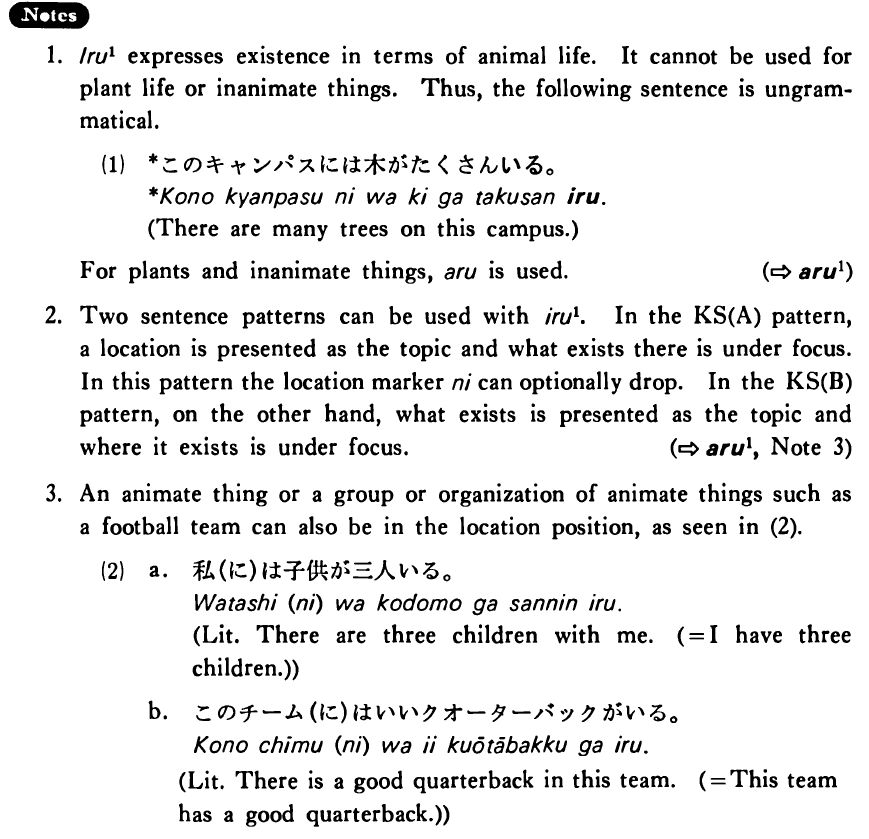

# いる (1)

[1. Summary](#summary) 
[2. Example Sentences](#example-sentences) 
[3. Explanation](#explanation) 
[4. Grammar Book Page](#grammar-book-page) 

## Summary

<table><tr>   <td>Summary</td>   <td>An animate thing exists.</td></tr><tr>   <td>English</td>   <td>Be; exist; stay</td></tr><tr>   <td>Part of speech</td>   <td>Verb (Group 2)</td></tr><tr>   <td>Related expression</td>   <td>ある1</td></tr></table>

## Example Sentences

<table><tr>   <td>この町(に)は日本人が沢山いる・います。</td>   <td>In this town are many Japanese.</td></tr><tr>   <td>リーはこの寮にいる・います。</td>   <td>Lee is in this dorm.</td></tr><tr>   <td>この動物園にはパンダがいます。</td>   <td>There are pandas in this zoo.</td></tr><tr>   <td>スチーブは今ロビンのアパートにいる。</td>   <td>Steve is in Robin's apartment now.</td></tr></table>

## Explanation

1. いる1 expresses existence in terms of animal life. It cannot be used for plant life or inanimate things. Thus, the following sentence is ungrammatical.
  <ul>(1)  <li>*このキャンパスには木がたくさんいる。</li> <li>There are many trees on this campus.</li> </ul> 
For plants and inanimate things, ある is used.
   
(⇨ <a href="#㊦ ある (1)">㊦ ある (1)</a>)
  
2. Two sentence patterns can be used with いる1. In the Key Sentence (A) pattern, a location is presented as the topic and what exists there is under focus. In this pattern the location marker に can optionally drop. In the Key Sentence (B) pattern, on the other hand, what exists is presented as the topic and where it exists is under focus.
 
(⇨ <a href="#㊦ ある (1)">㊦ ある (1)</a>, Note 3)
  
3. An animate thing or a group or organization of animate things such as a football team can also be in the location position, as seen in (2).
  <ul>(2)  <li>a. 私(に)は子供が三人いる。</li> <li>Literally: There are three children with me. (= I have three children.)</li> 

 <li>b. このチーム(に)はいいクオ一ターバックがいる。</li> <li>Literally: There is a good quarterback in this team. = This team has a good quarterback.)</li> </ul>

## Grammar Book Page

