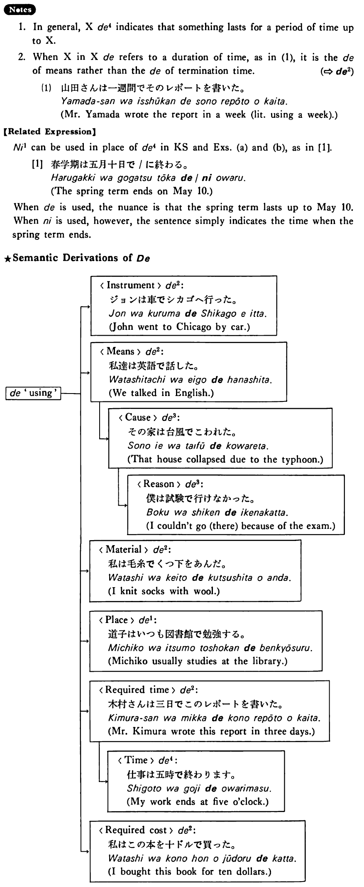

# で (4)

[1. Summary](#summary) 
[2. Example Sentences](#example-sentences) 
[3. Explanation](#explanation) 
 

## Summary

<table><tr>   <td>Summary</td>   <td>A particle which indicates the time when something terminates or the amount of time a period of activity has taken.</td></tr><tr>   <td>English</td>   <td>At; on; in</td></tr><tr>   <td>Part of speech</td>   <td>Particle</td></tr><tr>   <td>Related expression</td>   <td>に1</td></tr></table>

## Example Sentences

<table><tr>   <td>春学期は五月十日で終わる・終わります。</td>   <td>The spring term ends on May 10.</td></tr><tr>   <td>このコンサートは十時で終わります。</td>   <td>This concert will be over at ten o'clock.</td></tr><tr>   <td>私のパスポートは六月で切れる。</td>   <td>My passport expires in June.</td></tr><tr>   <td>アメリカに来てから今日で三年になる。</td>   <td>It's been three years since I came to America.</td></tr></table>

## Explanation

1. In general, Xで4 indicates that something lasts for a period of time up to X. 
  
2. When X in Xで refers to a duration of time, as in (1), it is the で of means rather than the で of termination time.
  
(⇨ <a href="#㊦ で (2)">で2</a>)
  <ul>(1) <li>山田さんは一週間でそのレポートを書いた。</li> <li>Mr. Yamada wrote the report in a week (literally: using a week).</li> </ul>  
【Related Expression】
  
に1 can be used in place of で4 in Key Sentence and Examples (a) and (b), as in [1].
  
[1]
 <ul> <li>春学期は五月十日で/に終わる。</li> <li>The spring term ends on May 10.</li> </ul>  
When で is used, the nuance is that the spring term lasts up to May 10. When に is used, however, the sentence simply indicates the time when the spring term ends. 
  
★Semantic derivations of で
  <table class="table"> <tbody> <tr class="tr"> <td class="td"></td> <td class="td"></td> <td class="td">→<Instrument>で2: ジョンは車でシカゴへ行った。 John when to Chicago by car.</td> <td class="td"></td> <td class="td"></td> </tr> <tr class="tr"> <td class="td">で 'using'―</td> <td class="td"></td> <td class="td">→<Means>で2: 私達は英語で話した。 We talked in English.</td> <td class="td"></td> <td class="td"></td> </tr> <tr class="tr"> <td class="td"></td> <td class="td"></td> <td class="td"></td> <td class="td">⤷<Cause>で3: その家は台風で壊れた。 That house collapsed due to the typhoon.</td> <td class="td"></td> </tr> <tr class="tr"> <td class="td"></td> <td class="td"></td> <td class="td"></td> <td class="td"></td> <td class="td">⤷<Reason>で3: 僕は試験で行けなかった。 I couldn't go (there) because of the exam.</td> </tr> <tr class="tr"> <td class="td"></td> <td class="td"></td> <td class="td">→<Material>で2 私は毛糸で靴下を編んだ。 I knit socks with wool.</td> <td class="td"></td> <td class="td"></td> </tr> <tr class="tr"> <td class="td"></td> <td class="td"></td> <td class="td">→<Place>で1 道子はいつも図書館で勉強する。 Michiko usually studies at the library.</td> <td class="td"></td> <td class="td"></td> </tr> <tr class="tr"> <td class="td"></td> <td class="td"></td> <td class="td">→<Required time>で2: 木村さんは三日でこのレポートを書いた。 Mr. Kimura wrote this report in three days.</td> <td class="td"></td> <td class="td"></td> </tr> <tr class="tr"> <td class="td"></td> <td class="td"></td> <td class="td"></td> <td class="td">⤷<Time>で4: 仕事は五時で終わります。 My work ends at five o'clock.</td> <td class="td"></td> </tr> <tr class="tr"> <td class="td"></td> <td class="td"></td> <td class="td">→<Required cost>で2 私はこの本を十ドルで買った。 I bought this book for ten dollars.</td> <td class="td"></td> <td class="td"></td> </tr> </tbody> </table>

## Grammar Book Page

