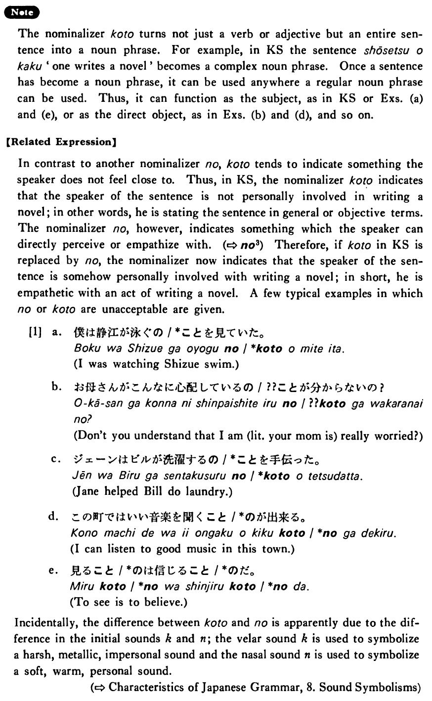

# こと (2)

[1. Summary](#summary) 
[2. Formation](#formation) 
[3. Example Sentences](#example-sentences) 
[4. Explanation](#explanation) 
[5. Grammar Book Page](#grammar-book-page) 

## Summary

<table><tr>   <td>Summary</td>   <td>A nominaliser used to indicate the speaker’s relative lack of empathy with the content of the sentence he is nominalising.</td></tr><tr>   <td>English</td>   <td>To ~; ~ing; that</td></tr><tr>   <td>Part of speech</td>   <td>Nominaliser</td></tr><tr>   <td>Related expression</td>   <td>の3</td></tr></table>

## Formation

<table class="table"> <tbody><tr class="tr head"> <td class="td">(i)  {V/Adjective い}    informal</td> <td class="td">こと </td> <td class="td">&nbsp;</td> </tr> <tr class="tr"> <td class="td">&nbsp;</td> <td class="td">{話す /話した} こと</td> <td class="td">(the    fact) that someone talks/talked</td> </tr> <tr class="tr"> <td class="td">&nbsp;</td> <td class="td">{高い /高かった} こと</td> <td class="td">(the    fact) that something is/was expensive</td> </tr> <tr class="tr head"> <td class="td">(ii)  Adjective な stem</td> <td class="td">{な/だった} こと</td> <td class="td">&nbsp;</td> </tr> <tr class="tr"> <td class="td">&nbsp;</td> <td class="td">{静かな/静かだった} こと</td> <td class="td">(the    fact) that something is/was quiet</td> </tr> <tr class="tr head"> <td class="td">(iii)  Noun</td> <td class="td">{である/であった/だった} こと</td> <td class="td">&nbsp;</td> </tr> <tr class="tr"> <td class="td">&nbsp;</td> <td class="td">{先生である/先生であった/先生だった} こと</td> <td class="td">(the    fact) that someone is/was a teacher</td> </tr></tbody></table>

## Example Sentences

<table><tr>   <td>小説を書くことは難しい（です）。</td>   <td>Writing a novel is hard.</td></tr><tr>   <td>若い時にいい友達を作ることはとても大事だ。</td>   <td>It is very important to make good friends when one is young.</td></tr><tr>   <td>大学四年の時フランスに留学することを考えています。</td>   <td>I am thinking of studying in France during my senior year.</td></tr><tr>   <td>日本の文化が面白いことは分かるが、ユニークだとは思わない。</td>   <td>I know that Japanese culture is interesting, but I don't think that it is unique.</td></tr><tr>   <td>スイスが奇麗なことは写真で知っています。</td>   <td>From pictures I know that Switzerland is beautiful.</td></tr><tr>   <td>あの人がいい人であることは確かです。</td>   <td>He is without doubt a good person.</td></tr></table>

## Explanation

The nominalizer こと turns not just a verb or adjective but an entire sentence into a noun phrase. For example, in Key Sentence the sentence 小説を書く 'one writes a novel' becomes a complex noun phrase. Once a sentence has become a noun phrase, it can be used anywhere a regular noun phrase can be used. Thus, it can function as the subject, as in Key Sentence or Examples (a) and (e), or as the direct object, as in Examples (b) and (d), and so on.
  
【Related Expression】
  
In contrast to another nominalizer の, こと tends to indicate something the speaker does not feel close to. Thus, in Key Sentence, the nominalizer こと indicates that the speaker of the sentence is not personally involved in writing a novel; in other words, he is stating the sentence in general or objective terms. The nominalizer の, however, indicates something which the speaker can directly perceive or empathize with. (⇨ <a href="#㊦ の (3)">の3</a>) Therefore, if こと in Key Sentence is replaced by の, the nominalizer now indicates that the speaker of the sentence is somehow personally involved with writing a novel; in short, he is empathetic with an act of writing a novel. A few typical examples in which の or こと are unacceptable are given.
  
[1]
  <ul> <li>a. 僕は静江が泳ぐの/*ことを見ていた。</li> <li>I was watching Shizue swim.</li> 

 <li>b. お母さんがこんなに心配しているの/??ことが分からないの？</li> <li>Don't you understand that I am (literally: your mom is) really worried?</li> 

 <li>c. ジェーンはビルが洗濯するの/*ことを手伝った。</li> <li>Jane helped Bill do laundry.</li> 

 <li>d. この町ではいい音楽を聞くこと/*のが出来る。</li> <li>I can listen to good music in this town.</li> 

 <li>e. 見ること/*のは信じること/*のだ。</li> <li>To see is to believe.</li> </ul>  
Incidentally, the difference between こと and の is apparently due to the difference in the initial sounds 'k' and 'n'; the velar sound 'k' is used to symbolize a harsh, metallic, impersonal sound and the nasal sound 'n' is used to symbolize a soft, warm, personal sound.

## Grammar Book Page

