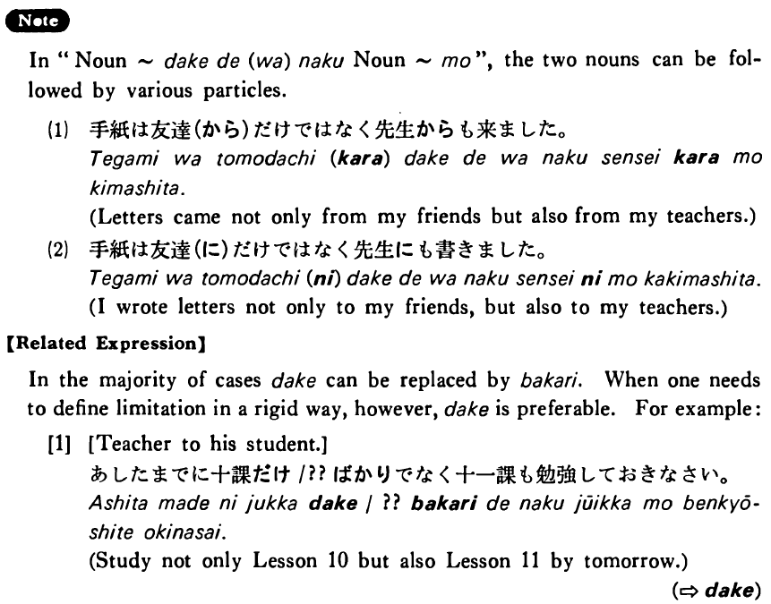

# だけで(は)なく～(も)

[1. Summary](#summary) 
[2. Formation](#formation) 
[3. Example Sentences](#example-sentences) 
[4. Explanation](#explanation) 
 

## Summary

<table><tr>   <td>Summary</td>   <td>Not only X but also Y, where X and Y can be either a noun, a verb, or an adjective.</td></tr><tr>   <td>English</td>   <td>Not only ~ but also ~</td></tr><tr>   <td>Part of speech</td>   <td>Phrase</td></tr><tr>   <td>Related expression</td>   <td>ばかりで(は)なく~も</td></tr></table>

## Formation

<table class="table"><tbody><tr class="tr head"><td class="td">(i) {V/Adjective い} informal</td><td class="td">だけで(は)なく</td><td class="td">Not only ~</td></tr><tr class="tr"><td class="td"></td><td class="td">{話す/話した}だけで(は)なく</td><td class="td">Someone not only speaks/spoke ~</td></tr><tr class="tr"><td class="td"></td><td class="td">{高い/高かった}だけで(は)なく</td><td class="td">Something is/was not only expensive ~</td></tr><tr class="tr head"><td class="td">(ii) Adjective な stem</td><td class="td">{な/だった} だけで(は)なく</td><td class="td">Not only ~</td></tr><tr class="tr"><td class="td"></td><td class="td">{静かな/静かだった}だけで(は)なく</td><td class="td">Something is/was not only quiet ~</td></tr><tr class="tr head"><td class="td">(iii) Noun</td><td class="td">{Ø/だった}だけで(は)なく</td><td class="td">Not only ~</td></tr><tr class="tr"><td class="td"></td><td class="td">{先生/ 先生だった}だけで(は)なく</td><td class="td">Not only teachers/not only someone was a teacher</td></tr></tbody></table>

## Example Sentences

<table><tr>   <td>あの人はよく勉強するだけで(は)なくよく遊ぶ・遊びます。</td>   <td>He not only studies hard, but also plays a lot.</td></tr><tr>   <td>あの人は頭がいいだけで(は)なくよく勉強(も)する・します。</td>   <td>He is not only smart; he studies hard, too.</td></tr><tr>   <td>このうちは奇麗なだけで(は)なくとても安い(です)。</td>   <td>This house is not only beautiful but it is also inexpensive.</td></tr><tr>   <td>ジョンだけで(は)なくメアリーも来た・来ました。</td>   <td>Not only John but also Mary came here.</td></tr><tr>   <td>あの人は小説を読むだけではなく書きます。</td>   <td>He not only reads novels but also writes them.</td></tr><tr>   <td>ブラウンさんは日本へ行っただけではなく住んだこともあります。</td>   <td>Mr. Brown has not only been to Japan, but has lived there.</td></tr><tr>   <td>このアパートは高いだけでなく大変狭いです。</td>   <td>This apartment is not only expensive but it is also very small.</td></tr><tr>   <td>幸子は頭がよかっただけではなく、とても親切でした。</td>   <td>Sachiko was not only bright but also very kind.</td></tr><tr>   <td>この車は奇麗なだけではなく、よく走ります。</td>   <td>This car is not only pretty but also runs well.</td></tr><tr>   <td>日本人だけではなくアメリカ人もよく働きます。</td>   <td>Not only Japanese but Americans also work hard.&nbsp;</td></tr><tr>   <td>中村さんはアメリカやヨーロッパだけではなく東南アジアにもよく出張します。</td>   <td>Mr. Nakamura makes a business trip not only to America and Europe but also to Southeast Asia.</td></tr><tr>   <td>ジョンソンさんは日本語だけではなく中国語も話せます。</td>   <td>Mr. Johnson can speak not only Japanese but also Chinese.</td></tr></table>

## Explanation

In "Noun ~だけで(は)なく Noun~ も", the two nouns can be followed by various particles.
  
[1]
  <ul> <li>手紙は友達(から)だけではなく先生からも来ました。</li> <li>Letters came not only from my friends but also from my teachers.</li> </ul>  
[2]
  <ul> <li>手紙は友達(に)だけではなく先生にも書きました。</li> <li>I wrote letters not only to my friends, but also to my teachers.</li> </ul>  
【Related Expression】
  
In the majority of cases だけ can be replaced by ばかり. When one needs to define limitation in a rigid way, however, だけ is preferable. For example:
  <ul>[1] [Teacher to his student.] 

 <li>あしたまでに十課だけ/??ばかりでなく十一課も勉強しておきなさい。</li> <li>Study not only Lesson 10 but also Lesson 11 by tomorrow.</li> </ul>  
(⇨ <a href="#㊦ だけ">だけ</a>)

## Grammar Book Page

