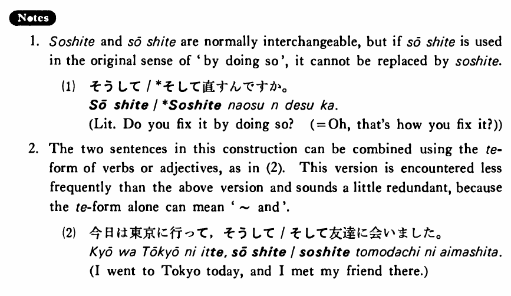

# そして

[1. Summary](#summary) 
[2. Example Sentences](#example-sentences) 
[3. Explanation](#explanation) 
[4. Grammar Book Page](#grammar-book-page) 

## Summary

<table><tr>   <td>Summary</td>   <td>A coordinate conjunction that connects two sentences.</td></tr><tr>   <td>English</td>   <td>And; and then</td></tr><tr>   <td>Part of speech</td>   <td>Conjunction</td></tr><tr>   <td>Related expression</td>   <td>それから</td></tr></table>

## Example Sentences

<table><tr>   <td>今日は東京に行った・行きました。そして友達に会った・会いました。</td>   <td>I went to Tokyo today. And I met my friend there.</td></tr><tr>   <td>昨日は朝ゴルフをしました。そして午後はテニスをしました。</td>   <td>Yesterday I played golf in the morning. And I played tennis in the afternoon.</td></tr><tr>   <td>この映画はつまらない。そして長過ぎる。</td>   <td>This movie is uninteresting. And it's too long.</td></tr><tr>   <td>この花は奇麗です。そして安いです。</td>   <td>This flower is pretty. And it is inexpensive.</td></tr></table>

## Explanation

1. そして and そうして are normally interchangeable, but if そうして is used in the original sense of 'by doing so', it cannot be replaced by そして.
  <ul>(1) <li>そうして/*そして直すんですか。</li> <li>Literally: Do you fix it by doing so? (= Oh, that’s how you fix it?)</li> </ul>  
2. The two sentences in this construction can be combined using the て-form of verbs or adjectives, as in (2). This version is encountered less frequently than the above version and sounds a little redundant, because the て-form alone can mean '~ and'.
  <ul>(2) <li>今日は東京に行って、そうして/そして友達に会いました。</li> <li>I went to Tokyo today, and I met my friend there.</li> </ul>

## Grammar Book Page

