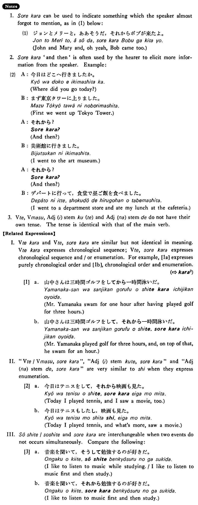

# それから

 
 
 
 
 

## Summary

<table><tr>   <td>Summary</td>   <td>A conjunction that indicates (1) temporally contiguous actions or states, or (2) a cumulative listing of objects, actions or states.</td></tr><tr>   <td>English</td>   <td>After that; and then; in addition to that</td></tr><tr>   <td>Part of speech</td>   <td>Conjunction</td></tr><tr>   <td>Related expression</td>   <td>から2; し; そして</td></tr></table>

## Formation

<table class="table"> <tbody><tr class="tr head"> <td class="td">(i)  {Vて/Vます}</td> <td class="td">それから </td> <td class="td">&nbsp;</td> </tr> <tr class="tr"> <td class="td">&nbsp;</td> <td class="td">{話して /話し}, それから</td> <td class="td">Someone    talks, and then ~</td> </tr> <tr class="tr"> <td class="td">&nbsp;</td> <td class="td">{食べて /食べ}, それから</td> <td class="td">Someone    eats, and then ~</td> </tr> <tr class="tr head"> <td class="td">(ii)  Adjective い stem</td> <td class="td">く(て)、それから</td> <td class="td">&nbsp;</td> </tr> <tr class="tr"> <td class="td">&nbsp;</td> <td class="td">高く(て)、それから</td> <td class="td">Something    is not only expensive but ~</td> </tr> <tr class="tr head"> <td class="td">(iii)  Adjective な stem</td> <td class="td">で、それから </td> <td class="td">&nbsp;</td> </tr> <tr class="tr"> <td class="td">&nbsp;</td> <td class="td">静かで、それから </td> <td class="td">Something    is not only quiet but ~</td> </tr> <tr class="tr head"> <td class="td">(iv)  Noun1 (と) Noun 2 (と) </td> <td class="td">それからNoun3</td> <td class="td">&nbsp;</td> </tr> <tr class="tr"> <td class="td">&nbsp;</td> <td class="td">英語(と)日本語(と)、それから中国語</td> <td class="td">English,    Japanese and Chinese</td> </tr></tbody></table>

## Example Sentences

<table><tr>   <td>昨日は二時間ぐらい友達と飲んでそれからうちに帰った・帰りました。</td>   <td>Yesterday I drank with my friend for about two hours and then went home.</td></tr><tr>   <td>昨日は二時間ぐらい友達と飲んだ。それから本屋に寄ってうちに帰った。</td>   <td>Yesterday I drank with my friend for about two hours. Then I dropped by a bookstore and went home.</td></tr><tr>   <td>十時まで宿題をしました。それから映画に行きました。</td>   <td>I did my homework until 10 o'clock. And then, I went to the movie.</td></tr><tr>   <td>昨日は朝銀座に行って、それから映画を見に行った。</td>   <td>Yesterday morning I went to Ginza and then went to see a movie.</td></tr><tr>   <td>レストランではステーキとサラダとそれからチーズケーキを食べました。</td>   <td>At the restaurant I ate steak, salad, and cheesecake.</td></tr><tr>   <td>湖の色は初めは青く、それから緑になりました。</td>   <td>The colour of the lake was blue in the beginning and then turned green.</td></tr><tr>   <td>月曜、火曜、それから木曜もとても忙しいです。</td>   <td>I am very busy on Monday, Tuesday, and Thursday, too.</td></tr></table>

## Explanation

1. それから can be used to indicate something which the speaker almost forgot to mention, as in (1) below:
  <ul>(1) <li>ジョンとメリーと，ああそうだ，それからボブが来たよ。</li> <li>John and Mary and, oh yeah, Bob came too.</li> </ul>  
2. それから 'and then' is often used by the hearer to elicit more information from the speaker, example:  <ul>(2) <li>A: 今日はどこへ行きましたか。</li> <li>Where did you go today?</li> 

 <li>B: まず東京タワーに上りました。</li> <li>First we went up Tokyo Tower.</li> 

 <li>A: それから？</li> <li>And then?</li> 

 <li>B: 美術館に行きました。</li> <li>I went to the art museum.</li> 

 <li>A: それから？</li> <li>And then?</li> 

 <li>B: デパートに行って，食堂で昼ご飯を食べました。</li> <li>I went to a department store and ate my lunch at the cafeteria.</li> </ul>  
3. Verbて, Verbます, Adjectiveい stemく(て) and Adjectiveな stemで do not have their own tense. The tense is identical with that of the main verb.
  
【Related Expressions】
  
1. Verbてから and Verbて、それから are similar but not identical in meaning. Verbてから expresses chronological sequence; Verbて、それから expresses chronological sequence and/or enumeration. For example, [1a] expresses purely chronological order and [1b], chronological order and enumeration.
  
(⇨ <a href="#㊦ から (2)">から2</a>)
  
[1]
 <ul> <li>a. 山中さんは三時間ゴルフをしてから一時間泳いだ。</li> <li>Mr. Yamanaka swam for one hour after having played golf for three hours.</li> 

 <li>b. 山中さんは三時間ゴルフをして、それから一時間泳いだ。</li> <li>Mr. Yamanaka played golf tor three hours, and, on top of that, he swam for an hour.</li> </ul>  
II. "Verbて/Verbます、それから", "Adjectiveい stemくて、それから" and "Adjectiveなstemで、それから" are very similar to し when they express enumeration.
  
[2] 
 <ul> <li>a. 今日はテニスをして、それから映画も見た。</li> <li>Today I played tennis, and I saw a movie, too.</li> 

 <li>b. 今日はテニスもしたし、映画も見た。</li> <li>Today I played tennis, and what’s more, saw a movie.</li> </ul>  
III. そうして/そして and それから are interchangeable when two events do not occurs simultaneously. Compare the following:
   
[3]
 <ul> <li>a. 音楽を間いて、そうして勉強するのが好きだ。</li> <li>I like to listen to music while studying. / I like to listen to music first and then study.</li> 

 <li>b. 音楽を聞いて、それから勉強するのが好きだ。</li> <li>I like to listen to music first and then study.</li> </ul>

## Grammar Book Page

