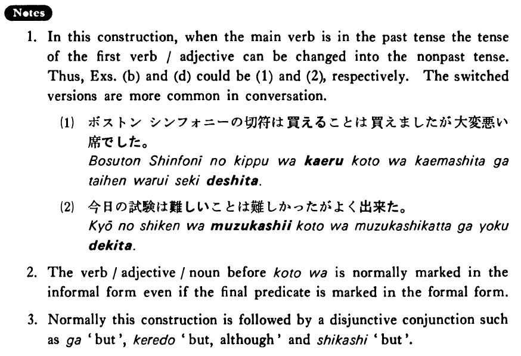

# ことは

[1. Summary](#summary) 
[2. Formation](#formation) 
[3. Example Sentences](#example-sentences) 
[4. Explanation](#explanation) 
[5. Grammar Book Page](#grammar-book-page) 

## Summary

<table><tr>   <td>Summary</td>   <td>Speaking of proposition X, X is certainly true.</td></tr><tr>   <td>English</td>   <td>Indeed one does something alright, (but ~); indeed ~ (but ~); do ~ (but ~)</td></tr><tr>   <td>Part of speech</td>   <td>Phrase</td></tr></table>

## Formation

<table class="table"> <tbody><tr class="tr head"> <td class="td">(i)  {V1/Adjective い1}    informal</td> <td class="td">ことは{V2/Adjective い2}</td> <td class="td">Where    {V1/Adjective い1}={V1/Adjective い2}</td> </tr> <tr class="tr"> <td class="td">&nbsp;</td> <td class="td">話すことは{話す/話します}</td> <td class="td">Someone    does talk</td> </tr> <tr class="tr"> <td class="td">&nbsp;</td> <td class="td">話したことは{話した/話しました}</td> <td class="td">Someone    did talk</td> </tr> <tr class="tr"> <td class="td">&nbsp;</td> <td class="td">高いことは高い(です}</td> <td class="td">Something    is expensive</td> </tr> <tr class="tr"> <td class="td">&nbsp;</td> <td class="td">高かったことは高かった(です}</td> <td class="td">Something    was expensive</td> </tr> <tr class="tr head"> <td class="td">(ii)  {Adjective な stem1 なこと/Noun1}</td> <td class="td">は{Adjective な stem2/Noun2} {だ /です}</td> <td class="td">Where    {Adjective な    stem1 /    Noun1}={Adjective な    stem2/Noun2}</td> </tr> <tr class="tr"> <td class="td">&nbsp;</td> <td class="td">静かなことは静か{だ/です}</td> <td class="td">Something    is quiet</td> </tr> <tr class="tr"> <td class="td">&nbsp;</td> <td class="td">いい人はいい人{だ/です}</td> <td class="td">Someone    is a good person</td> </tr> <tr class="tr head"> <td class="td">(iii)  {Adjective な stem1/   Noun1}</td> <td class="td">だったことは {Adjective な stem2/   Noun2} {だった/でした}</td> <td class="td">Where    {Adjective な    stem1/Noun1}={Adjective な stem2/   Noun2}</td> </tr> <tr class="tr"> <td class="td">&nbsp;</td> <td class="td">静かだったことは静か{だった/でした}</td> <td class="td">Something    was quiet</td> </tr> <tr class="tr"> <td class="td">&nbsp;</td> <td class="td">いい人だったことは人{だった/でした}</td> <td class="td">Someone    was a good person</td> </tr></tbody></table>

## Example Sentences

<table><tr>   <td>私はテニスをすることはする・しますが上手じゃない・上手じゃありません。</td>   <td>I do play tennis, but I am not good at it.</td></tr><tr>   <td>ジョーンズさんは日本語を話すことは話しますが、簡単なことしか言えません。</td>   <td>Mr. Jones does speak Japanese, but he can say only simply things.</td></tr><tr>   <td>ボストンシンフォニーの切符は買えたことは買えましたが、大変悪い席でした。</td>   <td>I could buy a ticket for the Boston Symphony alright, but it was a very bad seat.</td></tr><tr>   <td>この店は安いことは安いですが、ものが良くありません。</td>   <td>This store is inexpensive alright, but its goods are of poor quality.</td></tr><tr>   <td>今日の試験は難しかったことは難しかったが、よく出来た。</td>   <td>Today's test was indeed difficult, but I did well on it.</td></tr><tr>   <td>私のアパートは駅に近くて便利なことは便利ですが、家賃がとても高いです。</td>   <td>My apartment is close to the station and convenient alright, but the rent is very high.</td></tr><tr>   <td>その女の子が好きだったことは好きでしたが、結婚はしなかったんです。</td>   <td>I did like the girl, but I didn’t marry her.</td></tr><tr>   <td>あの人はいい人はいいだったけれど頑固だったね。</td>   <td>He was indeed a good person, but he was stubborn, wasn’t he?</td></tr></table>

## Explanation

1. In this construction, when the main verb is in the past tense the tense of the first verb/adjective can be changed into the nonpast tense. Thus, Examples (b) and (d) could be (1) and (2), respectively. The switched versions are more common in conversation.
  <ul>(1) <li>ボストン・シンフォニーの切符は買えることは買えましたが大変悪い席でした。</li> </ul>  <ul> (2) <li>今日の試験は難しいことは難しかったがよく出来た。</li> </ul>  
2. The verb/adjective/noun before ことは is normally marked in the informal form even if the final predicate is marked in the formal form.
  
3. Normally this construction is followed by a disjunctive conjunction such as が 'but', けれど 'but, although', and しかし 'but'.

## Grammar Book Page

