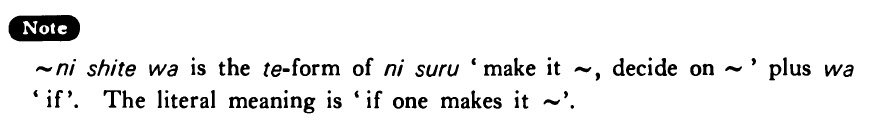

# にしては

[1. Summary](#summary) 
[2. Formation](#formation) 
[3. Example Sentences](#example-sentences) 
[4. Explanation](#explanation) 
 

## Summary

<table><tr>   <td>Summary</td>   <td>A phrase that indicates a generally agreed upon standard (the entire sentence that includes this phrase expresses some deviation from that standard.)</td></tr><tr>   <td>English</td>   <td>For ~; considering that ~</td></tr><tr>   <td>Part of speech</td>   <td>Particle</td></tr><tr>   <td>Related expression</td>   <td>としては</td></tr></table>

## Formation

<table class="table"> <tbody><tr class="tr head"> <td class="td">(i)  Noun</td> <td class="td">(だった) にしては</td> <td class="td">&nbsp;</td> </tr> <tr class="tr"> <td class="td">&nbsp;</td> <td class="td">先生(だった) にしては</td> <td class="td">Considering    that someone is/was a teacher</td> </tr> <tr class="tr head"> <td class="td">(ii) Vinformal</td> <td class="td">にしては </td> <td class="td">&nbsp;</td> </tr> <tr class="tr"> <td class="td">&nbsp;</td> <td class="td">{話す /話した} にしては</td> <td class="td">Considering    that someone talks/talked</td> </tr></tbody></table>

## Example Sentences

<table><tr>   <td>高山さんは日本人にしては大きい・大きいです。</td>   <td>Mr. Takayama is big for a Japanese person.</td></tr><tr>   <td>ボブは日本語をよく勉強しているにしては下手だ・下手です。</td>   <td>Considering that Bob is studying Japanese hard, he is poor at it.</td></tr><tr>   <td>八月にしては涼しいですね。</td>   <td>For August is it cool, isn't it?</td></tr><tr>   <td>これは日本の車にしては大きいですね。</td>   <td>For a Japanese car this is big, isn't it?</td></tr><tr>   <td>彼はレスラーだったにしては体が小さい。</td>   <td>Considering that he was a wrestler, he is small.</td></tr><tr>   <td>青木さんはアメリカに十年いたにしては英語があまり上手じゃない。</td>   <td>Considering that Mr. Aoki spent ten years in America, his English is not very good.</td></tr></table>

## Explanation

にしては is the て form of にする 'make it ~, decide on ~' plus は 'if'. The literal meaning is 'if one makes it ~'.

## Grammar Book Page

