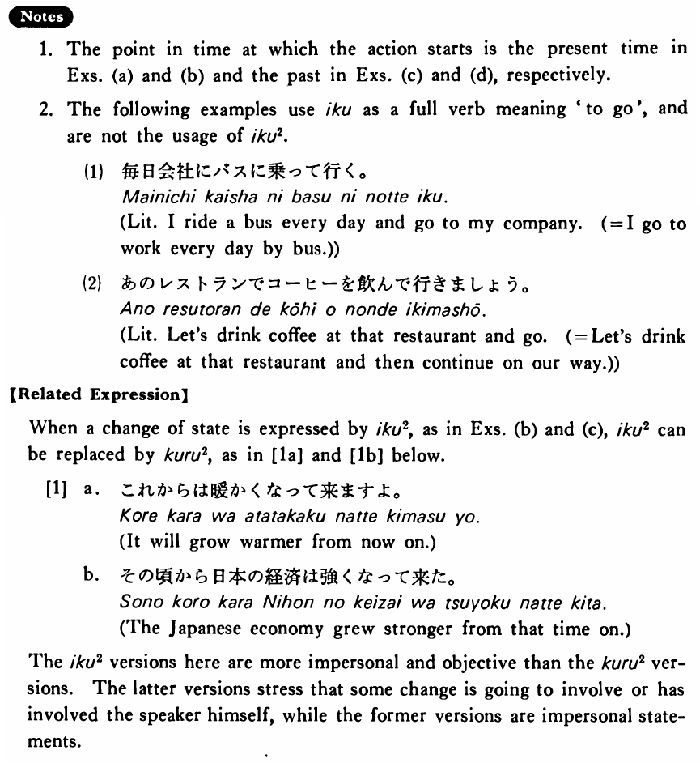

# 行く・いく (2)

[1. Summary](#summary) 
[2. Formation](#formation) 
[3. Example Sentences](#example-sentences) 
[4. Explanation](#explanation) 
 

## Summary

<table><tr>   <td>Summary</td>   <td>Some action or state keeps changing from the point in time at which the speaker first describes the action.</td></tr><tr>   <td>English</td>   <td>Go on ~ing; continue; grow; become</td></tr><tr>   <td>Part of speech</td>   <td>Auxiliary Verb (Group 1)</td></tr><tr>   <td>Related expression</td>   <td>来る2</td></tr></table>

## Formation

<table class="table"> <tbody><tr class="tr head"> <td class="td">Vて</td> <td class="td">行く </td> <td class="td">&nbsp;</td> </tr> <tr class="tr"> <td class="td">&nbsp;</td> <td class="td">話して行く </td> <td class="td">Someone    continues to talk</td> </tr> <tr class="tr"> <td class="td">&nbsp;</td> <td class="td">食べて行く </td> <td class="td">Someone    continues to eat</td> </tr></tbody></table>

## Example Sentences

<table><tr>   <td>これからは寒くなって行く・行きますよ。</td>   <td>It will get colder (and continue to be that way) from now on.</td></tr><tr>   <td>これからは毎日本を一冊読んで行くつもりです。</td>   <td>I intend to keep reading one book a day from now on.</td></tr><tr>   <td>これからは暖かくなって行きますよ。</td>   <td>It will grow warmer (and continue in that way) from now on.</td></tr><tr>   <td>その頃から日本の経済は強くなって行った。</td>   <td>The Japanese economy grew stronger (and continued to grow that way) from that time on.</td></tr><tr>   <td>分からないことをノートに書いて行った。</td>   <td>I went on taking notes on things I didn't understand.</td></tr></table>

## Explanation

1. The point in time at which the action starts is the present time in Examples (a) and (b) and the past in Examples (c) and (d), respectively.
  
2. The following examples use 行く as a full verb meaning 'to go' and are not the usage of 行く2.
  <ul>(1) <li>毎日会社にバスに乗って行く。</li> <li>Literally: I ride a bus every day and go to my company. (= I go to work every day by bus.)</li> </ul>  <ul>(2) <li>あのレストランでコーヒーを飲んで行きましょう。</li> <li>Literally: Let's drink coffee at that restaurant and go. (= Let's drink coffee at that restaurant and then continue on our way.)</li> </ul>  
【Related Expression】
  
When a change of state is expressed by 行く2, as in Examples (b) and (c), 行く2 can be replaced by 来る2, as in [1a] and [1b] below.
  
[1]
  <ul> <li>a. これからは暖かくなって来ますよ。</li> <li>It will grow warmer from now on.</li> 

 <li>b. その頃から日本の経済は強くなって来た。</li> <li>The Japanese economy grew stronger from that time on.</li> </ul>  
The 行く2 versions here are more impersonal and objective than the 来る2 versions. The latter versions stress that some change is going to involve or has involved the speaker himself, while the former versions are impersonal statements.

## Grammar Book Page

