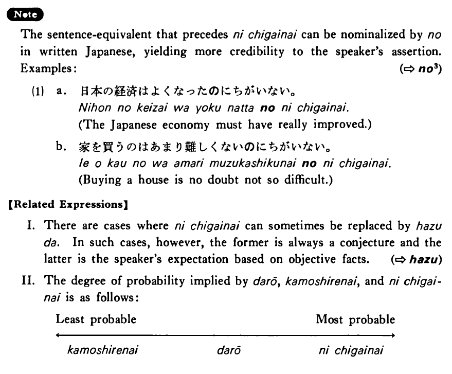

# に違いない・にちがいない

[1. Summary](#summary) 
[2. Formation](#formation) 
[3. Example Sentences](#example-sentences) 
[4. Explanation](#explanation) 
[5. Grammar Book Page](#grammar-book-page) 

## Summary

<table><tr>   <td>Summary</td>   <td>The speaker is convinced that there is no mistake on his part in guessing something.</td></tr><tr>   <td>Equivalent</td>   <td>There is no doubt that ~; must be ~; no doubt</td></tr><tr>   <td>Part of speech</td>   <td>Phrase</td></tr><tr>   <td>Related expression</td>   <td>だろう; はず; かもしれない</td></tr></table>

## Formation

<table class="table"> <tbody><tr class="tr head"> <td class="td">(i)  {Vinformal/Adjective い}    informal</td> <td class="td">に違いない </td> <td class="td">&nbsp;</td> </tr> <tr class="tr"> <td class="td">&nbsp;</td> <td class="td">{話す /話した} に違いない</td> <td class="td">Someone    will no doubt talk/someone no doubt talked</td> </tr> <tr class="tr"> <td class="td">&nbsp;</td> <td class="td">{食べる /食べた} に違いない</td> <td class="td">Someone    will no doubt eat/someone no doubt ate</td> </tr> <tr class="tr"> <td class="td">&nbsp;</td> <td class="td">{高い /高かった} に違いない</td> <td class="td">Something    is/was no doubt expensive</td> </tr> <tr class="tr head"> <td class="td">(ii)  {Adjective な stem/   Noun}</td> <td class="td">{Ø/だった} に違いない</td> <td class="td">&nbsp;</td> </tr> <tr class="tr"> <td class="td">&nbsp;</td> <td class="td">{静か /静かだった} に違いない</td> <td class="td">Something    is/was no doubt quiet</td> </tr> <tr class="tr"> <td class="td">&nbsp;</td> <td class="td">{先生 /先生だった} に違いない</td> <td class="td">Someone    is/was no doubt a teacher</td> </tr></tbody></table>

## Example Sentences

<table><tr>   <td>下田さんは今日のことを忘れたに違いない・違いありません。</td>   <td>Mr. Shimoda must have forgotten today’s plans.</td></tr><tr>   <td>あの先生の試験は難しいに違いない・違いません。</td>   <td>That teacher's exams must be hard.</td></tr><tr>   <td>ベイリーさんはテニスが上手に違いない・違いありません。</td>   <td>Mr. Bailey must be good at tennis.</td></tr><tr>   <td>あの人は日本人に違いない・違いありません。</td>   <td>That person must be Japanese.</td></tr><tr>   <td>二人は今頃ハワイで楽しく泳いでいるに違いない。</td>   <td>The two must be enjoying swimming in Hawaii.</td></tr><tr>   <td>一人で外国へ行くのは大変に違いない。</td>   <td>It must be hard to go to a foreign country alone.</td></tr><tr>   <td>山口さんは頭がいいに違いない。</td>   <td>Mr. Yamaguchi must be bright.</td></tr><tr>   <td>あれはトンプソンさんに違いない。</td>   <td>That must be Mr. Thompson.</td></tr></table>

## Explanation

The sentence-equivalent that precedes に違いない can be nominalized by の in written Japanese, yielding more credibility to the speakers assertion. Examples:
   
(⇨ <a href="#㊦ の (3)">の3</a>)
  <ul>(1) <li>a. 日本の経済はよくなったのに違いない。</li> <li>The Japanese economy must have really improved.</li> 

 <li>b. 家を買うのはあまり難しくないのに違いない。</li> <li>Buying a house is no doubt not so difficult.</li> </ul>  
【Related Expressions】
  
I. There are cases where に違いない can sometimes be replaced by はずだ. In such cases, however, the former is always a conjecture and the latter is the speaker's expectation based on objective facts. 
  
(⇨ <a href="#㊦ はず">はず</a>)
  
II. The degree of probability implied by だろう, かもしれない, and に違いない is as follows:
  <table class="table"> <tbody> <tr class="tr"> <td class="td">Least probable</td> <td class="td"></td> <td class="td">Most probable</td> </tr> <tr class="tr"> <td class="td">
</td> <td class="td">
</td> <td class="td">
</td> </tr> <tr class="tr"> <td class="td">かもしれない</td> <td class="td">だろう</td> <td class="td">に違いない</td> </tr> </tbody> </table>

## Grammar Book Page

