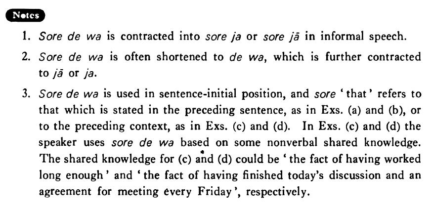

# それでは

 
 
 
 

## Summary

<table><tr>   <td>Summary</td>   <td>If that is the case</td></tr><tr>   <td>English</td>   <td>If so; then; well then</td></tr><tr>   <td>Part of speech</td>   <td>Conjunction</td></tr><tr>   <td>Related expression</td>   <td>それなら</td></tr></table>

## Example Sentences

<table><tr>   <td>A:このオレンジは甘くないです。  B:それではこれはどう（ですか）。</td>   <td>A: This orange is not sweet.&emsp;&emsp;B: How about this one, then?</td></tr><tr>   <td>A:僕は魚も肉も嫌いです。  B:それでは何を食べるんですか。</td>   <td>A: I hate both fish and meat.&emsp;&emsp;B: Then, what do you eat.</td></tr><tr>   <td>A:今日の午後テニスをしませんか。  B:今日の午後はちょっと都合が悪いんですが。&nbsp;&nbsp;&nbsp;A:それでは明日の午後はどうですか。</td>   <td>A: Wouldn't you like to play tennis this afternoon?&emsp;&emsp;B: This afternoon is not convenient for me, but...&emsp;&emsp;A: Then, how about tomorrow afternoon?</td></tr><tr>   <td>それでは二十分ぐらい休みましょう。</td>   <td>Well then, let's take a break for about twenty minutes.</td></tr><tr>   <td>それではまた来週の金曜日に来ます。</td>   <td>Well then, I'll come again next Friday.</td></tr></table>

## Explanation

1. それでは is contracted into それじゃ or それじゃあ in informal speech.
  
2. それでは is often shortened to では, which is further contracted to じゃあ or じゃ.
  
3. それでは is used in sentence-initial position, and それ 'that' refers to that which is stated in the preceding sentence, as in Examples (a) and (b), or to the preceding context, as in Examples (c) and (d). In Examples (c) and (d) the speaker uses それでは based on some nonverbal shared knowledge. The shared knowledge for (c) and (d) could be 'the fact of having worked long enough' and 'the fact of having finished today's discussion and an agreement for meeting every Friday', respectively.

## Grammar Book Page

