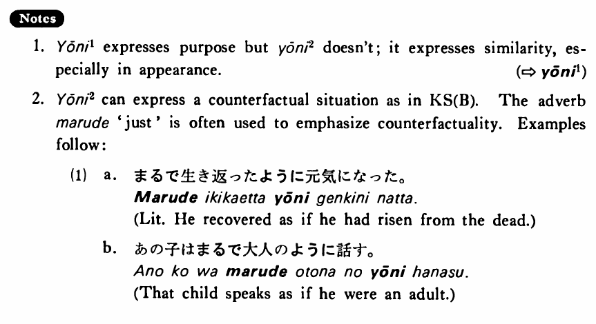

# ように (2)

[1. Summary](#summary) 
[2. Formation](#formation) 
[3. Example Sentences](#example-sentences) 
[4. Explanation](#explanation) 
 

## Summary

<table><tr>   <td>Summary</td>   <td>An adverbial form of ようだ</td></tr><tr>   <td>English</td>   <td>As; like</td></tr><tr>   <td>Part of speech</td>   <td>Auxiliary Adjective (な)</td></tr></table>

## Formation

<table class="table"> <tbody><tr class="tr head"> <td class="td">(i)  {V/Adjective い}    informal</td> <td class="td">ように </td> <td class="td">&nbsp;</td> </tr> <tr class="tr"> <td class="td">&nbsp;</td> <td class="td">{話す /話した} ように</td> <td class="td">As    someone talks/talked; as if someone (had) talked</td> </tr> <tr class="tr"> <td class="td">&nbsp;</td> <td class="td">{高い /高かった} ように</td> <td class="td">As    something is/was expensive; as if something were/had been expensive</td> </tr> <tr class="tr head"> <td class="td">(ii)  Adjective な stem</td> <td class="td">{な/だった} ように</td> <td class="td">&nbsp;</td> </tr> <tr class="tr"> <td class="td">&nbsp;</td> <td class="td">{静かな/静かだった} ように</td> <td class="td">As    something is/was quiet; as if something were/had been quiet</td> </tr> <tr class="tr head"> <td class="td">(iii)  Noun</td> <td class="td">{の/だった} ように</td> <td class="td">&nbsp;</td> </tr> <tr class="tr"> <td class="td">&nbsp;</td> <td class="td">{先生の/先生だった} ように</td> <td class="td">Like    a teacher/as someone was a teacher; as if someone were/had been a teacher</td> </tr></tbody></table>

## Example Sentences

<table><tr>   <td>私が言うように書いて下さい。</td>   <td>Please write it down as I tell you.</td></tr><tr>   <td>今日は春になったように暖かい・暖かいです。</td>   <td>Today is as warm as if it had become spring.</td></tr><tr>   <td>ドロシーは日本人のように日本語を話す・話します。</td>   <td>Dorothy speaks Japanese like a Japanese.</td></tr><tr>   <td>前に話したように私は来月会社を辞めます。</td>   <td>As I told you before, I'm going to quit the company next month.</td></tr><tr>   <td>上田さんのように走れますか。</td>   <td>Can you run like Mr. Ueda?</td></tr><tr>   <td>若い時のようには元気がなくなった。</td>   <td>I don't feel as strong as I used to when I was young.</td></tr><tr>   <td>土井さんはいつものように朝六時に起きた。</td>   <td>As usual Mr. Doi got up at six in the morning.</td></tr><tr>   <td>兄がスポーツが上手なように弟も上手だ。</td>   <td>Just like the older brother, the younger brother is also good at sports.</td></tr><tr>   <td>猫が可愛いように犬も可愛い。</td>   <td>Dogs are cute, just like cats.</td></tr></table>

## Explanation

1. ように1 expresses purpose but ように2 doesn't; it expresses similarity, especially in appearance.
  
(⇨ <a href="#㊦ ように (1)">ように1</a>)
  
2. ように2 can express a counterfactual situation as in Key Sentence (B). The adverb まるで 'just' is often used to emphasize counterfactuality. Examples follow:
  <ul>(1) <li>a. まるで生き返ったように元気になった。</li> <li>Literally: He recovered as if he had risen from the dead.</li> 

 <li>b. あの子はまるで大人のように話す。</li> <li>That child speaks as if he were an adult.</li> </ul>

## Grammar Book Page

