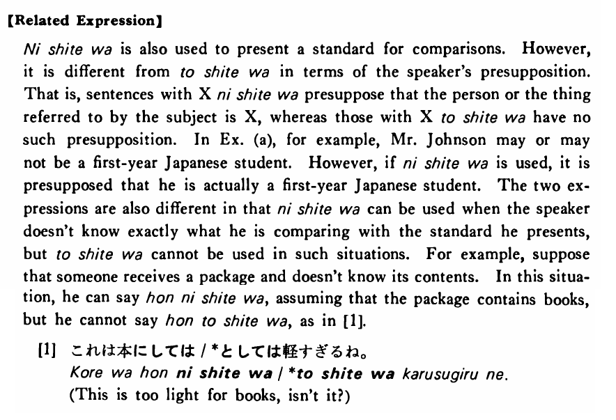

# としては

[1. Summary](#summary) 
[2. Formation](#formation) 
[3. Example Sentences](#example-sentences) 
[4. Explanation](#explanation) 
[5. Grammar Book Page](#grammar-book-page) 

## Summary

<table><tr>   <td>Summary</td>   <td>A compound particle which indicates a standard for comparisons.</td></tr><tr>   <td>Equivalent</td>   <td>For</td></tr><tr>   <td>Part of speech</td>   <td>Particle</td></tr><tr>   <td>Related expression</td>   <td>にしては</td></tr></table>

## Formation

<table class="table"> <tbody><tr class="tr head"> <td class="td">Noun</td> <td class="td">としては </td> <td class="td">&nbsp;</td> </tr> <tr class="tr"> <td class="td">&nbsp;</td> <td class="td">先生としては </td> <td class="td">For    a teacher</td> </tr></tbody></table>

## Example Sentences

<table><tr>   <td>このステーキは日本のステーキとしては安い・安いです。</td>   <td>This steak is inexpensive for Japanese steak.</td></tr><tr>   <td>ジョンソンさんは日本語の一年生としては日本語が上手だ。</td>   <td>Mr. Johnson is good at Japanese for a first-year student (of Japanese).</td></tr><tr>   <td>これは日本のアパートとしては大きい方です。</td>   <td>For a Japanese apartment, this is one of the bigger ones.</td></tr></table>

## Explanation

【Related Expression】
  
にしては is also used to present a standard for comparisons. However, it is different from としては in terms of the speaker's presupposition. That is, sentences with Xにしては presuppose that the person or the thing referred to by the subject is X, whereas those with Xとしては have no such presupposition. In Example (a), for example, Mr. Johnson may or may not be a first-year Japanese student. However, if にしては is used, it is presupposed that he is actually a first-year Japanese student. The two expressions are also different in that ni shite wa can be used when the speaker doesn't know exactly what he is comparing with the standard he presents, but としては cannot be used in such situations. For example, suppose that someone receives a package and doesn't know its contents. In this situation, he can say 本にしては, assuming that the package contains books, but he cannot say 本としては as in [1].
  
[1]
  <ul> <li>これは本にしては/*としては軽すぎるね。</li> <li>This is too light for books, isn’t it?</li> </ul>

## Grammar Book Page

