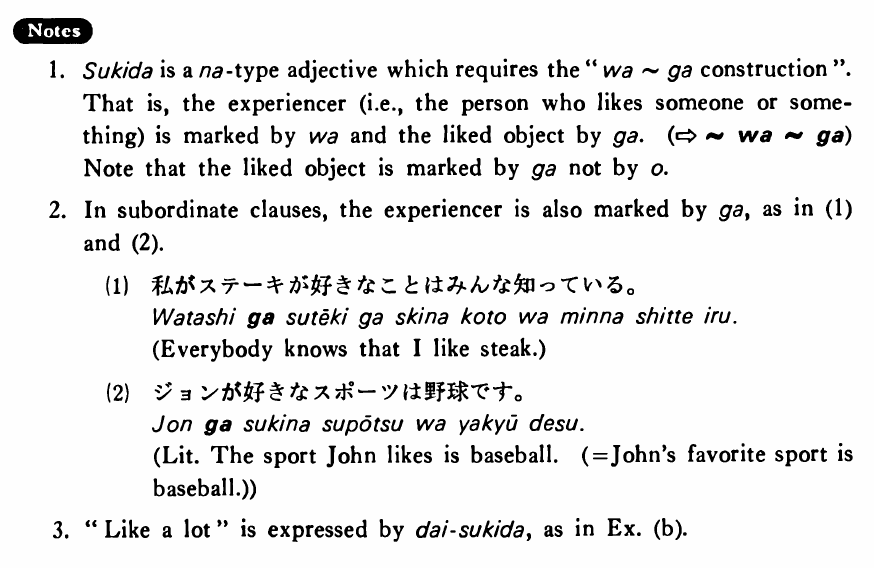

# 好きだ・すきだ

[1. Summary](#summary) 
[2. Example Sentences](#example-sentences) 
[3. Explanation](#explanation) 
[4. Grammar Book Page](#grammar-book-page) 

## Summary

<table><tr>   <td>Summary</td>   <td>Something or someone is what someone likes.</td></tr><tr>   <td>English</td>   <td>Like; be fond of</td></tr><tr>   <td>Part of speech</td>   <td>Adjective (な)</td></tr><tr>   <td>Related expression</td>   <td>嫌いだ</td></tr></table>

## Example Sentences

<table><tr>   <td>私はステーキが好きだ・好きです。</td>   <td>I like steak.</td></tr><tr>   <td>僕は野球が好きだ。</td>   <td>I like baseball.</td></tr><tr>   <td>ジョンソンさんはジャズが大好きです。</td>   <td>Mr. Johnson loves jazz.</td></tr></table>

## Explanation

1. 好きだ is a な type adjective which requires the "は~が construction". That is, the experiencer (i.e., the person who likes someone or something) is marked by は and the liked object by が. (⇨ <a href="#㊦ は～が">は~が</a>) Note that the liked object is marked by が not by を.
  
2. In subordinate clauses, the experiencer is also marked by が, as in (1) and (2).
  <ul>(1) <li>私がステーキが好きなことはみんな知っている。</li> <li>Everybody knows that I like steak.</li> </ul>  <ul>(2) <li>ジョンが好きなスポーツは野球です。</li> <li>Literally: The sport John likes is baseball. (= John's favorite sport is baseball.)</li> </ul>  
3. "Like a lot" is expressed by 大好きだ, as in Example (b).

## Grammar Book Page

