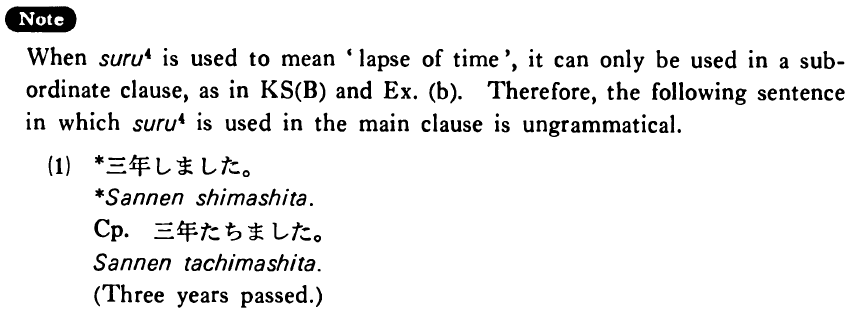

# する (4)

[1. Summary](#summary) 
[2. Example Sentences](#example-sentences) 
[3. Explanation](#explanation) 
[4. Grammar Book Page](#grammar-book-page) 

## Summary

<table><tr>   <td>Summary</td>   <td>A verb that indicates how much something costs or a duration of time.</td></tr><tr>   <td>Equivalent</td>   <td>Cost; lapse</td></tr><tr>   <td>Part of speech</td>   <td>Verb (Irregular)</td></tr></table>

## Example Sentences

<table><tr>   <td>この時計は十万円する・します。</td>   <td>This watch costs 100,000 yen.</td></tr><tr>   <td>後一年したら大学を出る・出ます。</td>   <td>In another year I'll graduate from college.</td></tr><tr>   <td>A:それはどのぐらいしましたか。  B:二十五万円ぐらいしました。</td>   <td>A: About how much did it cost?&emsp;&emsp;B: It cost about 250,000 yen.</td></tr><tr>   <td>もう少しすれば主人が帰ってまいります。</td>   <td>In a short time my husband will be here.</td></tr></table>

## Explanation

When する4 is used to mean 'lapse of time', it can only be used in a subordinate clause, as in Key Sentence (B) and Ex. (b). Therefore, the following sentence in which する4 is used in the main clause is ungrammatical.
  <ul>(1) <li>*三年しました。</li> <li>Correct: 三年たちました。</li> <li>Three years passed.</li> </ul>

## Grammar Book Page

