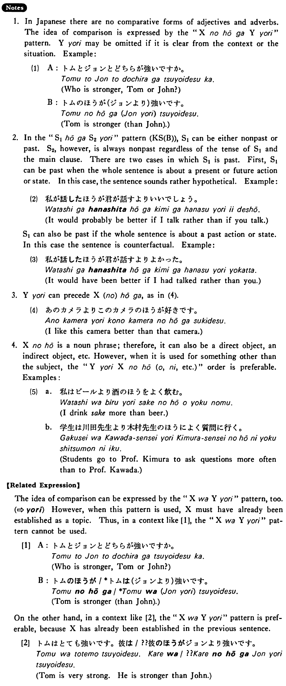

# ほうが~より

 
 
 
 
 

## Summary

<table><tr>   <td>Summary</td>   <td>Comparing two entities, one is in some state or does something more than the other.</td></tr><tr>   <td>English</td>   <td>~ be more (adjective) than ~; ~ do something more (adverb) than ~ do</td></tr><tr>   <td>Part of speech</td>   <td>Phrase</td></tr><tr>   <td>Related expression</td>   <td>より</td></tr></table>

## Formation

<table class="table"> <tbody><tr class="tr head"> <td class="td">(i)  Noun</td> <td class="td">のほうがNounより</td> <td class="td">&nbsp;</td> </tr> <tr class="tr"> <td class="td">&nbsp;</td> <td class="td">先生のほうが学生より </td> <td class="td">Teachers    are more ~ than studens</td> </tr> <tr class="tr head"> <td class="td">(ii)  {V/Adjective い}    informal</td> <td class="td">ほうが {V/Adjective い} informal nonpast より</td> <td class="td">&nbsp;</td> </tr> <tr class="tr"> <td class="td">&nbsp;</td> <td class="td">{話す /話した} ほうが 聞くより</td> <td class="td">Talking/having    talked is more ~; than hearing</td> </tr> <tr class="tr"> <td class="td">&nbsp;</td> <td class="td">{食べる /食べた} ほうが 寝るより</td> <td class="td">Eating/having    eaten is more ~; than sleeping</td> </tr> <tr class="tr"> <td class="td">&nbsp;</td> <td class="td">{高い /高かった} ほうが 安いより</td> <td class="td">Being/having    been expensive is more ~; than being cheap</td> </tr> <tr class="tr head"> <td class="td">(iii)  Adjective な stem</td> <td class="td">{な/だった} ほうが Adjective な    stem なより</td> <td class="td">&nbsp;</td> </tr> <tr class="tr"> <td class="td">&nbsp;</td> <td class="td">{な/だった} ほうが なより</td> <td class="td">Being/having    been quiet is more ~; than being pretty</td> </tr> <tr class="tr head"> <td class="td">(iv)  Noun</td> <td class="td">{である/だった} ほうが;Nounであるより</td> <td class="td">&nbsp;</td> </tr> <tr class="tr"> <td class="td">&nbsp;</td> <td class="td">{先生である/先生だった} ほうが学生であるより</td> <td class="td">Being/having    been a teacher is more ~; than being a student</td> </tr></tbody></table>

## Example Sentences

<table><tr>   <td>石田さんのほうが私より若い・若いです。</td>   <td>Mr. Ishida is younger than I am.</td></tr><tr>   <td>私のほうが上田さんよりよく食べる・食べます。</td>   <td>I eat more than Ms. Ueda does.</td></tr><tr>   <td>車で行くほうがバスで行くより安い・安いです。</td>   <td>Going by car is cheaper than going by bus.</td></tr><tr>   <td>このカメラのほうがあのカメラより好きです。</td>   <td>I like this camera better than that camera.</td></tr><tr>   <td>ジェフのほうが私より速く走れる。</td>   <td>Jeff can run faster than I can.</td></tr><tr>   <td>私が話すほうが君が話すよりいいでしょう。</td>   <td>It's probably better for me to talk than for you to talk.</td></tr><tr>   <td>もちろん、安いほうが高いより嬉しいです。</td>   <td>Of course, I'm happier when it is cheap than when it is expensive.</td></tr><tr>   <td>子供は元気なほうが静かなより安心だ。</td>   <td>Talking about children, you feel more at ease when they are lively than when they are quiet.</td></tr><tr>   <td>私は女であるほうが男であるより楽しいと思う。</td>   <td>I think it’s more enjoyable to be a woman than to be a man.</td></tr></table>

## Explanation

1. In Japanese there are no comparative forms of adjectives and adverbs. The idea of comparison is expressed by the "XのほうがYより" pattern. Yより may be omitted if it is clear from the context or the situation. Example:
  <ul>(1) <li>A: トムとジョンとどちらが強いですか。</li> <li>Who is stronger, Tom or John?</li> 

 <li>B: トムのほうが(ジョンより)強いです。</li> <li>Tom is stronger (than John).</li> </ul>  
2. In the "Sentence1ほうがSentence2より" pattern (Key Senetnce (B)), Sentence1 can be either nonpast or past. Sentence2, however, is always nonpast regardless of the tense of Sentence1 and the main clause. There are two cases in which Sentence1 is past. First, Senence1 can be past when the whole sentence is about a present or future action or state. In this case, the sentence sounds rather hypothetical. Example:
  <ul>(2) <li>私が話したほうが君が話すよりいいでしょう。</li> <li>It would probably be better if I talk rather than if you talk.</li> </ul>  
Sentence1 can also be past if the whole sentence is about a past action or state, in this case the sentence is counterfactual. Example:
  <ul>(3) <li>私が話したほうが君が話すよりよかった。</li> <li>It would have been better if I had talked rather than you.</li> </ul>  
3. Yより can precede X(の)ほうが, as in (4).  <ul>(4) <li>あのカメラよりこのカメラのほうが好きです。</li> <li>I like this camera better than that camera.</li> </ul>  
4. Xのほう is a noun phrase; therefore, it can also be a direct object, an indirect object, etc. However, when it is used for something other than the subject, the "YよりXのほう(を, に, etc.)" order is preferable. Examples:
  <ul>(5) <li>a. 私はビールより酒のほうをよく飲む。</li> <li>I drink sake more than beer.</li> 

 <li>b. 学生は川田先生より木村先生のほうによく質問に行く。</li> <li>Students go to Professor Kimura to ask questions more often than to Professor Kawada.</li> </ul>  
【Related Expression】
  
The idea of comparison can be expressed by the "XはYより" pattern, too. (⇨ <a href="#㊦ より (1)">より</a>) However, when this pattern is used, X must have already been established as a topic. Thus, in a context like [1], the "XはYより" pattern cannot be used.
  
[1]
  <ul> <li>A: トムとジョンとどちらが強いですか。</li> <li>Who is stronger, Tom or John?</li> 

 <li>B: トムのほうが/*トムは(ジョンより)強いです。</li> <li>Tom is stronger (than John).</li> </ul>  
On the other hand, in a context like [2], the "XはYより" pattern is preferable, because X has already been established in the previous sentence.
  
[2]
  <ul> <li>トムはとても強いです。彼は/??彼のほうがジョンより強いです。</li> <li>Tom is very strong. He is stronger than John.</li> </ul>

## Grammar Book Page

