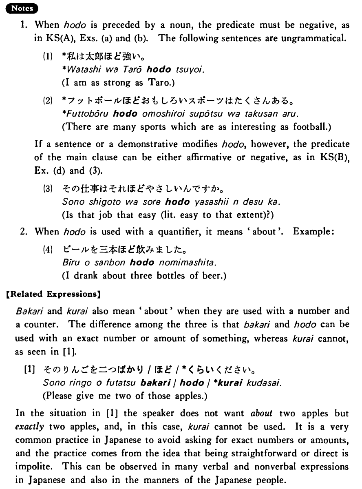

# ほど

 
 
 
 
 

## Summary

<table><tr>   <td>Summary</td>   <td>A particle which indicates an extent or a degree to which someone/something does something or is in some state.</td></tr><tr>   <td>English</td>   <td>To the extent of; to the extent that ~; (not as) ~ as ~; about</td></tr><tr>   <td>Part of speech</td>   <td>Particle</td></tr><tr>   <td>Related expression</td>   <td>ばかり; くらい</td></tr></table>

## Formation

<table class="table"><tbody><tr class="tr head"><td class="td">(i) Noun</td><td class="td">ほど</td><td class="td"></td></tr><tr class="tr"><td class="td"></td><td class="td">君ほど</td><td class="td">As you</td></tr><tr class="tr head"><td class="td">(ii) Demonstrative</td><td class="td">ほど</td><td class="td"></td></tr><tr class="tr"><td class="td"></td><td class="td">それほど</td><td class="td">To that extent</td></tr><tr class="tr head"><td class="td">(iii) Sinformal</td><td class="td">ほど</td><td class="td"></td></tr><tr class="tr"><td class="td"></td><td class="td">家が倒れるほど</td><td class="td">To the extent that houses would fall down</td></tr></tbody></table>

## Example Sentences

<table><tr>   <td>私はケンほど強くない・強くありません。</td>   <td>I'm not as strong as Ken.</td></tr><tr>   <td>この仕事は子共でも出来るほど易しい・易しいです。</td>   <td>This job is so easy that even a child can do it.</td></tr><tr>   <td>僕は君ほど速く歩けません。</td>   <td>I can't walk as fast as you can.</td></tr><tr>   <td>ジェニファーほどよく勉強する学生はいない。</td>   <td>There is no student who studies as hard as Jennifer.</td></tr><tr>   <td>私は西田さんがあれほどピアノが弾けるとは思わなかった。</td>   <td>I didn't think that Mr. Nishida could play the piano that well.</td></tr><tr>   <td>ルイスさんの日本語は太田先生も外国人だと気づかなかったほど上手です。</td>   <td>Mr. Lewis' Japanese is so good that even Professor Ota didn't notice he was a foreigner.</td></tr></table>

## Explanation

1. When ほど is preceded by a noun, the predicate must be negative, as in Key Sentence (A), Examples (a) and (b). The following sentences are ungrammatical.
  <ul>(1) <li>*私は太郎ほど強い。</li> <li>I am as strong as Taro.</li> </ul>  <ul>(2) <li>*フットボールほど面白いスポーツはたくさんある。</li> <li>There are many sports which are as interesting as football.</li> </ul>  
If a sentence or a demonstrative modifies ほど, however, the predicate of the main clause can be either affirmative or negative, as in Key Sentence (B), Example (d) and (3).
  <ul>(3) <li>その仕事はそれほどやさしいんですか。</li> <li>Is that job that easy (literally: easy to that extent)?</li> </ul>  
2. When ほど is used with a quantifier, it means 'about'. Example:
  <ul>(4) <li>ビールを三本ほど飲みました。</li> <li>I drank about three bottles of beer.</li> </ul>  
【Related Expressions】
  
ばかり and くらい also mean 'about' when they are used with a number and a counter. The difference among the three is that ばかり and ほど can be used with an exact number or amount of something, whereas くらい cannot, as seen in [1].
  
[1]
  <ul> <li>そのりんごをニつばかり/ほど/*くらいください。</li> <li>Please give me two of those apples.</li> </ul>  
In the situation in [1] the speaker does not want about two apples but exactly two apples, and, in this case, くらい cannot be used. It is a very common practice in Japanese to avoid asking for exact numbers or amounts, and the practice comes from the idea that being straightforward or direct is impolite. This can be observed in many verbal and nonverbal expressions in Japanese and also in the manners of the Japanese people.

## Grammar Book Page

