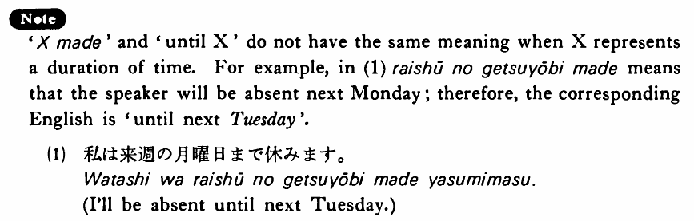

# まで

 
 
 
 
 

## Summary

<table><tr>   <td>Summary</td>   <td>A particle to indicate a spatial, temporal or quantitative limit or an unexpected animate/inanimate object.</td></tr><tr>   <td>English</td>   <td>As far as; till; up to; until; through; even</td></tr><tr>   <td>Part of speech</td>   <td>Particle</td></tr><tr>   <td>Related expression</td>   <td>までに</td></tr></table>

## Formation

<table class="table"> <tbody><tr class="tr head"> <td class="td">(i) Noun (time/location)  </td> <td class="td">まで </td> <td class="td">&nbsp;</td> </tr> <tr class="tr head"> <td class="td">&nbsp;</td> <td class="td">五時/学校まで</td> <td class="td">Until    five/as far as school</td> </tr> <tr class="tr head"> <td class="td">(ii)  Vinformal nonpast</td> <td class="td">まで </td> <td class="td">&nbsp;</td> </tr> <tr class="tr"> <td class="td">&nbsp;</td> <td class="td">話すまで </td> <td class="td">Until    someone talks/talked</td> </tr> <tr class="tr"> <td class="td">&nbsp;</td> <td class="td">食べるまで </td> <td class="td">Until    someone eats/ate</td> </tr> <tr class="tr head"> <td class="td">(iii)  Number-counter</td> <td class="td">まで </td> <td class="td">&nbsp;</td> </tr> <tr class="tr"> <td class="td">&nbsp;</td> <td class="td">四十人まで </td> <td class="td">Up    to forty people</td> </tr> <tr class="tr"> <td class="td">&nbsp;</td> <td class="td">五枚まで </td> <td class="td">Up    to five sheets of paper</td> </tr></tbody></table>

## Example Sentences

<table><tr>   <td>昨日は三時から五時まで友達とテニスをした・しました。</td>   <td>Yesterday I played tennis from three to five with my friend.</td></tr><tr>   <td>東京から京都まで新幹線で三時間かかる・かかります</td>   <td>It takes three hours by bullet train from Tokyo to Kyoto.</td></tr><tr>   <td>私が行くまでうちで待っていて下さい。</td>   <td>Please wait at home until I get there.</td></tr><tr>   <td>このホールは二千人まで入れる・入れます。</td>   <td>This hall can hold up to 2,000 people.</td></tr><tr>   <td>あの人は鼠やスカンクは勿論蛇まで好きだ・好きです。</td>   <td>He even likes snakes, not to mention rats and skunks.</td></tr><tr>   <td>アメリカ人は毎週月曜日から金曜日まで働く。</td>   <td>Americans work every week from Monday through Friday.</td></tr><tr>   <td>駅から大学までは歩いて十分ぐらいです。</td>   <td>It's about 10 minutes from the station to the university on foot.</td></tr><tr>   <td>スミスさんは刺身は勿論、納豆まで食べるんですよ。</td>   <td>Mr. Smith even eats fermented soybeans, not to mention raw fish.</td></tr><tr>   <td>飛行機が出るまでロビーで友達と話していた。</td>   <td>Until the plane left I was talking with my friend in the lobby.</td></tr></table>

## Explanation

'Xまで' and 'until X' do not have the same meaning when X represents a duration of time. For example, in (1) 来週の月曜日まで means that the speaker will be absent next Monday; therefore, the corresponding English is 'until next Tuesday'.
  <ul>(1) <li>私は来週の月曜日まで休みます。</li> <li>I'll be absent until next Tuesday.</li> <ul>

## Grammar Book Page

