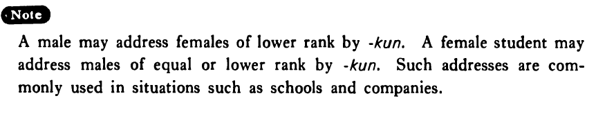

# 君・くん

[1. Summary](#summary) 
[2. Formation](#formation) 
[3. Example Sentences](#example-sentences) 
[4. Explanation](#explanation) 
 

## Summary

<table><tr>   <td>Summary</td>   <td>A suffix attached to the first or last name of a male equal or to the first or last name of a person whose status or rank is lower than the speaker’s.</td></tr><tr>   <td>Part of speech</td>   <td>Suffix</td></tr><tr>   <td>Related expression</td>   <td>様 (ちゃん; さん)</td></tr></table>

## Formation

<table class="table"> <tbody><tr class="tr head"> <td class="td">(i)  Last    name</td> <td class="td">君 </td> <td class="td">&nbsp;</td> </tr> <tr class="tr"> <td class="td">&nbsp;</td> <td class="td">山田君 </td> <td class="td">Mr.    Yamada</td> </tr> <tr class="tr head"> <td class="td">(ii)  First name</td> <td class="td">君 </td> <td class="td">&nbsp;</td> </tr> <tr class="tr"> <td class="td">&nbsp;</td> <td class="td">太郎君 </td> <td class="td">Taro</td> </tr> <tr class="tr head"> <td class="td">(iii)  Last name first name</td> <td class="td">君 </td> <td class="td">&nbsp;</td> </tr> <tr class="tr"> <td class="td">&nbsp;</td> <td class="td">山田太郎君 </td> <td class="td">Mr.    Taro Yamada</td> </tr></tbody></table>

## Example Sentences

<table><tr>   <td>もし、もし、一郎君いますか。</td>   <td>Hello, is Ichiro in?</td></tr><tr>   <td>田口君が来年結婚するそうだ。</td>   <td>I heard that Mr. Taguchi will get married next year.</td></tr><tr>   <td>田口一郎君、昇進おめでとう。</td>   <td>Mr. Ichiro Taguchi, congratulations on your promotion.</td></tr></table>

## Explanation

A male may address females of lower rank by 君. A female student may address males of equal or lower rank by 君. Such addresses are commonly used in situations such as schools and companies.

## Grammar Book Page

