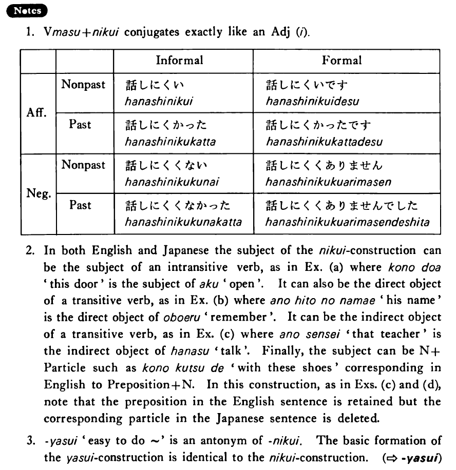

# 難い・にくい

[1. Summary](#summary) 
[2. Formation](#formation) 
[3. Example Sentences](#example-sentences) 
[4. Explanation](#explanation) 
[5. Grammar Book Page](#grammar-book-page) 

## Summary

<table><tr>   <td>Summary</td>   <td>Something or someone is hard to ~.</td></tr><tr>   <td>English</td>   <td>Hard to ~; difficult to ~; don’t do something easily; not readily; not prone to ~</td></tr><tr>   <td>Part of speech</td>   <td>Auxiliary Adjective (い)</td></tr><tr>   <td>Related expression</td>   <td>やすい</td></tr></table>

## Formation

<table class="table"> <tbody><tr class="tr head"> <td class="td">Vます</td> <td class="td">難い </td> <td class="td">&nbsp;</td> </tr> <tr class="tr"> <td class="td">&nbsp;</td> <td class="td">話し難い </td> <td class="td">Someone    is hard to talk to</td> </tr> <tr class="tr"> <td class="td">&nbsp;</td> <td class="td">食べ難い </td> <td class="td">Something    is hard to eat</td> </tr></tbody></table>

## Example Sentences

<table><tr>   <td>この本は大変読みにくい・にくいです。</td>   <td>This book is very hard to read.</td></tr><tr>   <td>このドアは開きにくいですね。</td>   <td>This door doesn't open easily, does it?</td></tr><tr>   <td>あの人の名前は覚えにくい。</td>   <td>His name is hard to remember.</td></tr><tr>   <td>あの先生は話しにくいです。</td>   <td>That teacher is hard to talk to.</td></tr><tr>   <td>この靴は走りにくいです。</td>   <td>These shoes are hard to run in.</td></tr></table>

## Explanation

1. Verbます+難い conjugates exactly like an Adjective い.
  <table class="table"> <tbody> <tr class="tr"> <td class="td"></td> <td class="td"></td> <td class="td">Informal</td> <td class="td">Formal</td> </tr> <tr class="tr"> <td class="td">Affirmative</td> <td class="td">Nonpast</td> <td class="td">話しにくい</td> <td class="td">話しにくいです</td> </tr> <tr class="tr"> <td class="td"></td> <td class="td">Past</td> <td class="td">話しにくかった</td> <td class="td">話しにくかったです</td> </tr> <tr class="tr"> <td class="td">Negative</td> <td class="td">Nonpast</td> <td class="td">話しにくくない</td> <td class="td">話しにくくありません</td> </tr> <tr class="tr"> <td class="td"></td> <td class="td">Past</td> <td class="td">話しにくくなかった</td> <td class="td">話しにくくありませんでした</td> </tr> </tbody> </table>  
2. In both English and Japanese the subject of the 難い construction can be the subject of an intransitive verb, as in Example (a) where このドア 'this door' is the subject of 開く 'open'. It can also be the direct object of a transitive verb, as in Example (b) where あの人の名前 'his name' is the direct object of 覚える 'remember'. It can be the indirect object of a transitive verb, as in Example (c) where あの先生 'that teacher' is the indirect object of 話す 'talk'. Finally, the subject can be Noun+Particle such as この靴で 'with these shoes' corresponding in English to Preposition+Noun. In this construction, as in Examples (c) and (d), note that the preposition in the English sentence is retained but the corresponding particle in the Japanese sentence is deleted.
  
3. やすい 'easy to do ~' is an antonym of 難い. The basic formation of the やすい construction is the identical to the 難い construction.
  
(⇨ <a href="#㊦ 易い・やすい">易い</a>)

## Grammar Book Page

