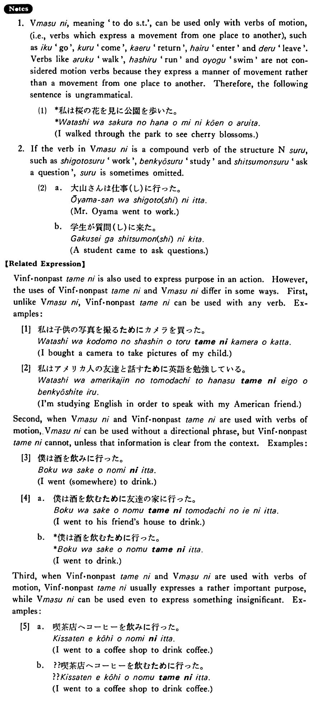

# に (5)

 
 
 
 
 

## Summary

<table><tr>   <td>Summary</td>   <td>A particle which indicates purpose when someone moves from one place to another.</td></tr><tr>   <td>English</td>   <td>To do something; in order to do something</td></tr><tr>   <td>Part of speech</td>   <td>Particle</td></tr><tr>   <td>Related expression</td>   <td>為に</td></tr></table>

## Formation

<table class="table"> <tbody><tr class="tr head"> <td class="td">Vます</td> <td class="td">に </td> <td class="td">&nbsp;</td> </tr> <tr class="tr"> <td class="td">&nbsp;</td> <td class="td">話しに </td> <td class="td">To    talk</td> </tr> <tr class="tr"> <td class="td">&nbsp;</td> <td class="td">食べに </td> <td class="td">To    eat</td> </tr></tbody></table>

## Example Sentences

<table><tr>   <td>私はデパートへ贈り物を買いに行った・行きました。</td>   <td>I went to a department store to buy a gift</td></tr><tr>   <td>学生が質問をしに来た。</td>   <td>A student came to ask questions.</td></tr><tr>   <td>そこへ何をしに行くんですか。</td>   <td>To do what are you going there? / For what are you going there?</td></tr><tr>   <td>村井さんは昼ご飯を食べにうちへ帰った。</td>   <td>Mr. Murai went home to eat his lunch.</td></tr></table>

## Explanation

1. Verbますに, meaning 'to do something', can be used only with verbs of motion, (i.e., verbs which express a movement from one place to another), such as 行く 'go', 来る 'come', 帰る 'return', 入る 'enter' and 出る 'leave'. Verbs like 歩く 'walk', 走る 'run' and 泳ぐ 'swim' are not considered motion verbs because they express a manner of movement rather than a movement from one place to another. Therefore, the following sentence is ungrammatical.
  <ul>(1) <li>*私は桜の花を見に公園を歩いた。</li> <li>I walked through the park to see cherry blossoms.</li> </ul>  
2. If the verb in Verbますに is a compound verb of the structure Nounする, such as 仕事する 'work', 勉強する 'study' and 質問する 'ask a question', する is sometimes omitted.
  <ul>(2)  <li>a. 大山さんは仕事(し)に行った。</li> <li>Mr. Oyama went to work.</li> 

 <li>b. 学生が質問(し)に来た。</li> <li>A student came to ask questions.</li> </ul>  
【Related Expression】  
Verb informal nonpast為に is also used to express purpose in an action. However, the uses of Verb informal nonpast為に and Verbますに differ in some ways. First, unlike Verbますに, Verb informal nonpast為に can be used with any verb. Examples:
  
[1]
  <ul> <li>私は子供の写真を撮るためにカメラを買った。</li> <li>I bought a camera to take pictures of my child.</li> </ul>  
[2]
  <ul> <li>私はアメリカ人の友逹と話すために英語を勉強している。</li> <li>I'm studying English in order to speak with my American friend.</li> </ul>  
Second, when Verbますに and Verb informal nonpast為に are used with verbs of motion, Verbますに can be used without a directional phrase, but Verb informal nonpast為に cannot, unless that information is clear from the context. Examples:
   
[3]
  <ul> <li>僕は酒を飲みに行った。</li> <li>I went (somewhere) to drink.</li> </ul>  
[4]
  <ul> <li>a. 僕は酒を飲むために友達の家に行った。</li> <li>I went to his friend's house to drink.</li> 

 <li>b. *僕は酒を飲むために行った。</li> <li>I went to drink.</li> </ul>  
Third, when Verb informal nonpast為に and Verbますに are used with verbs of motion, Verb informal nonpast為に usually expresses a rather important purpose, while Verbますに can be used even to express something insignificant. Examples:
   
[5]
  <ul> <li>a. 喫茶店へコーヒーを飲みに行った。</li> <li>I went to a coffee shop to drink coffee.</li> 

 <li>b. ??喫茶店へコーヒーを飲むために行った。</li> <li>I went to a coffee shop to drink coffee.</li> </ul>

## Grammar Book Page

