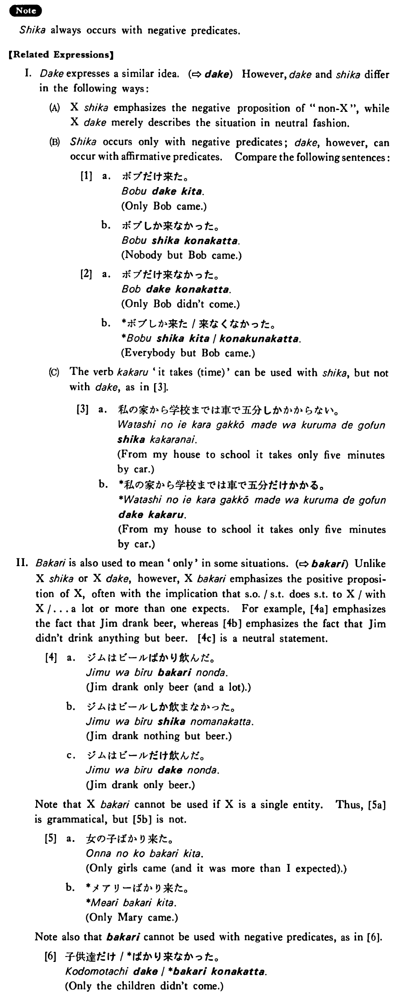

# しか

[1. Summary](#summary) 
[2. Formation](#formation) 
[3. Example Sentences](#example-sentences) 
[4. Explanation](#explanation) 
 

## Summary

<table><tr>   <td>Summary</td>   <td>A particle which marks an element X when nothing but X makes the expressed proposition true.</td></tr><tr>   <td>English</td>   <td>Nothing/nobody/no ~ but; only</td></tr><tr>   <td>Part of speech</td>   <td>Particle</td></tr><tr>   <td>Related expression</td>   <td>ばかり; だけ</td></tr></table>

## Formation

<table class="table"> <tbody><tr class="tr head"> <td class="td">(i)  Noun</td> <td class="td">しか </td> <td class="td">&nbsp;</td> </tr> <tr class="tr"> <td class="td">先生が(subject)→</td> <td class="td">先生しか </td> <td class="td">No    one but the teacher</td> </tr> <tr class="tr"> <td class="td">先生を(direct object)→</td> <td class="td">先生しか </td> <td class="td">No    one but the teacher</td> </tr> <tr class="tr head"> <td class="td">(ii)  Noun+(Particle) </td> <td class="td">しか </td> <td class="td">&nbsp;</td> </tr> <tr class="tr"> <td class="td">東京へ・に(direction)→</td> <td class="td">東京(へ・に)しか</td> <td class="td">To    nowhere but Tokyo</td> </tr> <tr class="tr"> <td class="td">先生に(indirect object, agent)→</td> <td class="td">先生(に)しか</td> <td class="td">No    one but the teacher</td> </tr> <tr class="tr"> <td class="td">日曜日に(time)→</td> <td class="td">日曜日(に)しか</td> <td class="td">Only    on Sunday</td> </tr> <tr class="tr"> <td class="td">東京に(location)→</td> <td class="td">東京(に)しか</td> <td class="td">Only    in Tokyo</td> </tr> <tr class="tr head"> <td class="td">(iii)  Noun+Particle</td> <td class="td">しか </td> <td class="td">&nbsp;</td> </tr> <tr class="tr"> <td class="td">東京で(location)→</td> <td class="td">東京でしか </td> <td class="td">Only    in Tokyo</td> </tr> <tr class="tr"> <td class="td">車で(means)→</td> <td class="td">車でしか </td> <td class="td">Only    by car</td> </tr> <tr class="tr"> <td class="td">山田さんと(reciprocal)→</td> <td class="td">山田さんとしか </td> <td class="td">Only    with Mr. Yamada</td> </tr> <tr class="tr"> <td class="td">東京から(starting point/source)→</td> <td class="td">東京からしか </td> <td class="td">Only    from Tokyo</td> </tr> <tr class="tr"> <td class="td">五時まで(ending point)→</td> <td class="td">五時までしか </td> <td class="td">Only    till five o’clock</td> </tr> <tr class="tr head"> <td class="td">(iv)  Quantifier</td> <td class="td">しか </td> <td class="td">&nbsp;</td> </tr> <tr class="tr"> <td class="td">&nbsp;</td> <td class="td">少ししか </td> <td class="td">Only    a little</td> </tr></tbody></table>

## Example Sentences

<table><tr>   <td>戸田さんしか煙草を吸わない・吸いません。</td>   <td>No one but Mr. Toda smokes.</td></tr><tr>   <td>私は日本語しか知らない・知りません。</td>   <td>I know nothing but Japanese.</td></tr><tr>   <td>それは江口さんにしか話していない・いません。</td>   <td>I haven't told it to anybody but Mr. Eguchi.</td></tr><tr>   <td>私はご飯を一杯しか食べなかった・食べませんでした。</td>   <td>I had only one bowl of rice.</td></tr><tr>   <td>パーティーには学生しか来なかった。</td>   <td>Only students came to the party.</td></tr><tr>   <td>田村さんはサラダしか食べなかった。</td>   <td>Mr. Tamura ate only salad.</td></tr><tr>   <td>私は日曜日（に）しか来られません。</td>   <td>I can come only on Sunday.</td></tr><tr>   <td>この本はこの図書館（に）しかありません。</td>   <td>Only this library has this book.</td></tr><tr>   <td>そこは車でしか行けない。</td>   <td>You can go there only by car. / The only way you can go there is by car.</td></tr><tr>   <td>私は山田さんとしか話をしない。</td>   <td>I talk only with Mr. Yamada.</td></tr><tr>   <td>この学校は学生が百人しかない。</td>   <td>This school has only a hundred students.</td></tr></table>

## Explanation

しか always occurs with negative predicates.
  
【Related Expressions】
  
I. だけ expresses a similar idea, (⇨ <a href="#㊦ だけ">だけ</a>) However, だけ and しか differ in the following ways:
  
(A)
 
Xしか emphasizes the negative proposition of "non-X", while Xだけ merely describes the situation in neutral fashion.
  
(B)
 
しか occurs only with negative predicates; だけ, however, can occur with affirmative predicates. Compare the following sentences:
  
[1]
  <ul> <li>a. ボブだけ来た。</li> <li>Only Bob came.</li> 

 <li>b. ボブしか来なかった。</li> <li>Nobody but Bob came.</li> </ul>  
[2]
  <ul> <li>a. ボブだけ来なかった。</li> <li>Only Bob didn’t come.</li> 

 <li>b. *ボブしか来た/来なくなかった。</li> <li>Everybody but Bob came.</li> </ul>  
(C)
 
The verb かかる 'it takes (time)' can be used with しか, but not with だけ, as in [3].
  
[3]
  <ul> <li>a. 私の家から学校までは車で五分しかかからない。</li> <li>From my house to school it takes only five minutes by car.</li> 

 <li>b. *私の家から学校までは車で五分だけかかる。</li> <li>From my house to school it takes only five minutes by car.</li> </ul>  
II. ばかり is also used to mean 'only' in some situations. (⇨ <a href="#㊦ ばかり">ばかり</a>) Unlike Xしか or Xだけ, however, Xばかり emphasizes the positive proposition of X, often with the implication that someone/something does something to X/with X/... a lot or more than one expects. For example, [4a] emphasizes the fact that Jim drank beer, whereas [4b] emphasizes the fact that Jim didn't drink anything but beer. [4c] is a neutral statement.
  
[4]
  <ul> <li>a. ジムはビールばかリ飲んだ。</li> <li>Jim drank only beer (and a lot).</li> 

 <li>b. ジムはビールしか飲まなかった。</li> <li>Jim drank nothing but beer.</li> 

 <li>c. ジムはビールだけ飲んだ。</li> <li>Jim drank only beer.</li> </ul>  
Note that Xばかり cannot be used if X is a single entity. Thus, [5a] is grammatical, but [5b] is not.
  
[5]
  <ul> <li>a. 女の子ばかり来た。</li> <li>Only girls came (and it was more than I expected).</li> 

 <li>b. *メアリーばかり来た。</li> <li>Only Mary came.</li> </ul>  
Note also that ばかり cannot be used with negative predicates, as in [6].
  
[6]
  <ul> <li>子供達だけ/*ばかり来なかった。</li> <li>Only the children didn’t come.</li> </ul>

## Grammar Book Page

