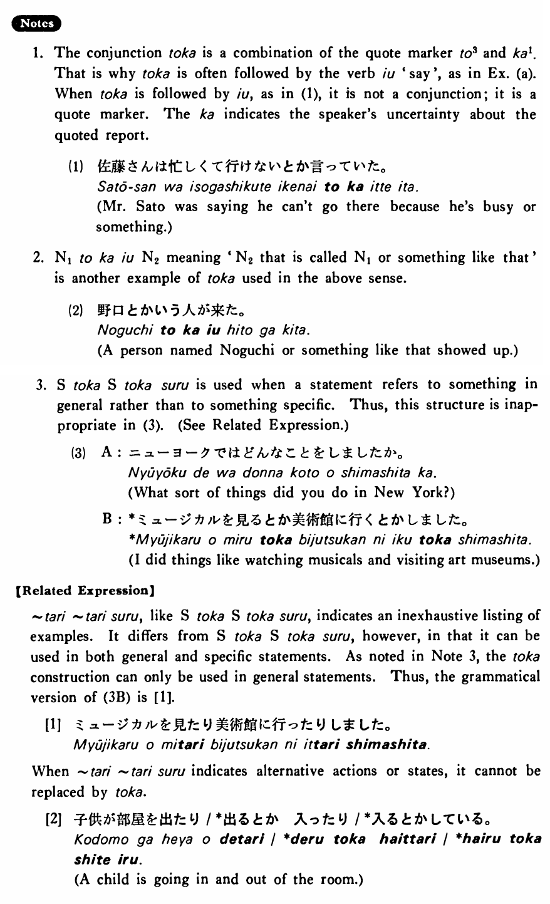

# とか

[1. Summary](#summary) 
[2. Formation](#formation) 
[3. Example Sentences](#example-sentences) 
[4. Explanation](#explanation) 
[5. Grammar Book Page](#grammar-book-page) 

## Summary

<table><tr>   <td>Summary</td>   <td>A conjunction that lists two or more items, actions or states as inexhaustive examples.</td></tr><tr>   <td>English</td>   <td>And; or</td></tr><tr>   <td>Part of speech</td>   <td>Conjunction</td></tr><tr>   <td>Related expression</td>   <td>たり; や</td></tr></table>

## Formation

<table class="table"> <tbody><tr class="tr head"> <td class="td">(i)  Noun</td> <td class="td">とか Noun とか…</td> <td class="td">&nbsp;</td> </tr> <tr class="tr"> <td class="td">&nbsp;</td> <td class="td">学生とか先生とか… </td> <td class="td">Students    and teachers… (among others) </td> </tr> <tr class="tr head"> <td class="td">(ii)  Sinformal</td> <td class="td">とか Sinformal とかする</td> <td class="td">&nbsp;</td> </tr> <tr class="tr"> <td class="td">&nbsp;</td> <td class="td">テレビを見るとか本を読むとかする </td> <td class="td">Do    such things as watching TV or reading books</td> </tr></tbody></table>

## Example Sentences

<table><tr>   <td>私はバッハとかモーツアルトとかベートーベンが好きだ・好きです。</td>   <td>I like Bach, Mozart and Beethoven, among others.</td></tr><tr>   <td>疲れた時はお風呂に入るとか早く寝るとかしなさい。</td>   <td>When you are tired, do things like taking a bath or going to sleep early.</td></tr><tr>   <td>日本の茶道とか生け花とかいうものをよく知らない。</td>   <td>I don't know much about things like the Japanese tea ceremony and flower arranging.</td></tr><tr>   <td>A:どんな日本の映画を見ましたか。  B:黒沢の「七人の侍」とか「生きる」とか「影武者」を見ました。</td>   <td>A: What kind of Japanese movie did you see?&emsp;&emsp;B: I saw Kurosawa's Seven Samurai, Ikiru and Kagemusha.</td></tr><tr>   <td>A:日曜日にはどんなことをしていますか。  B:音楽を聞くとか、本を読むとかしています。</td>   <td>A: What sorts of things do you do on Sundays?&emsp;&emsp;B: I do things like listening to music or reading books.</td></tr></table>

## Explanation

1. The conjunction とか is a combination of the quote marker と3 and か1. That is why とか is often followed by the verb 言う 'say', as in Example (a). When とか is followed by 言う, as in (1), it is not a conjunction; it is a quote marker. The か indicates the speaker's uncertainty about the quoted report.
  <ul>(1) <li>佐藤さんは忙しくて行けないとか言っていた。</li> <li>Mr. Sato was saying he can't go there because he's busy or something.</li> </ul>  
2. Noun1とか言うNoun2 meaning 'Noun2 that is called Noun1' is another example of とか used in the above sense.
  <ul>(2) <li>野口とかいう人が来た。</li> <li>A person named Noguchi or something like that showed up.</li> </ul>  
3. SentenceとかSentenceとかする is used when a statement refers to something in general rather than to something specific. Thus, this structure is inappropriate in (3).
  
(See Related Expression.)
  <ul>(3) <li>A: ニューヨークではどんなことをしましたか。</li> <li>What sort of things did you do in New York?</li> 

 <li>B: *ミュージカルを見るとか美術館に行くとかしました。</li> <li>I did things like watching musicals and visiting art museums.</li> </ul>  
【Related Expression】
  
たり~たりする, like SentenceとかSentenceとかする, indicates an inexhaustive listing of examples. It differs from SentenceとかSentenceとかする, however, in that it can be used in both general and specific statements. As noted in Note 3, the とか construction can only be used in general statements. Thus, the grammatical version of (3B) is [1].
  
[1]
  <ul> <li>ミュージカルを見たり美術館に行ったりしました。</li> </ul>  
When たり~たりする indicates alternative actions or states, it cannot be replaced by とか.  
[2]
  <ul> <li>子供が部屋を出たり/*出るとか入ったり/*入るとかしている。</li> <li>A child is going in and out of the room.</li> </ul>

## Grammar Book Page

