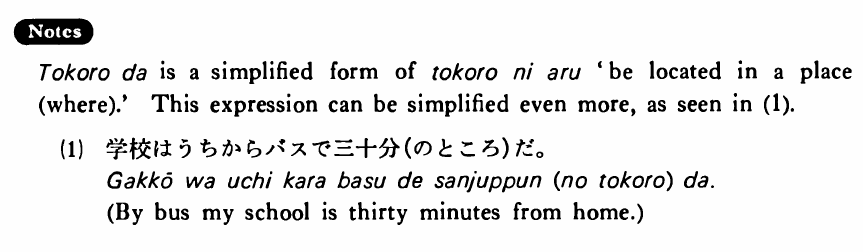

# ところだ (1)

[1. Summary](#summary) 
[2. Example Sentences](#example-sentences) 
[3. Explanation](#explanation) 
 

## Summary

<table><tr>   <td>Summary</td>   <td>A place is in a location which takes a certain amount of time to get to.</td></tr><tr>   <td>English</td>   <td>~ is (in) a place where it takes ~ to get to</td></tr><tr>   <td>Part of speech</td>   <td>Phrase</td></tr></table>

## Example Sentences

<table><tr>   <td>私のうちは駅から歩いて十分のところだ・です。</td>   <td>My house is in a place where it takes ten minutes to get to from the station on foot. / On foot my house is ten minutes from the station.</td></tr><tr>   <td>学校はうちからバスで三十分のところです。</td>   <td>My school is in a place where it takes thirty minutes to get to from home by bus. / By bus it takes thirty minutes to get from home to school.</td></tr><tr>   <td>その病院はここから車で十五分のところだ。</td>   <td>The hospital is in a place where it takes fifteen minutes to get to from here by car. / By car the hospital is fifteen minutes from here.</td></tr></table>

## Explanation

ところだ is a simplified form of ところにある 'be located in a (where).' This expression can be simplified even more, as seen in (1).
  <ul>(1) <li>学校はうちからバスで三十分(のところ)だ。</li> <li>By bus my school is thirty minutes from home.</li> </ul>

## Grammar Book Page

