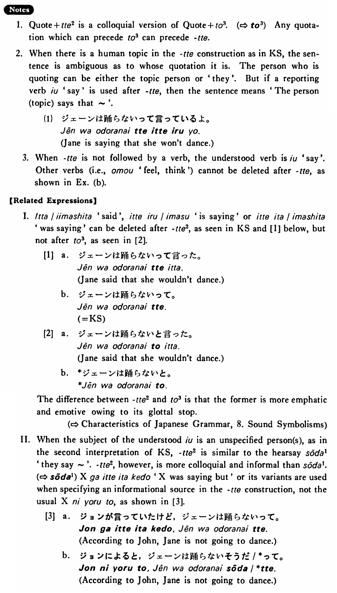

# って (2)

 
 
 
 

## Summary

<table><tr>   <td>Summary</td>   <td>A colloquial quotation marker.</td></tr><tr>   <td>English</td>   <td>That</td></tr><tr>   <td>Part of speech</td>   <td>Particle</td></tr><tr>   <td>Related expression</td>   <td>そうだ1; と3</td></tr></table>

## Example Sentences

<table><tr>   <td>ジェーンは踊らないって。</td>   <td>Jane said that she wouldn't dance / They say that Jane won't dance.</td></tr><tr>   <td>今晩は雪が降るって。</td>   <td>They say it's going to snow tonight.</td></tr><tr>   <td>僕も行こうかって思いました。</td>   <td>I wondered if I should go there, too.</td></tr></table>

## Explanation

1. Quote+って2 is a colloquial version of Quote+と3. (⇨ <a href="#㊦ と (3)">と3</a>) Any quotation which can precede と3 can precede って.
  
2. When there is a human topic in the って construction as in Key Sentence, the sentence is ambiguous as to whose quotation it is. The person who is quoting can be either the topic person or 'they'. But if a reporting verb 言う 'say' is used after って, then the sentence means 'The person (topic) says that ~'.
  <ul>(1) <li>ジェーンは踊らないって言っているよ。</li> <li>Jane is saying that she won't dance.</li> </ul>  
3. When って is not followed by a verb, the understood verb is 言う 'say'. Other verbs (i.e., 思う 'feel, think') cannot be deleted after って, as shown in Eample (b).
  
【Related Expressions】
  
I. 言った/言いました 'said', 言っている/います 'is saying' or 言っていった/いました 'was saying' can be deleted after って2, as seen in Key Sentence and [1] below, but not after と3 as seen in [2].
  
[1]
  <ul> <li>a. ジェーンは踊らないって言った。</li> <li>Jane said that she wouldn’t dance.</li> 

 <li>b. ジェーンは踊らないって。</li> 

 <li>(= Key Sentence)</li> </ul>  
[2]
  <ul> <li>a. ジェーンは踊らないと言った。</li> <li>Jane said that she wouldn't dance.</li> 

 <li>b. *ジェーンは踊らないと。</li> </ul>  
The difference between って2 and と3 is that the former is more emphatic and emotive owing to its glottal stop.
  
II. When the subject of the understood 言う is an unspecified person(s), as in the second interpretation of Key Sentence, って2 is similar to the hearsay そうだ1 'they say ~'. って2, however, is more colloquial and informal than そうだ1. (⇨ <a href="#㊦ そうだ (1)">そうだ1</a>) Xが言っていたけど 'X was saying but' or its variants are used when specifying an informational source in the って construction, not the usual Xによると, as shown in [3].
  
[3]
  <ul> <li>a. ジョンが言っていたけど，ジェーンは踊らないって。</li> <li>According to John, Jane is not going to dance.</li> 

 <li>b. ジョンによると、ジェーンは踊らないそうだ/*って。</li> <li>According to John, Jane is not going to dance.</li> </ul>

## Grammar Book Page

