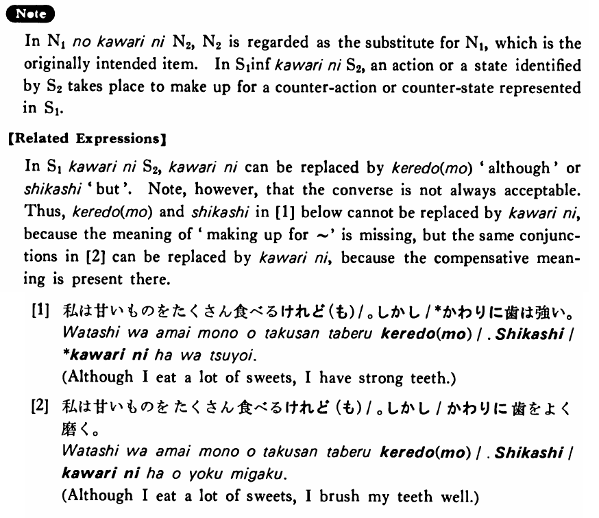

# 代わりに・かわりに

[1. Summary](#summary) 
[2. Formation](#formation) 
[3. Example Sentences](#example-sentences) 
[4. Explanation](#explanation) 
[5. Grammar Book Page](#grammar-book-page) 

## Summary

<table><tr>   <td>Summary</td>   <td>Something (including an action) replaces something else.</td></tr><tr>   <td>English</td>   <td>In place of ~; instead of; to make up for ~; although; but</td></tr><tr>   <td>Part of speech</td>   <td>Phrase</td></tr><tr>   <td>Related expression</td>   <td>けれど(も); しかし</td></tr></table>

## Formation

<table class="table"> <tbody><tr class="tr head"> <td class="td">(i)  Noun</td> <td class="td">の代わりに </td> <td class="td">&nbsp;</td> </tr> <tr class="tr"> <td class="td">&nbsp;</td> <td class="td">先生の代わりに </td> <td class="td">In    place of the teacher</td> </tr> <tr class="tr head"> <td class="td">(ii)  {V/Adjective い}    informal</td> <td class="td">代わりに </td> <td class="td">&nbsp;</td> </tr> <tr class="tr"> <td class="td">&nbsp;</td> <td class="td">{話す /話した} 代わりに</td> <td class="td">Instead    of talking/talked but</td> </tr> <tr class="tr"> <td class="td">&nbsp;</td> <td class="td">{食べる /食べた} 代わりに</td> <td class="td">Instead    of eating/ate but</td> </tr> <tr class="tr"> <td class="td">&nbsp;</td> <td class="td">{高い /高かった} 代わりに</td> <td class="td">Something    is/was expensive but ~</td> </tr> <tr class="tr head"> <td class="td">(iii)  Adjective な stem</td> <td class="td">{な/だった} 代わりに</td> <td class="td">&nbsp;</td> </tr> <tr class="tr"> <td class="td">&nbsp;</td> <td class="td">{静かな/静かだった} 代わりに</td> <td class="td">Something    is/was quiet but ~</td> </tr></tbody></table>

## Example Sentences

<table><tr>   <td>先生のかわりに私が教えた・教えました。</td>   <td>I taught in place of my teacher.</td></tr><tr>   <td>土曜日に仕事をするかわりに月曜日は休む・休みます。</td>   <td>To make up for working on Saturdays, I take Mondays off.</td></tr><tr>   <td>ビールのかわりに酒を買いました。</td>   <td>I bought sake instead of beer.</td></tr><tr>   <td>私のかわりに父が行ってもいいですか。</td>   <td>Can my father go there in place of me?</td></tr><tr>   <td>今日は夜おそくまで踊るかわりに明日は一日中勉強します。</td>   <td>I'll study all day tomorrow to make up for dancing until late tonight.</td></tr><tr>   <td>手伝ってあげるかわりに飲ませて下さいよ。</td>   <td>I'll help you, so (to make up for it) please (literally: let me drink) buy me a drink, OK?</td></tr><tr>   <td>僕のアパートは不便なかわりに家賃が安い。</td>   <td>My apartment is inconvenient, but the rent is cheap.</td></tr><tr>   <td>英語を教えてあげたかわりに日本語を教えてもらった。</td>   <td>I taught him Japanese, so (to make up for it) he taught me English.</td></tr><tr>   <td>その車は安かったかわりによく故障した。</td>   <td>That car was inexpensive, but it often broke down.</td></tr></table>

## Explanation

In Noun1 の代わりに Noun2, Noun2 is regarded as the substitute for Noun1, which is the originally intended item. In Sentence1 informal 代わりに Sentence2, an action or a state identified by Sentence2 takes place to make up for a counter-action or counter-state represented in Sentence.
  
【Related Expressions】
  
In Sentence1代わりにSentence2, 代わりに can be replaced by けれど(も) 'although' or しかし 'but'. Note, however, that the converse is not always acceptable. Thus, けれど(も) and しかし in [1] below cannot be replaced by 代わりに, because the meaning of 'making up for ~' is missing, but the same conjunctions in [2] can be replaced by 代わりに, because the compensative meaning is present there.
  
[1]
  <ul> <li>私は甘いものをたくさん食べるけれど(も)/。しかし/*かわりに歯は強い。</li> <li>Although I eat a lot of sweets, I have strong teeth.</li> </ul>  
[2]
  <ul> <li>私は甘いものをたくさん食べるけれど(も)/。しかし/かわりに歯をよく磨く。</li> <li>Although I eat a lot of sweets, I brush my teeth well.</li> </ul>

## Grammar Book Page

