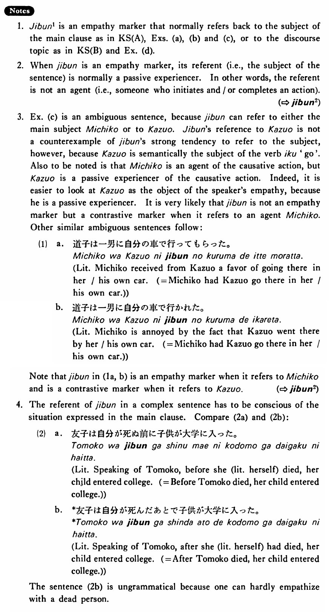

# 自分・じぶん (1)

[1. Summary](#summary) 
[2. Example Sentences](#example-sentences) 
[3. Explanation](#explanation) 
[4. Grammar Book Page](#grammar-book-page) 

## Summary

<table><tr>   <td>Summary</td>   <td>A reflexive pronoun that refers (back) to a human subject with whom the speaker is empathising.</td></tr><tr>   <td>English</td>   <td>~ self; own</td></tr><tr>   <td>Part of speech</td>   <td>Pronoun</td></tr><tr>   <td>Related expression</td>   <td>自分2</td></tr></table>

## Example Sentences

<table><tr>   <td>土田は幸子が自分を愛していることを知らなかった・知りませんでした。</td>   <td>Tsuchida didn't know that Sachiko loved him (literally: himself).</td></tr><tr>   <td>1:ゆかりは歩きながら考えていた。  2:健一は自分が本当に好きなんだろうか。</td>   <td>1: Yukari was walking while thinking.&emsp;&emsp;2: Does Kenichi really love me (literally: myself)?</td></tr><tr>   <td>中川は自分が京大に入れると思っていなかった。</td>   <td>Nakagawa didn't think that he (literally: himself) could enter Kyoto University.</td></tr><tr>   <td>一郎は冬子が自分に会いに来た時うちにいなかった。</td>   <td>Ichiro wasn't at home when Fuyuko came to see him (literally: himself).</td></tr><tr>   <td>道子は一男に自分の車で行かせた。</td>   <td>Michiko made Kazuo go there in his/her car.</td></tr><tr>   <td>ジョンはメアリーのことを思っていた。彼女は自分と結婚してくれるんだろうか。自分を捨てて、ボブと結婚するんだろうか。</td>   <td>John was thinking of Mary. Is she going to marry me (literally: myself)? Is she going to leave me (literally: myself) and marry Bob?</td></tr></table>

## Explanation

1. 自分1 is an empathy marker that normally refers back to the subject of the main clause as in Key Sentence (A), Examples (a), (b) and (c), or to the discourse topic as in Key Sentence (B) and Example (d).
  
2. When 自分 is an empathy marker, its referent (i.e., the subject of the sentence) is normally a passive experiencer. In other words, the referent is not an agent (i.e., someone who initiates and/or completes an action).
  
(⇨ <a href="#㊦ 自分・じぶん (2)">自分2</a>)
  
3. Example (c) is an ambiguous sentence, because 自分 can refer to either the main subject Michiko or to Kazuo. 自分's reference to Kazuo is not a counter example of 自分's strong tendency to refer to the subject, however, because Kazuo is semantically the subject of the verb 行く 'go'. Also to be noted is that Michiko is an agent of the causative action, but Kazuo is a passive experiencer of the causative action. Indeed，it is easier to look at Kazuo as the object of the speaker's empathy, because he is a passive experiencer. It is very likely that 自分 is not an empathy marker but a contrastive marker when it refers to an agent Michiko. Other similar ambiguous sentences follow:
  <ul>(1) <li>a. 道子は一男に自分の車で行ってもらった。</li> <li>Literally: Michiko received from Kazuo a favor of going there in her/his own car. ( = Michiko had Kazuo go there in her/his own car.)</li> 

 <li>b. 道子は一男に自分の車で行かれた。</li> <li>Literally: Michiko is annoyed by the fact that Kazuo went there by her/his own car. ( = Michiko had Kazuo go there in her/his own car.)</li> </ul>  
Note that 自分 in (1a, b) is an empathy marker when it refers to Michiko and is a contrastive marker when it refers to Kazuo.
  
(⇨ <a href="#㊦ 自分・じぶん (2)">自分2</a>)
  
4. The referent of 自分 in a complex sentence has to be conscious of the situation expressed in the main clause. Compare (2a) and (2b):
  <ul>(2) <li>a. 友子は自分が死ぬ前に子供が大学に入った。</li> <li>Literally: Speaking of Tomoko, before she (Literally: herself) died, her child entered college. (= Before Tomoko died, her child entered college.)</li> 

 <li>b. *友子は自分が死んだあとで子供が大学に入った。</li> <li>Literally: Speaking of Tomoko, after she (Literally: herself) had died, her child entered college. (= After Tomoko died, her child entered college.)</li> </ul>  
The sentence (2b) is ungrammatical because one can hardly empathize with a dead person.

## Grammar Book Page

