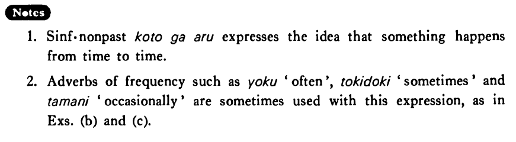

# ことがある (2)

[1. Summary](#summary) 
[2. Formation](#formation) 
[3. Example Sentences](#example-sentences) 
[4. Explanation](#explanation) 
[5. Grammar Book Page](#grammar-book-page) 

## Summary

<table><tr>   <td>Summary</td>   <td>There are times when ~.</td></tr><tr>   <td>Part of speech</td>   <td>Phrase</td></tr></table>

## Formation

<table class="table"> <tbody><tr class="tr head"> <td class="td">(i)  V/Adjective い    informal nonpast</td> <td class="td">ことがある </td> <td class="td">&nbsp;</td> </tr> <tr class="tr"> <td class="td">&nbsp;</td> <td class="td">話すことがある </td> <td class="td">There    are times when someone talks</td> </tr> <tr class="tr"> <td class="td">&nbsp;</td> <td class="td">高いことがある </td> <td class="td">There    are times when something is expensive</td> </tr> <tr class="tr head"> <td class="td">(ii)  Adjective な stem</td> <td class="td">なことがある </td> <td class="td">&nbsp;</td> </tr> <tr class="tr"> <td class="td">&nbsp;</td> <td class="td">静かなことがある </td> <td class="td">There    are times when something is quiet</td> </tr> <tr class="tr head"> <td class="td">(iii)  Noun</td> <td class="td">{の/である} ことがある</td> <td class="td">&nbsp;</td> </tr> <tr class="tr"> <td class="td">&nbsp;</td> <td class="td">{先生の/先生である} ことがある</td> <td class="td">There    are time when someone is a teacher</td> </tr></tbody></table>

## Example Sentences

<table><tr>   <td>私は朝風呂に入ることがある・あります。</td>   <td>There are times when I take a bath in the morning.</td></tr><tr>   <td>たかしは朝ご飯を食べずに学校へ行くことがある。</td>   <td>There are times when Takashi goes to school without eating breakfast.</td></tr><tr>   <td>この店のミルクはたまに古いことがある。</td>   <td>Occasionally there are times when the milk in this store is old.</td></tr><tr>   <td>アメリカで日本への土産を買うとそれが日本製であることがよくある。</td>   <td>Often there are times we find out that a souvenir we've bought in America for someone in Japan is made in Japan.</td></tr><tr>   <td>最近のいわゆる自然食品は本当の自然食品じゃないことがある。</td>   <td>There are times these days when so-called natural foods are not genuine natural foods.</td></tr></table>

## Explanation

1. Sentence informal nonpast ことがある expresses the idea that something happens from time to time.
  
2. Adverbs of frequency such as よく 'often', 時々 sometimes' and たまに 'occasionally', are sometimes used with this expression, as in Examples (b) and (c).

## Grammar Book Page

