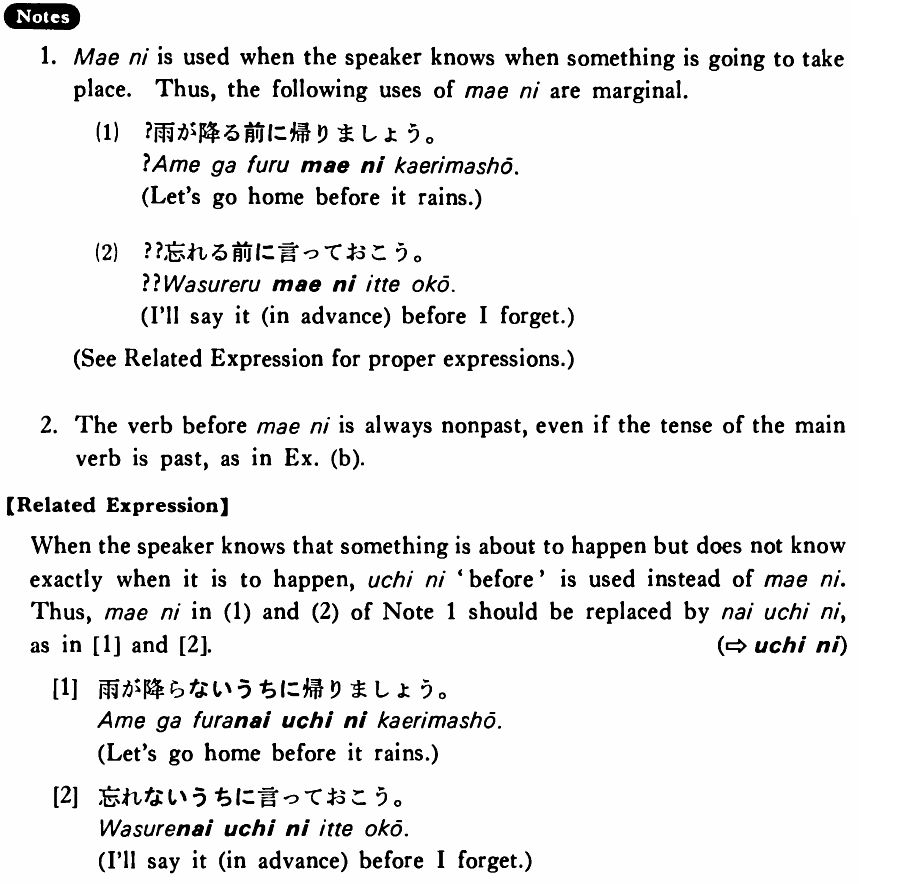

# 前に・まえに

[1. Summary](#summary) 
[2. Formation](#formation) 
[3. Example Sentences](#example-sentences) 
[4. Explanation](#explanation) 
 

## Summary

<table><tr>   <td>Summary</td>   <td>In front of or before some situation comes about.</td></tr><tr>   <td>English</td>   <td>Before; in front of</td></tr><tr>   <td>Part of speech</td>   <td>Conjunction</td></tr><tr>   <td>Related expression</td>   <td>までに; うちに</td></tr><tr>   <td>Antonym expression</td>   <td>あとで; 後ろに</td></tr></table>

## Formation

<table class="table"> <tbody><tr class="tr head"> <td class="td">(i)  Vinformal nonpast</td> <td class="td">前に </td> <td class="td">&nbsp;</td> </tr> <tr class="tr"> <td class="td">&nbsp;</td> <td class="td">話す前に </td> <td class="td">Before    someone talks/talked</td> </tr> <tr class="tr"> <td class="td">&nbsp;</td> <td class="td">食べる前に </td> <td class="td">Before    someone eats/ate</td> </tr> <tr class="tr head"> <td class="td">(ii)  Noun</td> <td class="td">の前に </td> <td class="td">&nbsp;</td> </tr> <tr class="tr"> <td class="td">&nbsp;</td> <td class="td">朝ご飯の前に </td> <td class="td">Before    breakfast</td> </tr></tbody></table>

## Example Sentences

<table><tr>   <td>ジャクソンさんは日本へ行く前に日本語を勉強した・しました。</td>   <td>Mr. Jackson studied Japanese before he went to Japan.</td></tr><tr>   <td>旅行の前に風邪を引いた・引きました。</td>   <td>Before the trip I caught a cold.</td></tr><tr>   <td>駅の前に煙草屋がある・あります。</td>   <td>There is a tobacco shop in front of the station.</td></tr><tr>   <td>日本人はご飯を食べる前に「いただきます。」と言う。</td>   <td>The Japanese say “Itadakimasu” (literally: I humbly receive (this food)) before eating their meals.</td></tr><tr>   <td>テイラーさんは日本へ行く前にハワイに寄りました。</td>   <td>Mr. Taylor stopped in Hawaii before he went to Japan.</td></tr><tr>   <td>私は試験の前に映画を見に行った。</td>   <td>Before the exam I went to see a movie.</td></tr></table>

## Explanation

1. 前に is used when the speaker knows when something is going to take place. Thus, the following uses of 前に are marginal.
  <ul>(1) <li>?雨が降る前に帰りましょう。</li> <li>Let's go home before it rains.</li> </ul>  <ul>(2) <li>??忘れる前に言っておこう。</li> <li>I'll say it (in advance) before I forget.</li> </ul>  
2. The verb before 前に is always nonpast, even if the tense of the main verb is past, as in Example (b).
  
【Related Expression】
  
When the speaker knows that something is about to happen but does not know exactly when it is to happen, うちに 'before' is used instead of 前に. Thus, 前に in (1) and (2) of Note 1 should be replaced by ないうちに, as in [1] and [2].
  
(⇨ <a href="#㊦ うちに">うちに</a>)
  
[I]
  <ul> <li>雨が降らないうちに帰りましょう。</li> <li>Let's go home before it rains.</li> </ul>  
[2]
  <ul> <li>忘れないうちに言っておこう。</li> <li>I'll say it (in advance) before I forget.</li> </ul>

## Grammar Book Page

