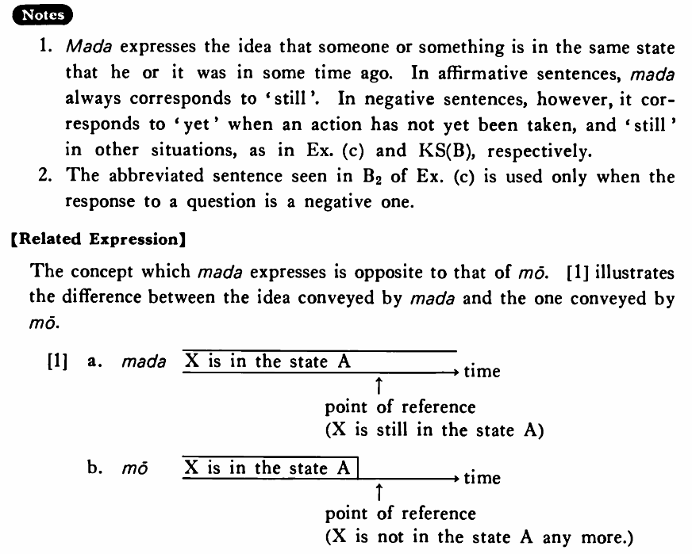

# まだ

[1. Summary](#summary) 
[2. Example Sentences](#example-sentences) 
[3. Explanation](#explanation) 
[4. Grammar Book Page](#grammar-book-page) 

## Summary

<table><tr>   <td>Summary</td>   <td>Someone or something is in some state he or it was in some time ago.</td></tr><tr>   <td>Equivalent</td>   <td>Still; (not) yet</td></tr><tr>   <td>Part of speech</td>   <td>Adverb</td></tr><tr>   <td>Related expression</td>   <td>もう</td></tr></table>

## Example Sentences

<table><tr>   <td>木村君はまだ昼ご飯を食べている・います。</td>   <td>Mr. Kimura is still eating his lunch.</td></tr><tr>   <td>太田さんはまだそのことを知らない・知りません。</td>   <td>Mr. Oota still doesn't know about it.</td></tr><tr>   <td>お酒はまだありますか。</td>   <td>Do you still have sake?</td></tr><tr>   <td>私はまだ日本へ行ったことがない。</td>   <td>I have not been to Japan yet.</td></tr><tr>   <td>A:もう昼ご飯を食べましたか。  B:いえ、まだ食べていません。/いい、まだです。</td>   <td>A: Have you eaten your lunch yet?&emsp;&emsp;B: No, I haven't eaten it yet./No, not yet.</td></tr></table>

## Explanation

1. まだ expresses the idea that someone or something is in the same state that he or it was in some time ago. In affirmative sentences, まだ always corresponds to 'still'. In negative sentences, however, it corresponds to 'yet' when an action has not yet been taken, and 'still' in other situations, as in Example (c) and Key Sentence (B), respectively.
  
2. The abbreviated sentence seen in B2 of Example (c) is used only when the response to a question is a negative one.
  
【Related Expression】
  
The concept which まだ expresses is opposite to that of もう. [1] illustrates the difference between the idea conveyed by まだ and the one conveyed by もう. 
  
[1]
  <table class="table"> <tbody> <tr class="tr"> <td class="td"></td> <td class="td"></td> <td class="td">
</td> <td class="td">
</td> <td class="td"></td> </tr> <tr class="tr"> <td class="td">a.</td> <td class="td"> まだ</td> <td class="td">X is in the state A</td> <td class="td">~~~~~~~~~~~~~~~~~~~~~~~~~~</td> <td class="td">→ time</td> </tr> <tr class="tr"> <td class="td"></td> <td class="td"></td> <td class="td">
</td> <td class="td">
</td> <td class="td"></td> </tr> <tr class="tr"> <td class="td"></td> <td class="td"></td> <td class="td"></td> <td class="td">↑</td> <td class="td"></td> </tr> <tr class="tr"> <td class="td"></td> <td class="td"></td> <td class="td"></td> <td class="td">point of reference (X is still in the state A)</td> <td class="td"> </tr> <tr class="tr"> <td class="td"></td>

</td> </tr> <tr class="tr"> <td class="td"></td> <td class="td"></td> <td class="td">
</td> <td class="td"></td> <td class="td"></td> </tr> <tr class="tr"> <td class="td">b. </td> <td class="td">もう</td> <td class="td">X is in the State A⎪</td> <td class="td"></td> <td class="td">→ time</td> </tr> <tr class="tr"> <td class="td"></td> <td class="td"></td> <td class="td">
</td> <td class="td">
</td> <td class="td"></td> </tr> <tr class="tr"> <td class="td"></td> <td class="td"></td> <td class="td"></td> <td class="td">↑</td> <td class="td"></td> </tr> <tr class="tr"> <td class="td"></td> <td class="td"></td> <td class="td"></td> <td class="td">point of refrence X is not in the state A any more</td> <td class="td"></td> </tr> </tbody> </table>

## Grammar Book Page

