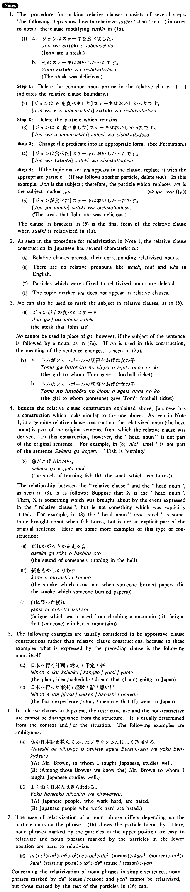

# Relative Clause

 
 
 
 
 

## Summary

<table></table>

## Formation

<table class="table"> <tbody><tr class="tr head"> <td class="td">(i) {V/Adjective い} </td> <td class="td">informal+Noun</td> <td class="td">&nbsp;</td> </tr> <tr class="tr"> <td class="td">&nbsp;</td> <td class="td">{話す/話した} 人</td> <td class="td">A    person who (will) talks/talked</td> </tr> <tr class="tr"> <td class="td">&nbsp;</td> <td class="td">{高い/高かった} 本</td> <td class="td">A    book which is/was expensive</td> </tr> <tr class="tr head"> <td class="td">(ii) Adjective な stem </td> <td class="td">{な/&nbsp;だった} Noun</td> <td class="td">&nbsp;</td> </tr> <tr class="tr"> <td class="td">&nbsp;</td> <td class="td">{静かな/静かだった} 家</td> <td class="td">A    house which is/was quiet</td> </tr> <tr class="tr head"> <td class="td">(iii) Noun </td> <td class="td">{の/だった/である/であった} Noun</td> <td class="td">&nbsp;</td> </tr> <tr class="tr head"> <td class="td">&nbsp;</td> <td class="td">{先生の/先生である} 田中さん</td> <td class="td">Mr.    Tanaka (,) who is a teacher</td> </tr> <tr class="tr"> <td class="td">&nbsp;</td> <td class="td">{先生だった/先生であった} 田中さん</td> <td class="td">Mr.    Tanaka (,) who was a teacher</td> </tr></tbody></table>

## Example Sentences

<table><tr>   <td>［田中さんが食べた］ステーキは高かった・高かったです。</td>   <td>The steak that Mr. Tanaka ate was expensive.</td></tr><tr>   <td>［ステーキが美味しい］レストランを知らない・知りませんか。</td>   <td>Do you know a restaurant which has good steak (literally: in which steak is good)?</td></tr><tr>   <td>［日本語を教えている］先生は小林先生です。</td>   <td>The teacher who is teaching Japanese is Professor Kobayashi.</td></tr><tr>   <td>［テニスが上手］な人を教えて下さい。</td>   <td>Please tell me of a person who is good at tennis.</td></tr><tr>   <td>［お父さんが医者］の学生は三人います。</td>   <td>There are three students whose fathers are doctors.</td></tr><tr>   <td>［私がいた］町は病院がなかった。</td>   <td>There was no hospital in the town where I lived.</td></tr><tr>   <td>［道子が行く］学校は東京にあります。</td>   <td>The school where Michiko is going is in Tokyo.</td></tr><tr>   <td>［スティーブがあなたの写真を撮った］カメラはこれですか。</td>   <td>Is this the camera with which Steve took pictures of you?</td></tr></table>

## Explanation

1. The procedure for making relative clauses consists of several steps. The following steps show how to relativize ステーキ 'steak' in (1a) in order to obtain the clause modifying ステーキ in (1b).
  <ul>(1) <li>a.ジョンはステーキを食べました。</li> <li>John ate a steak.</li> 

 <li>b.そのステーキは美味しかったです。</li> <li>the steak was delicious.</li> </ul>  
Step 1: Delete the common noun phrase in the relative clause. ([] indicates the relative clause boundary.)
  <ul>(2) <li>[ジョンはØを食べました]ステーキは美味しかったです。</li> </ul>  
Step 2： Delete the particle which remains.
  <ul>(3) <li>[ジョンはØ食べました]ステーキは美味しかったです。</li> </ul>  
Step 3: Change the predicate into an appropriate form. [See Formation.]
  <ul>(4) <li>[ジョンは食べた]ステーキは美味しかったです。</li> </ul>  
Step 4： If the topic marker は appears in the clause, replace it with the appropriate particle. (If は follows another particle, delete は.) In this example, ジョン is the subject; therefore, the particle which replaces は is the subject marker が.
   
(⇨ <a href="#㊦ が (1)">が</a>; <a href="#㊦ は (1)">は</a>)
  <ul>(5) <li>[ジョンが食べた]ステーキは美味しかったです。</li> <li>The steak that John ate was delicious.</li> </ul>  
The clause in brackets in (5) is the final form of the relative clause when ステーキ is relativized in (1a).
  
2. As seen in the procedure for relativization in Note 1,the relative clause construction in Japanese has several characteristics:
  <ul> <li>(A)&nbsp;&nbsp;&nbsp;&nbsp;Relative clauses precede their corresponding relativized nouns.</li> 

 <li>(B)&nbsp;&nbsp;&nbsp;&nbsp;There are no relative pronouns like 'which', 'that' and 'who' in English.</li> 

 <li>(C)&nbsp;&nbsp;&nbsp;&nbsp;Particles which were affixed to relativized nouns are deleted.</li> 

 <li>(D)&nbsp;&nbsp;&nbsp;&nbsp;The topic marker は does not appear in relative clauses.</li> </ul>  
3. の can also be used to mark the subject in relative clauses, as in (6).
  <ul>(6) <li>ジョンが/の食べたステーキ</li> <li>the steak that John ate</li> </ul>  
の cannot be used in place of が, however, if the subject of the sentence is followed by a noun, as in (7a). If の is used in this construction, the meaning of the sentence changes, as seen in (7b).
  <ul>(7)  <li>a. トムがフットボールの切符をあげた女の子</li> <li>the girl to whom Tom gave a football ticket</li> 

 <li>b. トムのフットボールの切符をあげた女の子</li> <li>the girl to whom (someone) gave Tom's football ticket</li> </ul>  
4. Besides the relative clause construction explained above, Japanese has a construction which looks similar to the one above. As seen in Note 1, in a genuine relative clause construction, the relativized noun (the head noun) is part of the original sentence from which the relative clause was derived. In this construction, however, the "head noun" is not part of the original sentence. For example, in (8), におい 'smell' is not part of the sentence 魚がこげる. 'Fish is burning.'
  <ul>(8) <li>魚がこげるにおい。</li> <li>the smell of burning fish (literally: the smell which fish burns)</li> </ul>  
The relationship between the "relative clause" and the "head noun", as seen in (8), is as follows: Suppose that X is the "head noun". Then, X is something which was brought about by the event expressed in the "relative clause", but is not something which was explicitly stated. For example, in (8) the "head noun" におい 'smell' is something brought about when fish burns, but is not an explicit part of the original sentence. Here are some more examples of this type of construction:
  <ul>(9) <li>誰かが廊下を走る音</li> <li>the sound of someone's running in the hall</li> </ul>  <ul>(10) 紙をもやした煙</li> the smoke which came out when someone burned papers (literally: the smoke which someone burned papers)</li> </ul>  <ul>(11) <li>山に登った疲れ</li> <li>fatigue which was caused from climbing a mountain (literally: fatigue that (someone) climbed a mountain)</li> </ul>  
5. The following examples are usually considered to be appositive clause constructions rather than relative clause constructions, because in these examples what is expressed by the preceding clause is the following noun itself.
  <ul>(12) <li>日本へ行く計画/考え/予定/夢</li> <li>the plan/ dea/schedule/dream that (I am) going to Japan</li> </ul>  <ul>(13) <li>日本へ行った事実/経験/話/思い出</li> <li>the fact/experience/story/memory that (I) went to Japan</li> </ul>  
6. In relative clauses in Japanese, the restrictive use and the non-restrictive use cannot be distinguished from the structure. It is usually determined from the context and/or the situation. The following examples are ambiguous.
  <ul>(14) <li>私が日本語を教えてあげたブラウンさんはよく勉強する。</li> 

 <li>(A) Mr. Brown, to whom I taught Japanese, studies well.</li> <li>(B) (Among those Browns we know the) Mr. Brown to whom I taught Japanese studies well.</li> </ul>  <ul>(15) <li>よく働く日本人は嫌われる。</li> 

 <li>(A) Japanese people, who work hard, are hated.</li> <li>(B) Japanese people who work hard are hated.</li> </ul>  
7. The ease or relativization of a noun phrase differs depending on the particle marking the phrase. (16) shows the particle hierarchy. Here, noun phrases marked by the particles in the upper position are easy to relativize and noun phrases marked by the particles in the lower position are hard to relativize.
  <ul>(16) <li>が>を1>に2>に6>を2>へ>で1>で2(means)>から1(source)>の1>から1(starting point)>と2>で(cause/reason)>より1</li> </ul>  
Concerning the relativization of noun phrases in simple sentences, noun phrases marked by で2 (cause/reason) and より1 cannot be relativized, but those marked by the rest of the particles in (16) can.

## Grammar Book Page

