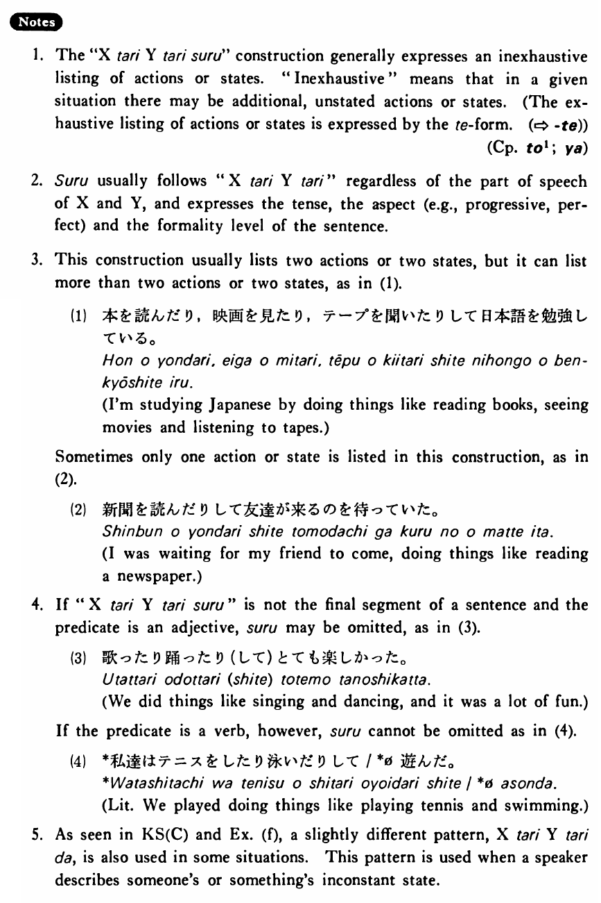

# たり～たりする

[1. Summary](#summary) 
[2. Formation](#formation) 
[3. Example Sentences](#example-sentences) 
[4. Explanation](#explanation) 
[5. Grammar Book Page](#grammar-book-page) 

## Summary

<table><tr>   <td>Summary</td>   <td>A phrase which expresses an inexhaustive listing of action or states.</td></tr><tr>   <td>Equivalent</td>   <td>Do things like ~ and ~; sometimes ~ and sometimes ~</td></tr><tr>   <td>Part of speech</td>   <td>Phrase</td></tr></table>

## Formation

<table class="table"> <tbody><tr class="tr head"> <td class="td">{V/Adjective (い/な) Noun+Copula} informal past</td> <td class="td">り(する)  </td> <td class="td">&nbsp;</td> </tr> <tr class="tr"> <td class="td">&nbsp;</td> <td class="td">話したり(する)  </td> <td class="td">Someone    (does) things like talking</td> </tr> <tr class="tr"> <td class="td">&nbsp;</td> <td class="td">高かったり(する)  </td> <td class="td">Something    is sometimes expensive</td> </tr> <tr class="tr"> <td class="td">&nbsp;</td> <td class="td">静かだったり(する)  </td> <td class="td">Something    is sometimes quiet</td> </tr> <tr class="tr"> <td class="td">&nbsp;</td> <td class="td">先生だったり(する)  </td> <td class="td">Someone    is sometimes a teacher</td> </tr></tbody></table>

## Example Sentences

<table><tr>   <td>私達は歌ったり躍ったりした・しました。</td>   <td>We did things like singing and dancing.</td></tr><tr>   <td>このレストランのステーキは大きかったり小さかったりする・します。</td>   <td>Steaks at this restaurant are sometimes big and sometimes small.</td></tr><tr>   <td>A:毎日テープを聞いていますか。  B:いいえ、聞いたり聞かなかったりです。</td>   <td>A: Are you listening to tapes every day?&emsp;&emsp;B: No, I listen at one time and don't listen at another (only off and on).</td></tr><tr>   <td>私はニューヨークでミュージカルを見たりコンサートを聞いたりした。</td>   <td>In New York I did things like seeing musicals and listening to concerts.</td></tr><tr>   <td>トムは来たり来なかったりする。</td>   <td>Tom comes at one time and doesn't at another time (Tom doesn’t always come).</td></tr><tr>   <td>明日は雨が降ったり止んだりするでしょう。</td>   <td>It will probably rain off and on tomorrow.</td></tr><tr>   <td>この店の魚は新しかったり古かったりする。</td>   <td>This shop's fish is sometimes fresh and sometimes old.</td></tr><tr>   <td>日本語の先生は日本人だったりアメリカ人だったりします。</td>   <td>Teachers of Japanese are sometimes Japanese and sometimes American.</td></tr></table>

## Explanation

1. The "XたりYたりする" construction generally expresses an inexhaustive listing of actions or states. "Inexhaustive" means that in a given situation there may be additional, unstated actions or states. (The ex-haustive listing of actions or states is expressed by the て form. (⇨ <a href="#㊦ て">て</a>))
  
(Complementiser phrase: <a href="#㊦ と (1)">と1</a>; <a href="#㊦ や">や</a>)
  
2. する usually follows "XたりYたり" regardless of the part of speech of X and Y, and expresses the tense, the aspect (e,g.,  progressive, perfect) and the formality level of the sentence.
  
3. This construction usually lists two actions or two states, but it can list more than two actions or two states, as in (1).
  <ul>(1) <li>本を読んだり、映画を見たり、テープを間いたりして日本語を勉強している。</li> <li>I'm studying Japanese by doing things like reading books, seeing movies and listening to tapes.</li> </ul>  
Sometimes only one action or state is listed in this construction, as in (2).
  <ul>(2) <li>新聞を読んだりして友達が来るのを待っていた。</li> <li>I was waiting for my friend to come, doing things like reading a newspaper.</li> </ul>  
4. If "XたりYたりする" is not the final segment of a sentence and the predicate is an adjective, する may be omitted, as in (3).
  <ul>(3) <li>歌ったり踊ったり(して)とても楽しかった。</li> <li>We did things like singing and dancing, and it was a lot of fun.</li> </ul>  
If the predicate is a verb, however, する cannot be omitted as in (4).
  <ul>(4) <li>*私達はテニスをしたり泳いだりして/Ø遊んだ。</li> <li>Literally: We played doing things like playing tennis and swimming.</li> </ul>  
5. As seen in Key Sentence (C) and Example (f), a slightly different pattern, XたりYたりだ, is also used in some situations. This pattern is used when a speaker describes someone's or something's inconstant state.

## Grammar Book Page

