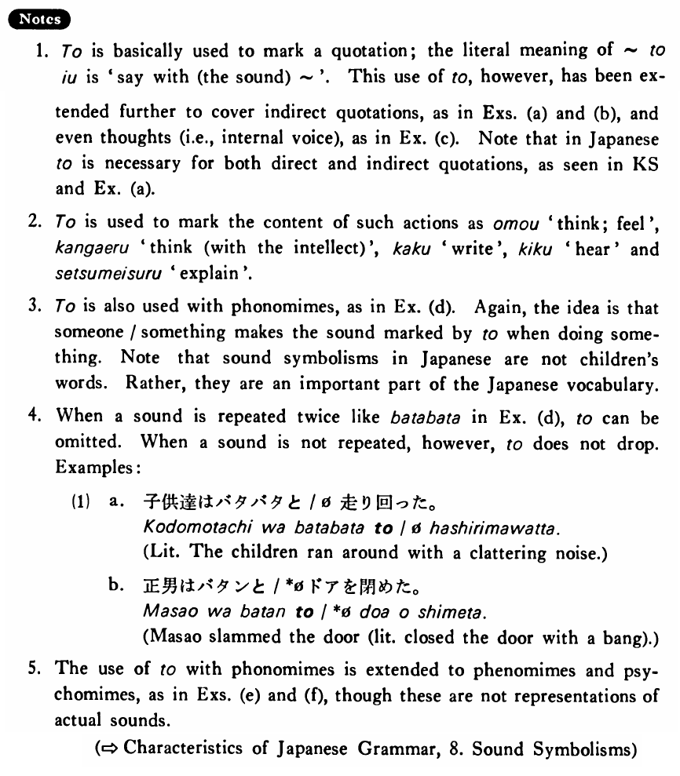

# と (3)

[1. Summary](#summary) 
[2. Formation](#formation) 
[3. Example Sentences](#example-sentences) 
[4. Explanation](#explanation) 
[5. Grammar Book Page](#grammar-book-page) 

## Summary

<table><tr>   <td>Summary</td>   <td>A particle which marks a quotation, sound or the manner in which someone/something does something.</td></tr><tr>   <td>English</td>   <td>That; with the sound of; in the manner of</td></tr><tr>   <td>Part of speech</td>   <td>Particle</td></tr></table>

## Formation

<table class="table"> <tbody><tr class="tr head"> <td class="td">(i)  Quotation</td> <td class="td">と </td> <td class="td">&nbsp;</td> </tr> <tr class="tr"> <td class="td">&nbsp;</td> <td class="td">「私は学生です。」と </td> <td class="td">“I am a student”</td> </tr> <tr class="tr"> <td class="td">&nbsp;</td> <td class="td">私は学生だと </td> <td class="td">That I am a student</td> </tr> <tr class="tr head"> <td class="td">(ii)  Phonomime</td> <td class="td">と </td> <td class="td">&nbsp;</td> </tr> <tr class="tr"> <td class="td">&nbsp;</td> <td class="td">バタバタと </td> <td class="td">With a clattering noise</td> </tr> <tr class="tr head"> <td class="td">(iii)  Phenomime</td> <td class="td">と </td> <td class="td">&nbsp;</td> </tr> <tr class="tr"> <td class="td">&nbsp;</td> <td class="td">ゆっくりと </td> <td class="td">Slowly</td> </tr> <tr class="tr head"> <td class="td">(iv)  Psychomime</td> <td class="td">と </td> <td class="td">&nbsp;</td> </tr> <tr class="tr"> <td class="td">&nbsp;</td> <td class="td">うきうきと </td> <td class="td">Cheerfully</td> </tr></tbody></table>

## Example Sentences

<table><tr>   <td>ヒルさんは私に日本語で「こんにちは。」と言った・言いました。</td>   <td>Mr. Hill said to me in Japanese, “Hello!”</td></tr><tr>   <td>トムは日本へ行きたいと言っている。</td>   <td>Tom says that he wants to go to Japan.</td></tr><tr>   <td>これは十六世紀に建てられたと書いてあります。</td>   <td>It is written that this was built in the sixteenth century.</td></tr><tr>   <td>私はバスで行こうと思う。</td>   <td>I think I will go by bus.</td></tr><tr>   <td>子供達はバタバタと走れ回った。</td>   <td>The children ran around with a clattering noise.</td></tr><tr>   <td>真知子はしっかりと私の手を握った。</td>   <td>Machiko grabbed my hand firmly.</td></tr><tr>   <td>ベンはむっつりと座っている。</td>   <td>Ben is sitting sullenly.</td></tr></table>

## Explanation

1. と is basically used to mark a quotation; the literal meaning of という is 'say with the (the sound) ~'. This use of と, however, has been extended further to cover indirect quotations, as in Examples (a) and (b), and even thoughts (i.e., internal voice), as in Example (c). Note that in Japanese と is necessary for both direct and indirect quotations, as seen in Key Sentence and Example (a).
  
2. と is used to mark the content of such actions as 思う 'think; feel', 考える 'think (with the intellect)', 書く 'write', 聞く 'hear', and 説明する 'explain'.
  
3. と is also used with phonomimes, as in Example (d). Again, the idea is that someone/something makes the sound marked by と when doing something. Note that sound symbolisms in Japanese are not children's words. Rather, they are an important part of the Japanese vocabulary.
  
4. When a sound is repeated twice like バタバタ in Example (d), と can be omitted. When a sound is not repeated, however, と does not drop. Examples:
  <ul>(1) <li>a. 子供達はバタバタと/Ø走り回った。</li> <li>Literally: The children ran around with a clattering noise.</li> 

 <li>b. 正男はバタンと/*Øドアを閉めた。</li> <li>Masao slammed the door (literally: closed the door with a bang).</li> </ul>  
5. The use of と with phonomimes is extended to phenomimes and psychomimes, as in Examples (e) and (f), though these are not representations of actual sounds.

## Grammar Book Page

