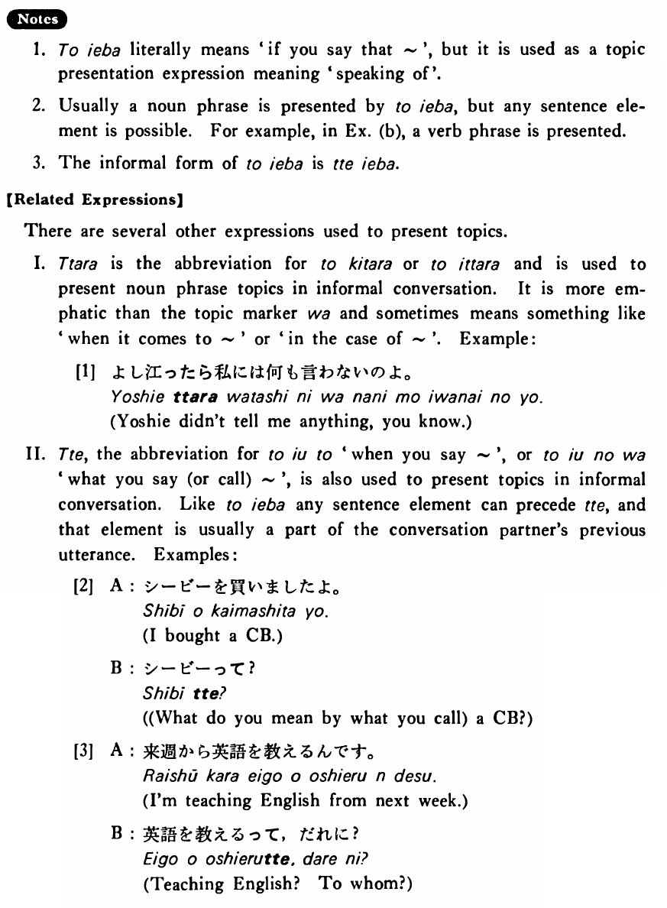

# と言えば

[1. Summary](#summary) 
[2. Example Sentences](#example-sentences) 
[3. Explanation](#explanation) 
[4. Grammar Book Page](#grammar-book-page) 

## Summary

<table><tr>   <td>Summary</td>   <td>An expression which presents as the topic of a following discourse a phrase which has just been uttered.</td></tr><tr>   <td>Equivalent</td>   <td>Speaking of ~</td></tr><tr>   <td>Part of speech</td>   <td>Phrase</td></tr><tr>   <td>Related expression</td>   <td>ったら; って</td></tr></table>

## Example Sentences

<table><tr>   <td>A:この本は田中さんに借りたんです。  B:田中さんと言えばもう病気は治ったのかしら。</td>   <td>A: I borrowed this book from Mr. Tanaka.&emsp;&emsp;B: Speaking of Mr. Tanaka, I wonder if he's gotten over his illness yet.</td></tr><tr>   <td>A:次の日曜日は京都へ行くつもりだ。  B:京都と言えば、春子が京都大学の入学試験に通ったそうだ。</td>   <td>A: I'm going to Kyoto next Sunday.&emsp;&emsp;B: Speaking of Kyoto, I heard that Haruko passed Kyoto University's entrance exam.</td></tr><tr>   <td>A:小西君はよく休むね。  B:よく休むと言えば、山本君も最近見ませんね。</td>   <td>A: Mr. Konishi is absent frequently, isn't he?&emsp;&emsp;B: Talking about about (someone's) frequent absences, we don't see Mr. Yamamoto these days either, do we?</td></tr></table>

## Explanation

1. と言えば literally means 'if you say that ~', but it is used as a topic presentation expression meaning 'speaking of'.
  
2. Usually a noun phrase is presented by と言えば, but any sentence element is possible. For example, in Example (b), a verb phrase is presented.
  
3. The informal form of と言えば is って言えば  
【Related Expressions】
  
There are several other expressions used to present topics.
  
I. ったら is the abbreviation for と来たら or to と行ったら and is used to present noun phrase topics in informal conversation. It is more emphatic than the topic marker は and sometimes means something like 'when it comes to ~' or 'in the case of ~'. Example:
  
[1]
  <ul> <li>よし江ったら私には何も言わないのよ。</li> <li>Yoshie didn't tell me anything, you know.</li> </ul>  
II. って the abbreviation for と言うと, 'when you say ~', or と言うのは 'what you say (or call) ~', is also used to present topics in informal conversation. Like to と言えば any sentence element can precede って, and that element is usually a part of the conversation partner's previous utterance. Examples:
  
[2]
  <ul> <li>A: シービーを買いましたよ。</li> <li>I bought a CB.</li> 

 <li>B: シービーって？</li> <li>(What do you mean by what you call) a CB?</li> </ul>  
[3]
  <ul> <li>A: 来週から英語を教えるんです。</li> <li>I'm teaching English from next week.</li> 

 <li>B: 英語を教えるって、誰に？</li> <li>Teaching English? To whom?</li> </ul>

## Grammar Book Page

