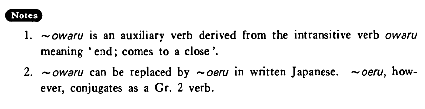

# 終わる・おわる

[1. Summary](#summary) 
[2. Formation](#formation) 
[3. Example Sentences](#example-sentences) 
[4. Explanation](#explanation) 
 

## Summary

<table><tr>   <td>Summary</td>   <td>Finish doing ~</td></tr><tr>   <td>English</td>   <td>Finish; end</td></tr><tr>   <td>Part of speech</td>   <td>Auxiliary Verb (Group 1)</td></tr><tr>   <td>Related expression</td>   <td>しまう</td></tr><tr>   <td>Antonym expression</td>   <td>~始める</td></tr></table>

## Formation

<table class="table"> <tbody><tr class="tr head"> <td class="td">Vます</td> <td class="td">終わる </td> <td class="td">&nbsp;</td> </tr> <tr class="tr"> <td class="td">&nbsp;</td> <td class="td">話し終わる </td> <td class="td">Finish    talking</td> </tr> <tr class="tr"> <td class="td">&nbsp;</td> <td class="td">食べ終わる </td> <td class="td">Finish    eating</td> </tr></tbody></table>

## Example Sentences

<table><tr>   <td>源氏物語をやっと読み終わった・終わりました。</td>   <td>I finally finished reading The Tale of Genji.</td></tr><tr>   <td>やっと論文を書き終わった。</td>   <td>I finally finished writing a paper.</td></tr><tr>   <td>ちょうどご飯を食べ終わったところです。</td>   <td>I've just finished eating my meal.</td></tr></table>

## Explanation

1. ~終わる is an auxiliary verb derived from the intransitive verb 終わる meaning 'end; comes to a close'.
  
2. ~終わる can be replaced by 終える in written Japanese. 終える, however, conjugates as a Group 2 verb.

## Grammar Book Page

